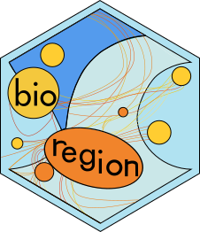

# __bioRgeo__ 

# An R package to compare several methods of bioregionalizations

[](https://github.com/bioRgeo/bioRgeo/actions) 
[](https://www.r-project.org/Licenses/GPL-3) 
[](https://github.com/bioRgeo/bioRgeo)   

## 1 Install

THe package `bioRgeo` can be installed with the following command line in R session:

``` r
devtools::install_github("bioRgeo/bioRgeo", build_vignettes = TRUE)
```

## 2 Tutorial

A tutorial vignette is available [here](https://jbferet.github.io/biodivMapR/articles/tutorial.html) and can be
visualised with the following command line:

``` r
vignette("bioRgeo", package = "bioRgeo")
```

## 3 Dependencies

`bioRgeo` depends on `igraph`, `RcppEigen`, `Rdpack`, `reshape2`, `stats`, `tidyr` and `utils`

## 4  Citation  


