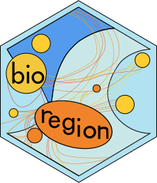

<!-- README.md is generated from README.Rmd. Please edit that file -->

# bioregion 

<!-- badges: start -->

[](https://github.com/bioRgeo/bioregion/actions)
[](https://app.codecov.io/gh/bioRgeo/bioregion?branch=master)
[](https://cran.r-project.org/package=bioregion)
[](https://r-pkg.org:443/pkg/bioregion)
[](https://zenodo.org/doi/10.5281/zenodo.10843109)
<!-- badges: end -->

This **R package** gathers a comprehensive set of algorithms to perform
bioregionalisation analyses.

Bioregionalisation methods can be based on hierarchical clustering
algorithms, non-hierarchical clustering algorithms or network
algorithms.

## :arrow_double_down: Installation

The package can be installed with the following command line in R
session:

From the CRAN

``` r
install.packages("bioregion")
```

or from GitHub

``` r
# install.packages("devtools")
devtools::install_github("bioRgeo/bioregion")
```

## :scroll: Vignettes

We wrote several vignettes that will help you using the **bioregion R
package**. Vignettes available are the following ones: <br>

- **[1. Installation of the executable binary
  files](https://bioRgeo.github.io/bioregion/articles/a1_install_binary_files.html)**  
- **[2. Matrix and network
  formats](https://bioRgeo.github.io/bioregion/articles/a2_matrix_and_network_formats.html)**
- **[3. Pairwise similarity/dissimilarity
  metrics](https://bioRgeo.github.io/bioregion/articles/a3_pairwise_metrics.html)**
- **[4.1 Hierarchical
  clustering](https://bioRgeo.github.io/bioregion/articles/a4_1_hierarchical_clustering.html)**
- **[4.2 Non-hierarchical
  clustering](https://bioRgeo.github.io/bioregion/articles/a4_2_non_hierarchical_clustering.html)**
- **[4.3 Network
  clustering](https://bioRgeo.github.io/bioregion/articles/a4_3_network_clustering.html)**
- **[4.4
  Microbenchmark](https://bioRgeo.github.io/bioregion/articles/a4_4_microbenchmark.html)**
- **[5.1
  Visualization](https://bioRgeo.github.io/bioregion/articles/a5_1_visualization.html)**
- **[5.2 Compare
  bioregionalizations](https://bioRgeo.github.io/bioregion/articles/a5_2_compare_bioregionalizations.html)**
- **[5.3 Summary
  metrics](https://bioRgeo.github.io/bioregion/articles/a5_3_summary_metrics.html)**

Alternatively, if you prefer to view the vignettes in R, you can install
the package with `build_vignettes = TRUE`. But be aware that some
vignettes can be slow to generate.

``` r
remotes::install_github("bioRgeo/bioregion",
                        dependencies = TRUE, 
                        upgrade = "ask", 
                        build_vignettes = TRUE)

vignette("bioregion")
```

## :desktop_computer: Functions

An overview of all functions and data is given
**[here](https://bioRgeo.github.io/bioregion/reference/index.html)**.

## :bug: Find a bug?

Thank you for finding it. Head over to the GitHub Issues tab and let us
know about it. Alternatively, you can also send us an e-mail. We will
try to get to it as soon as we can!

## References and dependencies

`bioregion` depends on `ape`, `apcluster`, `bipartite`, `cluster`,
`data.table`, `dbscan`, `dynamicTreeCut`, `earth`, `fastcluster`,
`ggplot2`, `grDevices`, `httr`, `igraph`, `mathjaxr`, `Matrix`,
`phangorn`, `Rdpack`, `rlang`, `rmarkdown`, `segmented`,`sf`, `stats`,
`tidyr` and `utils`.

## Citation

Denelle P, Leroy B & Lenormand M (2025) [Bioregionalization analyses
with the bioregion R
package.](https://besjournals.onlinelibrary.wiley.com/doi/10.1111/2041-210X.14496)
*Methods in Ecology and Evolution* 16, 496-506.
