# 4.1 Hierarchical clustering

Hierarchical clustering consists in creating a hierarchical tree from a
matrix of distances (or beta-diversities). From this hierarchical tree,
clusters can be obtained by cutting the tree.

Although these methods are conceptually simple, their implementation can
be complex and requires important user decisions. Here, we provide a
step-by-step guide to performing hierarchical clustering analyses with
`bioregion`, along with comments on the philosophy on how we designed
the functions.

Hierarchical clustering takes place on the right-hand side of the
`bioregion` conceptual diagram:


## 1. Compute dissimilarity indices from input data

To initiate the hierarchical clustering procedure, you need to provide
pairwise distances between sites. These pairwise distances between sites
can be obtained by running
[`dissimilarity()`](https://bioRgeo.github.io/bioregion/reference/dissimilarity.md)
on a species-site matrix, such as a presence-absence or an abundance
matrix.

In the example below, we use the vegetation dataset from the package to
compute distance metrics.

``` r

# Work with the vegetation dataset we include in the package
data(vegemat)

# This is an abundance matrix where sites are in rows and species in columns
vegemat[1:10, 1:10]
```

    ##     Species
    ## Site 10001 10002 10003 10004 10005 10006 10007 10008 10009 10010
    ##   35     0     0     0     0     0     0     0     0     0     0
    ##   36     2     0     0     0     0     0     1    12     0     0
    ##   37     0     0     0     0     0     0     0     0     0     0
    ##   38     0     0     0     0     0     0     0     0     0     0
    ##   39     5     0     0     0     0     0     0     2     0     0
    ##   84     0     0     0     0     0     0     0     0     0     0
    ##   85     3     0     0     0     0     0     1     7     0     0
    ##   86     0     0     0     2     0     0     2    22     0     0
    ##   87    16     0     0     0     0     0     2    54     0     0
    ##   88   228     0     0     0     0     0     0     5     0     0

We are going to compute the \\\beta\_{sim}\\ diversity metric, which is
a presence-absence dissimilarity index. The formula is as follows:
\\\beta\_{sim} = min(b, c) / (a+min(b, c))\\

Where *a* is the number of species shared by both sites; *b* is the
number of species occurring only in the first site; and *c* is the
number of species only occurring only in the second site.

We typically choose this metric for bioregionalization, because it is
the **turnover** component of the Sorensen index (Baselga, 2012) (in a
nutshell, it tells us how sites are different because they have distinct
species), and because it is less dependent on species richness than the
Jaccard turnover (Leprieur & Oikonomou, 2014). Alternatively, given that
we have abundance data here, we could also use the Bray-Curtis turnover
index (Baselga, 2013). The choice of the distance metric is very
important for the outcome of the clustering procedure, so we recommend
that you choose carefully depending on your research question.

``` r

dissim <- dissimilarity(vegemat)

head(dissim)
```

    ## Data.frame of dissimilarity between sites
    ##  - Total number of sites:  715 
    ##  - Total number of species:  3697 
    ##  - Number of rows:  255255 
    ##  - Number of dissimilarity metrics:  1 
    ## 
    ## 
    ##   Site1 Site2    Simpson
    ## 2    35    36 0.02325581
    ## 3    35    37 0.03100775
    ## 4    35    38 0.05426357
    ## 5    35    39 0.05426357
    ## 6    35    84 0.72093023
    ## 7    35    85 0.08527132

By default, only the Simpson index is computed, but other options are
available in the `metric` argument of dissimilarity(). Furthermore,
users can also write down their own formula to compute any index they
want for in the argument `formula`, see ?dissimilarity().

We are now ready to start the hierarchical clustering procedure with the
object `dissim` we have just created. Alternatively, you can also use
other types of objects in
[`hclu_hierarclust()`](https://bioRgeo.github.io/bioregion/reference/hclu_hierarclust.md),
such as a distance matrix object (class `dist`) or a `data.frame` of
your own crafting (make sure to read the required format carefully in
[`?hclu_hierarclust`](https://bioRgeo.github.io/bioregion/reference/hclu_hierarclust.md)).

## 2. Hierarchical clustering with basic parameters

Hierarchical clustering, and the associated hierarchical tree, can be
constructed in two ways: - *agglomerative*, where all sites are
initially assigned to their own bioregion and they are progressively
grouped together - *divisive*, where all sites initially belong to the
same unique bioregion and are then progressively divided into different
bioregions

Subsections 2.1 to 2.3 detail the functioning of agglomerative
hierarchical clustering, while [sub-section 2.4.](#id_2.4.) illustrates
the divisive method.

### 2.1 Basic usage

The basic use of the function is as follows:

``` r

tree1 <- hclu_hierarclust(dissim)
```

The function gives us some information as it proceeds. Notably, it talks
about a randomization of the dissimilarity matrix - this is a very
important feature because hierarchical clustering is strongly influenced
by the order of the sites in the distance matrix. Therefore, by default,
the function performs a randomization of the order of sites in the
distance matrix with 30 trials ([more information in the randomization
section](#randomization)). It also tells us that it built a consensus
tree based on an iterative hierarchical consensus algorithm, and it
found a tree with a cophenetic correlation coefficient of 0.7.

We can see type the name of the object in the console to see more
information:

``` r

tree1
```

    ## Clustering results for algorithm : hclu_hierarclust 
    ##  (hierarchical clustering based on a dissimilarity matrix)
    ##  - Number of sites:  715 
    ##  - Name of dissimilarity metric:  Simpson 
    ##  - Tree construction method:  average 
    ##  - Randomization of the dissimilarity matrix:  yes, number of trials 100 
    ##  - Method to compute the final tree:  Iterative hierarchical consensus tree 
    ##  - Cophenetic correlation coefficient:  0.701 
    ## Clustering procedure incomplete - no clusters yet

The last line tells us that the the clustering procedure is incomplete:
the tree has been built, but it has not yet been cut - so there are no
clusters in the object yet.

To cut the tree, we can use the
[`cut_tree()`](https://bioRgeo.github.io/bioregion/reference/cut_tree.md)
function:

``` r

# Ask for 3 clusters
tree1 <- cut_tree(tree1,
                  n_clust = 3)
```

Here, we asked for 3 clusters, and the algorithm automatically finds the
height at which 3 clusters are found (h = 0.555).

``` r

tree1
```

    ## Clustering results for algorithm : hclu_hierarclust 
    ##  (hierarchical clustering based on a dissimilarity matrix)
    ##  - Number of sites:  715 
    ##  - Name of dissimilarity metric:  Simpson 
    ##  - Tree construction method:  average 
    ##  - Randomization of the dissimilarity matrix:  yes, number of trials 100 
    ##  - Method to compute the final tree:  Iterative hierarchical consensus tree 
    ##  - Cophenetic correlation coefficient:  0.701 
    ##  - Number of clusters requested by the user:  3 
    ## Clustering results:
    ##  - Number of partitions:  1 
    ##  - Number of clusters:  3 
    ##  - Height of cut of the hierarchical tree: 0.555

When we type again the name of the object in the console, it gives us
the results of the clustering: we have

- **1 partition**: a partition is a clustering result. We only cut the
  tree once, so we only have 1 partition at the moment
- **4 clusters**: this is the number of clusters in the partition. We
  asked for 3, and we obtained 3, which is good. Sometimes, however, we
  cannot get the number of clusters we asked for - in which case the
  outcome will be indicated.
- **a height of cut at 0.555**: this is the height of cut at which we
  can obtain 4 clusters in our tree.

We can make a quick plot of our partitioned tree with

``` r

# We reduced the size of text labels with cex = .2, because there are too many sites
plot(tree1, cex = .2)
```

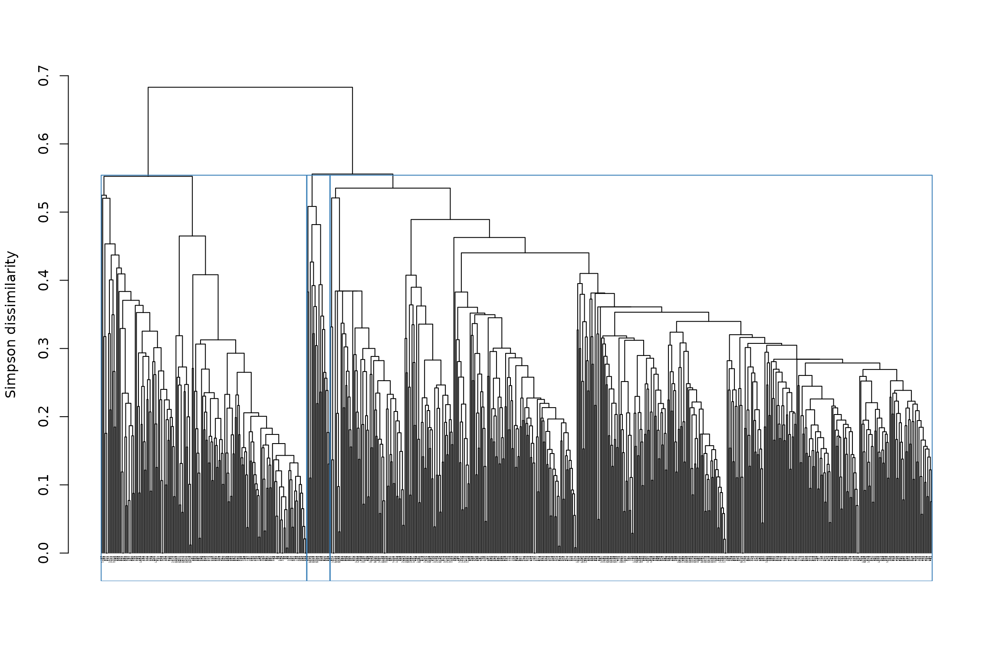

Let’s see how it looks like on a map:

``` r

#data(vegesf)
#map_bioregions(tree1, map = vegesf)
```

Now, this is a hierarchical tree, and cutting it only once (= only 1
partition) oversimplifies the result of the tree. Why not cut it
multiple times? For example, we could make deep, intermediate, and
shallow cuts to the tree, likewise to Ficetola *et al.* (2017), which
would allow us to see broad- to fine-scale relationships among sites in
our tree.

We can specify, e.g. 4, 10 and 20 clusters:

``` r

# Ask for 4, 10 and 20 clusters
tree1 <- cut_tree(tree1,
                  n_clust = c(2, 3, 12))

plot(tree1, cex = .2)
```

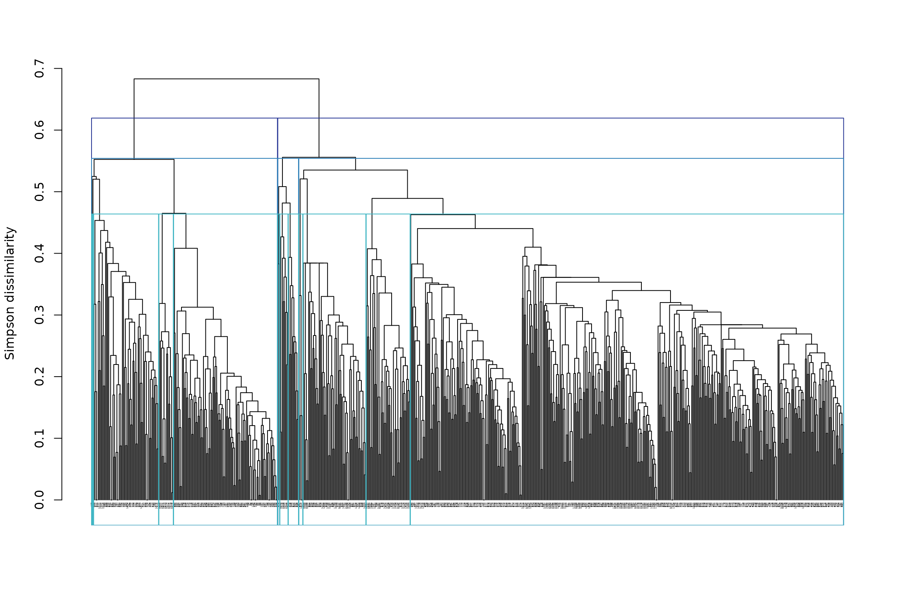

We can also see directly in the console the hierarchical structure of
the tree, with info on each cluster, by using the convenient
[`summary()`](https://rdrr.io/r/base/summary.html) function.

``` r

summary(tree1)
```

    ## 
    ## Summary of clustering results
    ## =============================
    ## 
    ## Algorithm:  hclu_hierarclust 
    ## Number of sites:  715 
    ## Number of bioregionalizations:  3 
    ## Hierarchical clustering: Yes
    ## 
    ## Bioregionalization 1: K_2
    ## ------------------------- 
    ## Total clusters:  2 
    ## Top 2 clusters by size:
    ##   Cluster 1: 538 items
    ##   Cluster 2: 177 items
    ## 
    ## Bioregionalization 2: K_3
    ## ------------------------- 
    ## Total clusters:  3 
    ## Top 3 clusters by size:
    ##   Cluster 1: 518 items
    ##   Cluster 2: 177 items
    ##   Cluster 3: 20 items
    ## 
    ## Bioregionalization 3: K_12
    ## -------------------------- 
    ## Total clusters:  12 
    ## Top 10 clusters by size:
    ##   Cluster 2: 412 items
    ##   Cluster 8: 99 items
    ##   Cluster 5: 62 items
    ##   Cluster 1: 60 items
    ##   Cluster 3: 42 items
    ##   Cluster 7: 14 items
    ##   Cluster 11: 10 items
    ##   Cluster 6: 8 items
    ##   Cluster 4: 4 items
    ##   Cluster 12: 2 items
    ##   ... and 2 more cluster(s)
    ## 
    ## Hierarchical structure
    ## ======================
    ## 
    ## 1 (n=538)
    ## ├─1 (n=518)
    ## │ ├─1 (n=60)
    ## │ ├─2 (n=412)
    ## │ ├─3 (n=42)
    ## │ └─4 (n=4)
    ## └─3 (n=20)
    ##   ├─11 (n=10)
    ##   ├─12 (n=2)
    ##   └─6 (n=8)
    ## 
    ## 2 (n=177)
    ## └─2 (n=177)
    ##   ├─10 (n=1)
    ##   ├─5 (n=62)
    ##   ├─7 (n=14)
    ##   ├─8 (n=99)
    ##   └─9 (n=1)

However, it may be more useful to choose the heights of cut, rather than
the number of clusters. We could, for example, cut the tree at heights
0.4 (shallow cut), 0.5 (intermediate cut) and 0.6 (deep cut):

``` r

tree1 <- cut_tree(tree1,
                  cut_height = c(.4, .5, .6))

plot(tree1, cex = .2)
```

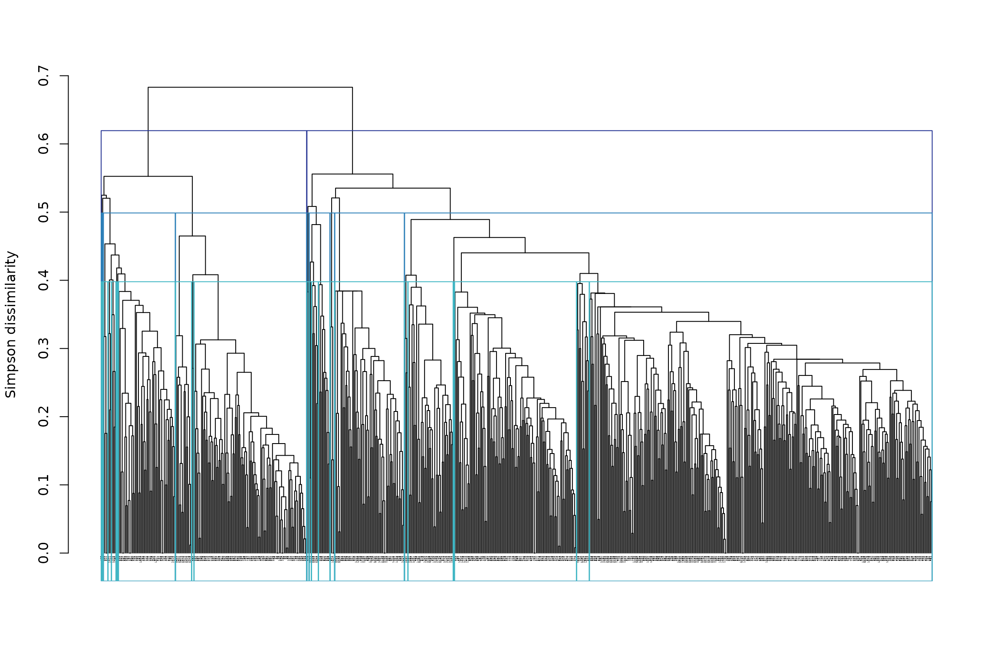

The plot is not easy to read because of the large number of sites. We
can rather extract the information directly from the object:

``` r

tree1
```

    ## Clustering results for algorithm : hclu_hierarclust 
    ##  (hierarchical clustering based on a dissimilarity matrix)
    ##  - Number of sites:  715 
    ##  - Name of dissimilarity metric:  Simpson 
    ##  - Tree construction method:  average 
    ##  - Randomization of the dissimilarity matrix:  yes, number of trials 100 
    ##  - Method to compute the final tree:  Iterative hierarchical consensus tree 
    ##  - Cophenetic correlation coefficient:  0.701 
    ##  - Heights of cut requested by the user:  0.4 0.5 0.6 
    ## Clustering results:
    ##  - Number of partitions:  3 
    ##  - Partitions are hierarchical
    ##  - Number of clusters:  2 9 23 
    ##  - Height of cut of the hierarchical tree: 0.6 0.5 0.4

From the result, we can read that for the deep cut partition (h = 0.6)
we have clusters, for the intermediate cut partition (h = 0.5) we have 9
clusters and for the shallow cut partition (h = 0.4) we have 23
clusters.

Let’s look at the hierarchical structure of clusters with
[`summary()`](https://rdrr.io/r/base/summary.html):

``` r

summary(tree1)
```

    ## 
    ## Summary of clustering results
    ## =============================
    ## 
    ## Algorithm:  hclu_hierarclust 
    ## Number of sites:  715 
    ## Number of bioregionalizations:  3 
    ## Hierarchical clustering: Yes
    ## 
    ## Bioregionalization 1: K_2
    ## ------------------------- 
    ## Total clusters:  2 
    ## Top 2 clusters by size:
    ##   Cluster 1: 538 items
    ##   Cluster 2: 177 items
    ## 
    ## Bioregionalization 2: K_9
    ## ------------------------- 
    ## Total clusters:  9 
    ## Top 9 clusters by size:
    ##   Cluster 2: 454 items
    ##   Cluster 6: 113 items
    ##   Cluster 4: 62 items
    ##   Cluster 1: 60 items
    ##   Cluster 5: 18 items
    ##   Cluster 3: 4 items
    ##   Cluster 9: 2 items
    ##   Cluster 7: 1 items
    ##   Cluster 8: 1 items
    ## 
    ## Bioregionalization 3: K_23
    ## -------------------------- 
    ## Total clusters:  23 
    ## Top 10 clusters by size:
    ##   Cluster 2: 295 items
    ##   Cluster 7: 105 items
    ##   Cluster 11: 97 items
    ##   Cluster 1: 60 items
    ##   Cluster 5: 49 items
    ##   Cluster 3: 39 items
    ##   Cluster 8: 14 items
    ##   Cluster 12: 11 items
    ##   Cluster 21: 10 items
    ##   Cluster 9: 6 items
    ##   ... and 13 more cluster(s)
    ## 
    ## Hierarchical structure
    ## ======================
    ## 
    ## 1 (n=538)
    ## ├─1 (n=60)
    ## │ └─1 (n=60)
    ## ├─2 (n=454)
    ## │ ├─10 (n=3)
    ## │ ├─12 (n=11)
    ## │ ├─2 (n=295)
    ## │ ├─23 (n=1)
    ## │ ├─3 (n=39)
    ## │ └─7 (n=105)
    ## ├─3 (n=4)
    ## │ └─4 (n=4)
    ## ├─5 (n=18)
    ## │ ├─21 (n=10)
    ## │ ├─6 (n=2)
    ## │ └─9 (n=6)
    ## └─9 (n=2)
    ##   └─22 (n=2)
    ## 
    ## 2 (n=177)
    ## ├─4 (n=62)
    ## │ ├─13 (n=4)
    ## │ ├─14 (n=3)
    ## │ ├─17 (n=4)
    ## │ ├─18 (n=1)
    ## │ ├─19 (n=1)
    ## │ └─5 (n=49)
    ## ├─6 (n=113)
    ## │ ├─11 (n=97)
    ## │ ├─16 (n=2)
    ## │ └─8 (n=14)
    ## ├─7 (n=1)
    ## │ └─15 (n=1)
    ## └─8 (n=1)
    ##   └─20 (n=1)

Here is how the maps look like:

``` r

#for(i in 2:ncol(tree1$clusters)){
#  map_bioregions(tree1$clusters[, c(1, i)], vegesf)
#}
```

In the next section we will see what are the default settings and why we
chose them, and then we will see how to find optimal numbers of
clusters.

### 2.2 Exploring the outputs

To explore the object, you can use
[`str()`](https://rdrr.io/r/utils/str.html) to see the object structure:

``` r

str(tree1)
```

    ##  $ name        : chr "hclu_hierarclust"
    ##  $ args        :List of 20
    ##   ..$ index              : chr "Simpson"
    ##   ..$ method             : chr "average"
    ##   ..$ randomize          : logi TRUE
    ##   ..$ seed               : NULL
    ##   ..$ n_runs             : num 100
    ##   ..$ optimal_tree_method: chr "ihct"
    ##   ..$ keep_trials        : chr "no"
    ##   ..$ n_clust            : NULL
    ##   ..$ cut_height         : num [1:3] 0.4 0.5 0.6
    ##   ..$ find_h             : logi TRUE
    ##   ..$ h_max              : num 1
    ##   ..$ h_min              : num 0
    ##   ..$ consensus_p        : num 0.5
    ##   ..$ show_hierarchy     : logi FALSE
    ##   ..$ ihct_top_n_trees   : num 2
    ##   ..$ ihct_variation_drop: num 0.2
    ##   ..$ ihct_sites_drop    : num 10
    ##   ..$ ihct_height_rule   : chr "least_squares"
    ##   ..$ verbose            : logi TRUE
    ##   ..$ dynamic_tree_cut   : logi FALSE
    ##  $ inputs      :List of 9
    ##   ..$ bipartite      : logi FALSE
    ##   ..$ weight         : logi TRUE
    ##   ..$ pairwise       : logi TRUE
    ##   ..$ pairwise_metric: chr "Simpson"
    ##   ..$ dissimilarity  : logi TRUE
    ##   ..$ nb_sites       : int 715
    ##   ..$ data_type      : chr "occurrence"
    ##   ..$ node_type      : chr "site"
    ##   ..$ hierarchical   : logi TRUE
    ##  $ algorithm   :List of 6
    ##   ..$ final.tree         :List of 5
    ##   .. ..- attr(*, "class")= chr "hclust"
    ##   ..$ final.tree.coph.cor: num 0.701
    ##   ..$ final.tree.msd     : num 0.0221
    ##   ..$ trials             : chr "Trials not stored in output"
    ##   ..$ output_n_clust     : Named int [1:3] 2 9 23
    ##   .. ..- attr(*, "names")= chr [1:3] "h_0.6" "h_0.5" "h_0.4"
    ##   ..$ output_cut_height  : num [1:3] 0.6 0.5 0.4
    ##  $ clusters    :'data.frame':    715 obs. of  4 variables:
    ##   ..$ ID  : chr [1:715] "1003" "1004" "1005" "1006" ...
    ##   ..$ K_2 : chr [1:715] "1" "1" "1" "1" ...
    ##   ..$ K_9 : chr [1:715] "1" "1" "1" "1" ...
    ##   ..$ K_23: chr [1:715] "1" "1" "1" "1" ...
    ##   ..- attr(*, "node_type")= chr [1:715] "site" "site" "site" "site" ...
    ##  $ cluster_info:'data.frame':    3 obs. of  3 variables:
    ##   ..$ partition_name      : chr [1:3] "K_2" "K_9" "K_23"
    ##   ..$ n_clust             : int [1:3] 2 9 23
    ##   ..$ requested_cut_height: num [1:3] 0.6 0.5 0.4

It show you the different slots in the object, and how you can access
them. For example, if I want to access the `clusters` slot, I have to
type `tree1$clusters`.

- **name**: the name of the method we are using
- **args**: the arguments you have selected for your tree
- **inputs**: this is mostly for internal use in the package, it
  provides some info about the nature of input data and methods
- **algorithm**: this slot contains detailed information about the
  hierarchical clustering. For example, you can have access to the raw
  tree here, in `hclust` format. To access it, I can type
  `tree1$algorithm$final.tree`
- **clusters**: this is a `data.frame` containing your partitions. The
  first column is your sites, and all the other columns are the
  partitions.
- **cluster_info**: this is a small `data.frame` which will help you
  link your requests with the `clusters` `data.frame`. Its content
  varies depending on your choices; for example, in my case, it looks
  like this:

``` r

tree1$cluster_info
```

    ##       partition_name n_clust requested_cut_height
    ## h_0.6            K_2       2                  0.6
    ## h_0.5            K_9       9                  0.5
    ## h_0.4           K_23      23                  0.4

It shows the name of the partition (corresponding to column names in
`tree1$clusters`), the number of clusters in each partition, and the cut
height I initially requested.

### 2.3 Explanation of the default settings and how to change them

#### 2.3.1 Randomization of the distance matrix

The order of sites in the distance matrix influences the outcome of the
hierarchical tree. Let’s see that with an example:

``` r

# Compute the tree without randomizing the distance matrix
tree2 <- hclu_hierarclust(dissim,
                          randomize = FALSE)
plot(tree2, cex = .1)
```

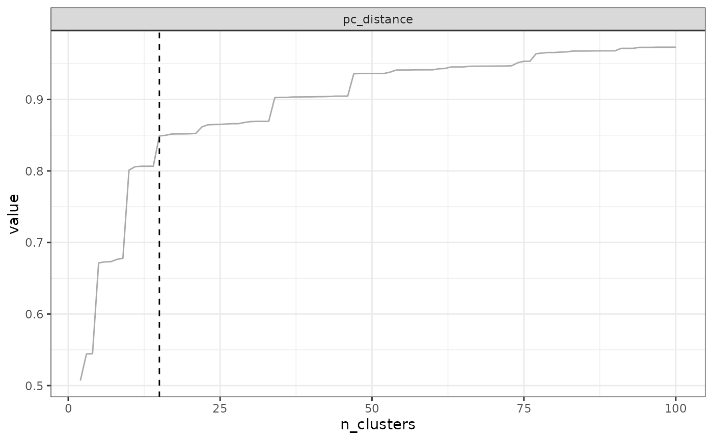

This is how the tree looks like when the matrix is not randomized. Now
let’s randomize it and regenerate the tree:

``` r

# This line randomizes the order of rows in the distance matrix
dissim_random <- dissim[sample(1:nrow(dissim)), ]

# Recompute the tree
tree3 <- hclu_hierarclust(dissim_random,
                          randomize = FALSE)
plot(tree3, cex = .1)
```


See how the tree looks different? This is problematic because it means
that the outcome is heavily influenced by the order of sites in the
distance matrix.

To address this issue, we have developed an iterative algorithm that
will reconstruct the entire tree from top to bottom, by selecting for
each branch a majority decision among multiple randomizations of the
distance matrix (100 times by default, can be increased). This method is
called **Iterative Hierarchical Consensus Tree** (argument
`optimal_tree_method = "ihct"`, default value) and it ensures that you
obtain a consensus tree that it will find a majority decision for each
branch of the tree. The tree produced with this method generally have a
better topology than any individual tree. We estimate the performance of
the topology with the **cophenetic correlation coefficient**, which is
the *correlation between the initial distance \\\beta\_{sim}\\ among
sites* and *the cophenetic distance*, which is the distance at which
sites are connected in the tree. It tells us how representative is the
tree of the initial distance matrix.

Although this method performs better than any other available method, it
comes with a computing cost: it needs to randomize the distance matrix
multiple times for each branching of the tree. Therefore, we recommend
using it to obtain a robust tree - be patient in that case. Otherwise,
if you only need a very fast look at a *good* tree, you can simply
select the single best tree among multiple randomization trials. It will
never be as good as the **Iterative Hierarchical Consensus Tree**, but
it will be a best choice for a fast exploration. To do that, choose
`optimal_tree_method = "best"`. It will select the tree that best
represents the distance matrix; i.e., the one that has the highest
cophenetic correlation coefficient among all trials.

Let’s see an example of `optimal_tree_method = "best"`. We can also  
ask the function to keep all individual trees for further exploration  
with `keep_trials = "all"` (including, for each trial, the randomized
matrix,  
the associated tree, and metrics for that tree).  
By default, `keep_trials = "no"` and `keep_trials = "metrics"` can be
used to  
keep only the metrics associated with each tree.

``` r

tree_best <- hclu_hierarclust(dissim_random,
                              randomize = TRUE,
                              optimal_tree_method = "best",
                              keep_trials = "all")
```

Another possible approach is to build a simple consensus tree among all
the trials. However, we generally do not recommend constructing a
consensus tree, because the topology of simple consensus trees can be
very problematic if there are a lot of ties in the distance matrix.
Let’s see it in action here:

``` r

tree_consensus <- hclu_hierarclust(dissim_random,
                                   randomize = TRUE,
                                   optimal_tree_method = "consensus",
                                   keep_trials = "no")
```

See how the cophenetic correlation coefficient for the consensus tree is
terrible compared to the IHCT and best tree ?

This consensus tree has almost no correlation with our initial distance
matrix. This is because its topology is terribly wrong, see how the tree
looks like:

``` r

plot(tree_consensus)
```


Booo, this is just a large rake, not a tree!!!

#### 2.3.2 Tree construction algorithm

By default, the function uses the UPGMA method (Unweighted Pair Group
Method with Arithmetic Mean) because it has been recommended in
bioregionalization for its better performance over other approaches
(Kreft & Jetz, 2010). You can change this method by changing the
argument `method`; all methods implemented in
[`stats::hclust()`](https://rdrr.io/r/stats/hclust.html) are available.

Note that the current height distances for methods `method = "ward.D"`
and `method = "ward.D2"` may differ from the calculations in
[`stats::hclust()`](https://rdrr.io/r/stats/hclust.html), due to the
iterative nature of the algorithm. In addition, using the method
`method = "single"` are much slower than the other approaches, and we
have not yet implemented a workaround to make it faster (do not hesitate
to contact us if you need a faster implementation or have an idea of how
to make it run faster).

#### 2.3.3 Cutting the tree

There are three ways of cutting the tree:

1.  **Specify the expected number of clusters**: you can request a
    specific number of clusters (`n_clust = 5` for example). You can
    also request multiple partitions, each with their own number of
    clusters (`n_clust = c(5, 10, 15)`) for example.

**Note:** When you specify the number of clusters, the function will
search for the associated height of cut automatically; you can disable
this parameter with `find_h = FALSE`. It will search for this *h* value
between `h_max` (default 1) and `h_min` (default 0). These arguments can
be adjusted if you are working with indices whose values do not range
between 0 and 1.

2.  **Specify the height of cut**: you can request the height at which
    you want to cut the tree (e.g., `cut_height = 0.5`). You can also
    request multiple partitions, each with their own cut height
    (`cut_height = c(0.4, 0.5, 0.6)`) for example.

3.  **Use a dynamic tree cut method**: Rather than cutting the entire
    tree at once, this alternative approach consists in cutting
    individual branches at different heights. This method can be
    requested by using `dynamic_tree_cut = TRUE`, and is based on the
    dynamicTreeCut R package.

### 2.4. Divisive clustering

While the agglomerative hierarchical clustering in the previous
subsections followed a bottom-up approach, divisive clustering follows a
top-down approach. This means that in the first step of the clustering,
all sites belong to the same bioregion, and then sites are iteratively
divided into different bioregions until all sites belong to a unique
bioregion.

Divisive clustering is following the DIvisive ANAlysis (DIANA)
clustering algorithm described in (Kaufman & Rousseeuw, 2009).

At each step, the algorithm splits the largest cluster by identifying
the most dissimilar observation (i.e. site) and then putting sites that
are closer to this most dissimilar observation than to the ‘old party’
group into a splinter group. The result is that the large cluster is
split into two clusters.

The function `hclu_diana` performs the Diana divisive clustering.

``` r

# Compute the tree with the Diana algorithm
tree_diana <- hclu_diana(dissim)

plot(tree_diana)
```

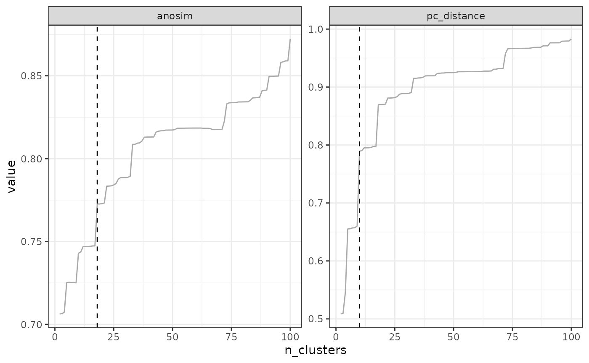

## 3. How to find an optimal number of clusters?


1.  Step 1. **Build a tree** with
    [`hclu_hierarclust()`](https://bioRgeo.github.io/bioregion/reference/hclu_hierarclust.md)

2.  Step 2. **Explore a range of partitions**, from a minimum (e.g.,
    starting at 2 clusters) up to a maximum (e.g. \\n-1\\ clusters where
    \\n\\ is the number of sites).

3.  Step 3. **Calculate one or several metrics for each partition**, to
    be used as the basis for evaluation plots.

4.  Step 4. **Search for one or several optimal number(s) of clusters
    using evaluation plots**. Different criteria can be applied to
    identify the optimal number(s) of clusters.

5.  Step 5. **Export the optimal partitions from your cluster object.**

### 3.1 A practical example

In this example we will compute the evaluation metric used by Holt *et
al.* (2013), which compares the total dissimilarity with the
inter-cluster dissimilarity (sum of distances between clusters). Then we
will choose the optimal number of clusters as the elbow of the
evaluation plot.

``` r

data(vegemat)

# Calculate dissimilarities
dissim <- dissimilarity(vegemat)

# Step 1 & 2. Compute the tree and cut it into many different partitions
tree4 <- hclu_hierarclust(dissim,
                          n_clust = 2:100)

# Step 3. Calculate the same evaluation metric as Holt et al. 2013
eval_tree4 <- bioregionalization_metrics(tree4, 
                                         eval_metrics = "prop_between_dissim",
                                         dissimilarity = dissim)

# Step 4. Find the optimal number of clusters
opti_n_tree4 <- find_optimal_n(eval_tree4)
```

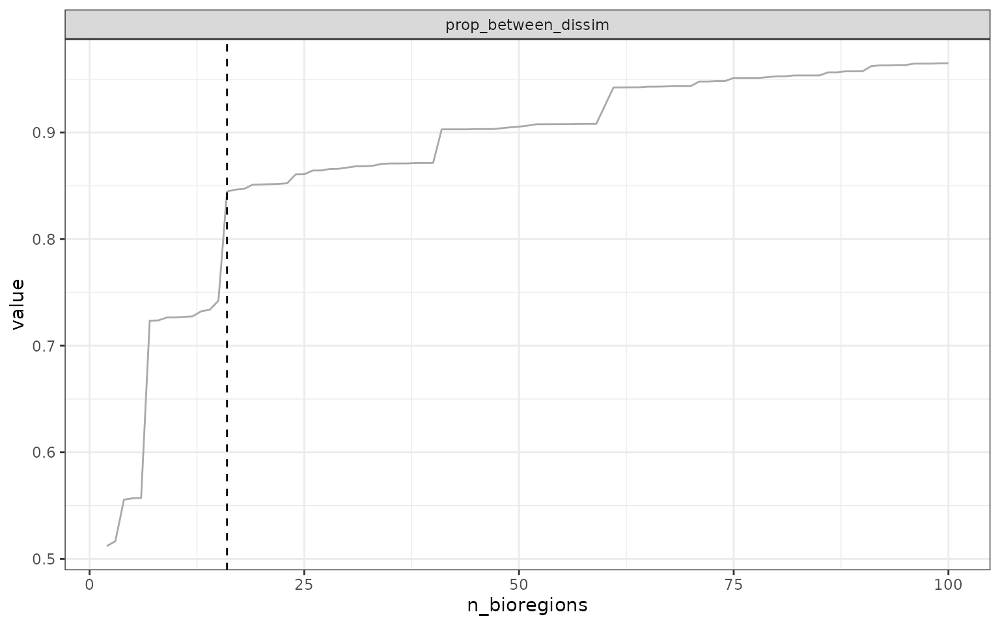

``` r

opti_n_tree4
```

    ## Search for an optimal number of clusters:
    ##  - 99  partition(s) evaluated
    ##  - Range of clusters explored: from  2  to  100 
    ##  - Evaluated metric(s):  prop_between_dissim 
    ## 
    ## Potential optimal partition(s):
    ##  - Criterion chosen to optimise the number of clusters:  elbow 
    ##  - Optimal partition(s) of clusters for each metric:

``` r

# Step 5. Extract the optimal number of clusters
# We get the name of the correct partition in the next line
K_name <- opti_n_tree4$evaluation_df$partition[opti_n_tree4$evaluation_df$optimal_n_prop_between_dissim]
# Look at the site-cluster table
head(tree4$clusters[, c("ID", K_name)])
```

    ##        ID K_16
    ## 1003 1003    1
    ## 1004 1004    1
    ## 1005 1005    1
    ## 1006 1006    1
    ## 1007 1007    1
    ## 1008 1008    1

``` r

# Make a map of the clusters
#data("vegesf")
#library("sf")
#map_bioregions(tree4$clusters[, c("ID", K_name)], vegesf)
```

Or if you are allergic to lines of code, you could also simply recut
your tree at the identified optimal number of cut-offs with
[`cut_tree()`](https://bioRgeo.github.io/bioregion/reference/cut_tree.md).

### 3.2 Evaluation metrics

Currently, there are four evaluation metrics available in the package
described
[here](https://biorgeo.github.io/bioregion/articles/a5_2_summary_metrics.html#bioregionalization).

**Important note**

To be able to calculate `prop_between_dissim` and `anosim`, you need to
provide your dissimilarity object to the argument `dissimilarity`. In
addition, to be able to calculate `mean_endemics` and `tot_endemics`,
you need to provide your species-site co-occurrence matrix to the
argument `comat`.

Let’s see that in practice. Depending on the size of your dataset,
computing endemism-based metrics can take a while.

``` r

# Calculate prop_between_dissim and anosim
bioregionalization_metrics(tree4, 
                           eval_metrics = c("prop_between_dissim", "anosim"),
                           dissimilarity = dissim)
```

    ##    partition n_bioregions prop_between_dissim    anosim
    ## 1        K_2            2           0.5119835 0.7023016
    ## 2        K_3            3           0.5165863 0.7038016
    ## 3        K_4            4           0.5555531 0.7065607
    ## 4        K_5            5           0.5568160 0.7059239
    ## 5        K_6            6           0.5572628 0.7058640
    ## 6        K_7            7           0.7234545 0.7397239
    ## 7        K_8            8           0.7237522 0.7399334
    ## 8        K_9            9           0.7264643 0.7413423
    ## 9       K_10           10           0.7264995 0.7413497
    ## 10    K_12_1           12           0.7275783 0.7413928
    ## 11    K_12_2           12           0.7275783 0.7413928
    ## 12      K_13           13           0.7323364 0.7418928
    ## 13      K_14           14           0.7337700 0.7420267
    ## 14      K_15           15           0.7422624 0.7416167
    ## 15      K_16           16           0.8446922 0.7893431
    ## 16      K_17           17           0.8464397 0.7907869
    ## 17      K_18           18           0.8471819 0.7913035
    ## 18    K_19_1           19           0.8510755 0.7939484
    ## 19    K_19_2           19           0.8510755 0.7939484
    ## 20    K_19_3           19           0.8510755 0.7939484
    ## 21      K_22           22           0.8517974 0.7944725
    ## 22      K_23           23           0.8523847 0.7946816
    ## 23      K_24           24           0.8607463 0.8002397
    ## 24      K_25           25           0.8608632 0.8003071
    ## 25      K_26           26           0.8643934 0.8017103
    ## 26      K_27           27           0.8644199 0.8017220
    ## 27      K_28           28           0.8658456 0.8022027
    ## 28    K_29_1           29           0.8659844 0.8022323
    ## 29    K_29_2           29           0.8659844 0.8022323
    ## 30      K_31           31           0.8683174 0.8029426
    ## 31      K_32           32           0.8683203 0.8029430
    ## 32      K_33           33           0.8688860 0.8031397
    ## 33      K_34           34           0.8705847 0.8034989
    ## 34      K_35           35           0.8709676 0.8035794
    ## 35      K_36           36           0.8709818 0.8035808
    ## 36      K_37           37           0.8710215 0.8035858
    ## 37      K_38           38           0.8713743 0.8036335
    ## 38      K_39           39           0.8713827 0.8036326
    ## 39      K_40           40           0.8714715 0.8036496
    ## 40      K_41           41           0.9029777 0.8163607
    ## 41      K_42           42           0.9029942 0.8163701
    ## 42      K_43           43           0.9029969 0.8163714
    ## 43      K_44           44           0.9030051 0.8163742
    ## 44      K_45           45           0.9032491 0.8164615
    ## 45      K_46           46           0.9032627 0.8164672
    ## 46    K_47_1           47           0.9032979 0.8164869
    ## 47    K_47_2           47           0.9032979 0.8164869
    ## 48      K_49           49           0.9048841 0.8171194
    ## 49      K_50           50           0.9055191 0.8171865
    ## 50      K_51           51           0.9064402 0.8174775
    ## 51      K_52           52           0.9077569 0.8180749
    ## 52      K_53           53           0.9077932 0.8180822
    ## 53      K_54           54           0.9078164 0.8180862
    ## 54      K_55           55           0.9078468 0.8180796
    ## 55      K_56           56           0.9078569 0.8180760
    ## 56      K_57           57           0.9080844 0.8180236
    ## 57      K_58           58           0.9081071 0.8180173
    ## 58    K_59_1           59           0.9081523 0.8180095
    ## 59    K_59_2           59           0.9081523 0.8180095
    ## 60      K_61           61           0.9423177 0.8299331
    ## 61      K_62           62           0.9423473 0.8299712
    ## 62      K_63           63           0.9424308 0.8301351
    ## 63      K_64           64           0.9424430 0.8301460
    ## 64      K_65           65           0.9430171 0.8305961
    ## 65      K_66           66           0.9430318 0.8306099
    ## 66      K_67           67           0.9432103 0.8307496
    ## 67      K_68           68           0.9435381 0.8311228
    ## 68      K_69           69           0.9435405 0.8311233
    ## 69      K_70           70           0.9435598 0.8311327
    ## 70      K_71           71           0.9478587 0.8337823
    ## 71      K_72           72           0.9478658 0.8337851
    ## 72      K_73           73           0.9482874 0.8342391
    ## 73      K_74           74           0.9482922 0.8342400
    ## 74      K_75           75           0.9511909 0.8369696
    ## 75      K_76           76           0.9512219 0.8370073
    ## 76      K_77           77           0.9512290 0.8370185
    ## 77    K_78_1           78           0.9512338 0.8370198
    ## 78    K_78_2           78           0.9512338 0.8370198
    ## 79      K_80           80           0.9527677 0.8384965
    ## 80      K_81           81           0.9527748 0.8385010
    ## 81      K_82           82           0.9535339 0.8390197
    ## 82      K_83           83           0.9535386 0.8390213
    ## 83      K_84           84           0.9535433 0.8390230
    ## 84      K_85           85           0.9535784 0.8390487
    ## 85      K_86           86           0.9564732 0.8416570
    ## 86      K_87           87           0.9564755 0.8416576
    ## 87      K_88           88           0.9573813 0.8424440
    ## 88      K_89           89           0.9574045 0.8424545
    ## 89      K_90           90           0.9574643 0.8425001
    ## 90      K_91           91           0.9621875 0.8472390
    ## 91      K_92           92           0.9630122 0.8483256
    ## 92      K_93           93           0.9630168 0.8483276
    ## 93      K_94           94           0.9633024 0.8485970
    ## 94      K_95           95           0.9633295 0.8486201
    ## 95      K_96           96           0.9646178 0.8498513
    ## 96      K_97           97           0.9646493 0.8498770
    ## 97      K_98           98           0.9646515 0.8498776
    ## 98      K_99           99           0.9649678 0.8501374
    ## 99     K_100          100           0.9650300 0.8502351

``` r

# Calculate mean_endemics and tot_endemics
bioregionalization_metrics(tree4,
                           eval_metrics = c("mean_endemics", "tot_endemics"),
                           dissimilarity = NULL,
                           comat = vegemat)
```

    ##    partition n_bioregions mean_endemics tot_endemics
    ## 1        K_2            2   0.183770960   0.31674331
    ## 2        K_3            3   0.122136018   0.31539086
    ## 3        K_4            4   0.083424624   0.28022721
    ## 4        K_5            5   0.066707139   0.27968623
    ## 5        K_6            6   0.055631686   0.27968623
    ## 6        K_7            7   0.022231814   0.10954828
    ## 7        K_8            8   0.019455424   0.10954828
    ## 8        K_9            9   0.017324737   0.10927779
    ## 9       K_10           10   0.015594565   0.10927779
    ## 10    K_12_1           12   0.012929653   0.10873681
    ## 11    K_12_2           12   0.012929653   0.10873681
    ## 12      K_13           13   0.012258443   0.10170408
    ## 13      K_14           14   0.011362421   0.10143359
    ## 14      K_15           15   0.010326698   0.09710576
    ## 15      K_16           16   0.009180198   0.08709765
    ## 16      K_17           17   0.008687028   0.08709765
    ## 17      K_18           18   0.008193279   0.08682716
    ## 18    K_19_1           19   0.007729305   0.08628618
    ## 19    K_19_2           19   0.007729305   0.08628618
    ## 20    K_19_3           19   0.007729305   0.08628618
    ## 21      K_22           22   0.006631785   0.08574520
    ## 22      K_23           23   0.006136322   0.08249932
    ## 23      K_24           24   0.005841894   0.08141737
    ## 24      K_25           25   0.005611593   0.08141737
    ## 25      K_26           26   0.005358477   0.08060590
    ## 26      K_27           27   0.005160782   0.08060590
    ## 27      K_28           28   0.004977251   0.08006492
    ## 28    K_29_1           29   0.004807376   0.08006492
    ## 29    K_29_2           29   0.004807376   0.08006492
    ## 30      K_31           31   0.004560544   0.08006492
    ## 31      K_32           32   0.004418027   0.08006492
    ## 32      K_33           33   0.004272639   0.07952394
    ## 33      K_34           34   0.004154962   0.07898296
    ## 34      K_35           35   0.004022500   0.07871247
    ## 35      K_36           36   0.003912318   0.07871247
    ## 36      K_37           37   0.003808543   0.07871247
    ## 37      K_38           38   0.003724374   0.07871247
    ## 38      K_39           39   0.003628877   0.07871247
    ## 39      K_40           40   0.003538764   0.07871247
    ## 40      K_41           41   0.003434501   0.07708953
    ## 41      K_42           42   0.003361965   0.07708953
    ## 42      K_43           43   0.003283780   0.07708953
    ## 43      K_44           44   0.003209149   0.07708953
    ## 44      K_45           45   0.003128953   0.07681904
    ## 45      K_46           46   0.003060933   0.07681904
    ## 46    K_47_1           47   0.003019061   0.07681904
    ## 47    K_47_2           47   0.003019061   0.07681904
    ## 48      K_49           49   0.002901561   0.07654855
    ## 49      K_50           50   0.002882141   0.07654855
    ## 50      K_51           51   0.002839677   0.07654855
    ## 51      K_52           52   0.002785182   0.07573708
    ## 52      K_53           53   0.002734109   0.07573708
    ## 53      K_54           54   0.002686496   0.07573708
    ## 54      K_55           55   0.002640495   0.07573708
    ## 55      K_56           56   0.002593343   0.07573708
    ## 56      K_57           57   0.002589729   0.07546659
    ## 57      K_58           58   0.002546292   0.07546659
    ## 58    K_59_1           59   0.002509746   0.07546659
    ## 59    K_59_2           59   0.002509746   0.07546659
    ## 60      K_61           61   0.002423777   0.07465513
    ## 61      K_62           62   0.002384684   0.07465513
    ## 62      K_63           63   0.002390713   0.07465513
    ## 63      K_64           64   0.002354293   0.07465513
    ## 64      K_65           65   0.002295691   0.07384366
    ## 65      K_66           66   0.002245494   0.07357317
    ## 66      K_67           67   0.002205711   0.07330268
    ## 67      K_68           68   0.002157416   0.07276170
    ## 68      K_69           69   0.002129228   0.07276170
    ## 69      K_70           70   0.002100465   0.07276170
    ## 70      K_71           71   0.002071558   0.07276170
    ## 71      K_72           72   0.002042786   0.07276170
    ## 72      K_73           73   0.002030298   0.07276170
    ## 73      K_74           74   0.002014902   0.07276170
    ## 74      K_75           75   0.001679035   0.05680281
    ## 75      K_76           76   0.001642836   0.05626183
    ## 76      K_77           77   0.001621501   0.05626183
    ## 77    K_78_1           78   0.001600712   0.05626183
    ## 78    K_78_2           78   0.001600712   0.05626183
    ## 79      K_80           80   0.001567895   0.05626183
    ## 80      K_81           81   0.001549627   0.05626183
    ## 81      K_82           82   0.001530818   0.05626183
    ## 82      K_83           83   0.001512375   0.05626183
    ## 83      K_84           84   0.001494370   0.05626183
    ## 84      K_85           85   0.001506952   0.05599134
    ## 85      K_86           86   0.001492551   0.05599134
    ## 86      K_87           87   0.001475395   0.05599134
    ## 87      K_88           88   0.001454665   0.05572085
    ## 88      K_89           89   0.001438320   0.05572085
    ## 89      K_90           90   0.001422400   0.05572085
    ## 90      K_91           91   0.001410120   0.05545037
    ## 91      K_92           92   0.001390216   0.05517988
    ## 92      K_93           93   0.001375268   0.05517988
    ## 93      K_94           94   0.001350821   0.05463890
    ## 94      K_95           95   0.001344325   0.05463890
    ## 95      K_96           96   0.001330448   0.05463890
    ## 96      K_97           97   0.001318048   0.05463890
    ## 97      K_98           98   0.001304599   0.05463890
    ## 98      K_99           99   0.001291421   0.05463890
    ## 99     K_100          100   0.001278507   0.05463890

### 3.2 Criteria to choose an optimal number of clusters

Choosing the optimal number of clusters is a long-standing issue in the
literature, and there is no absolute and objective answer to this
question. A plethora of methods have been proposed over the years, and
the best approach to tackle this issue is probably to compare the
results of multiple approaches to make an informed decision.

In the `bioregion` package, we have implemented several methods that are
specifically suited for bioregionalization analysis.

For example, a standard criterion used for identifying the optimal
number of clusters is the **elbow method**, which is the default
criterion in
[`find_optimal_n()`](https://bioRgeo.github.io/bioregion/reference/find_optimal_n.md).
However, we recommend moving beyond the paradigm of a single optimal
number of clusters, which is likely an oversimplification of the
hierarchy of the tree. We recommend considering multiple cuts of the
tree, and we provide several methods for doing so: **identifying large
steps in the curve** or **using multiple cutoffs**. Additionally, we
implement other approaches, such as using the maximum or minimum value
of the metrics, or by finding break points in the curve with a segmented
model.

Before we look at these different methods, we will compute all the
evaluation metrics and store them in `eval_tree4`:

``` r

eval_tree4 <- bioregionalization_metrics(tree4, 
                                         eval_metrics = "all",
                                         dissimilarity = dissim, 
                                         comat = vegemat)
```

#### 3.2.1 Elbow method

The elbow method consists in find the ‘elbow’ in the form of the
metric-cluster relationship. This method will typically work for metrics
which have an L-shaped form (typically, `prop_between_dissim` and
endemism metrics), but not for other metrics (e.g. the form of `anosim`
does not necessarily follow an L-shape).

*The rationale behind the elbow method is to find a cutoff above which
the metric values stop increasing significantly, such that adding new
clusters does not provide much significant improvement in the metric.*

The elbow method is the default method in
[`find_optimal_n()`](https://bioRgeo.github.io/bioregion/reference/find_optimal_n.md).
There are no parameters to adjust it. If the curve is not elbow-shaped,
it may give spurious results.

``` r

find_optimal_n(eval_tree4)
```


    ## Search for an optimal number of clusters:
    ##  - 99  partition(s) evaluated
    ##  - Range of clusters explored: from  2  to  100 
    ##  - Evaluated metric(s):  prop_between_dissim anosim mean_endemics tot_endemics 
    ## 
    ## Potential optimal partition(s):
    ##  - Criterion chosen to optimise the number of clusters:  elbow 
    ##  - Optimal partition(s) of clusters for each metric:

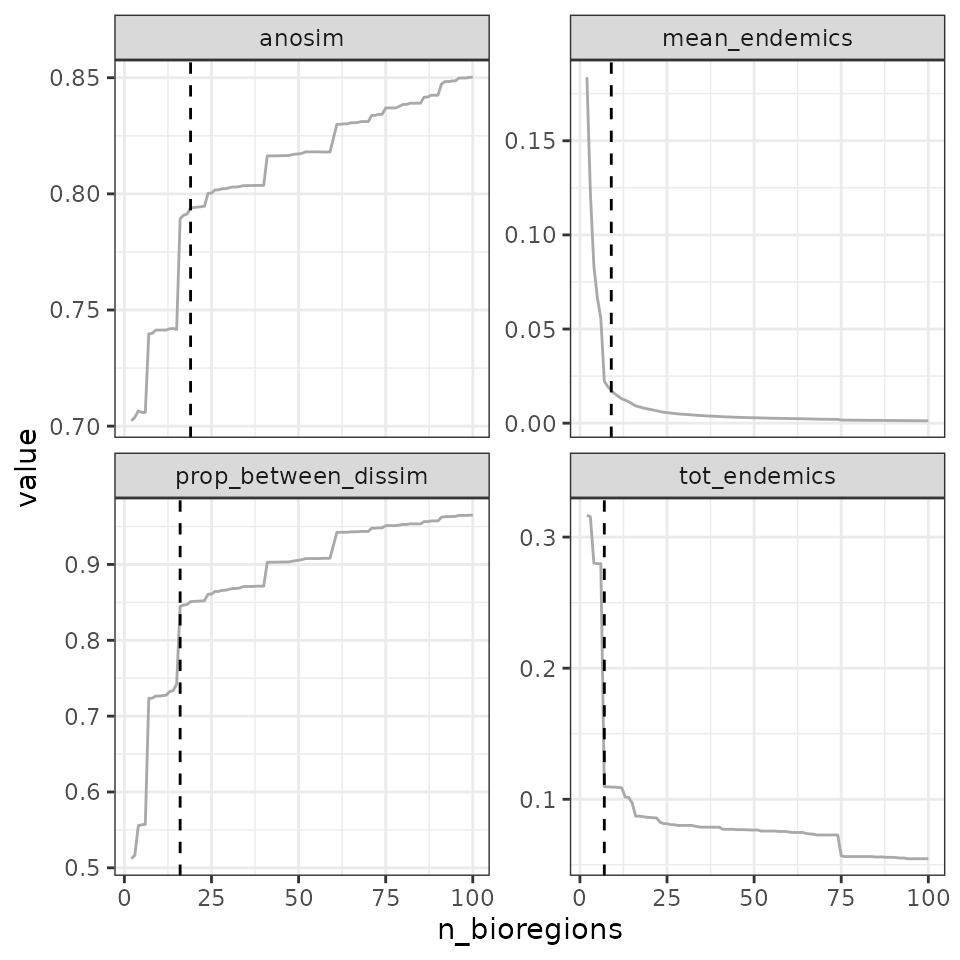

In our example above, the optimal number of clusters varies depending on
the metric, from a minimum of 7 to a maximum of 19. The final choice
depends on your metric preferences with respect to metrics, and your
objectives with the clustering. Alternatively, two cut-offs could be
used, a deep cut-off based on the endemism metrics e.g. at a value of 9,
and a shallow cutoff based on `prop_between_dissim`, at 16.

#### 3.2.2 Step method

The step method consists in identifying the largest “steps” in metrics,
i.e., the largest increases or decreases in the value of the metric.

To do this, the function calculates all successive differences in
metrics between partitions. It will then keep only the largest positive
differences (`increasing_step`) or negative differences
(`decreasing_step`). `increasing_step` is for increasing metrics
(`prop_between_dissim`) and `decreasing_step` is for decreasing metrics
(`Mean_Endemics` and `tot_endemics`). `anosim` values can either
increase or decrease depending on your dataset, so you would have to
explore both ways.

By default, the function selects the top 1% steps:

``` r

find_optimal_n(eval_tree4,
               metrics_to_use = c("anosim", "prop_between_dissim"),
               criterion = "increasing_step")
```

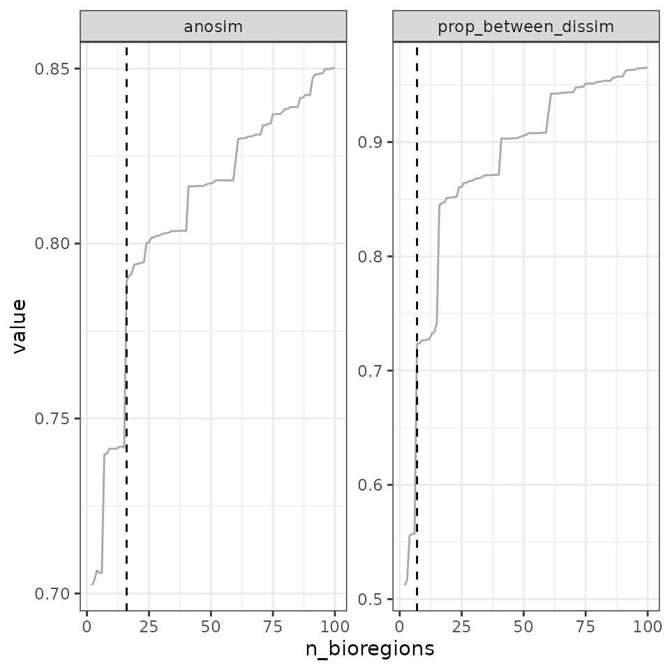

    ## Search for an optimal number of clusters:
    ##  - 99  partition(s) evaluated
    ##  - Range of clusters explored: from  2  to  100 
    ##  - Evaluated metric(s):  anosim prop_between_dissim 
    ## 
    ## Potential optimal partition(s):
    ##  - Criterion chosen to optimise the number of clusters:  increasing_step 
    ##    (step quantile chosen:  0.99  (i.e., only the top 1 %  increase  in evaluation metrics  are used as break points for the number of clusters)
    ##  - Optimal partition(s) of clusters for each metric:

``` r

find_optimal_n(eval_tree4,
               metrics_to_use = c("mean_endemics", "tot_endemics"),
               criterion = "decreasing_step")
```

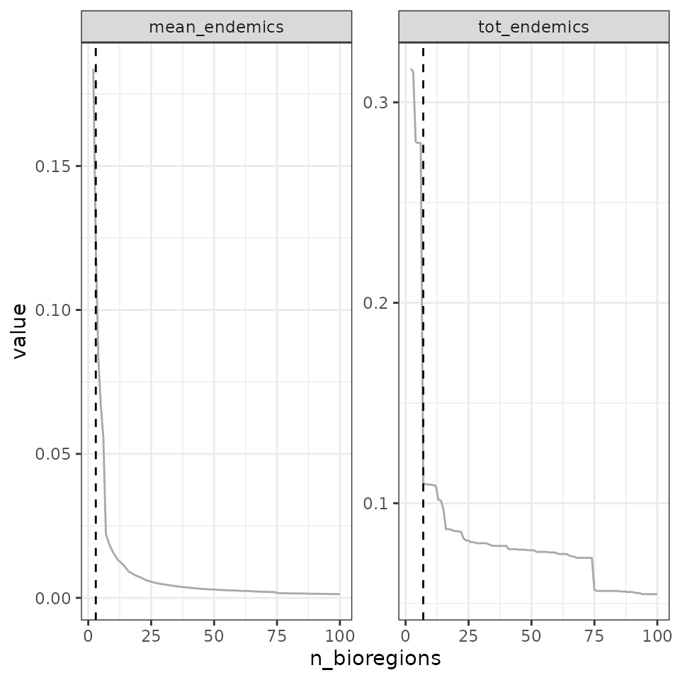

    ## Search for an optimal number of clusters:
    ##  - 99  partition(s) evaluated
    ##  - Range of clusters explored: from  2  to  100 
    ##  - Evaluated metric(s):  mean_endemics tot_endemics 
    ## 
    ## Potential optimal partition(s):
    ##  - Criterion chosen to optimise the number of clusters:  decreasing_step 
    ##    (step quantile chosen:  0.99  (i.e., only the top 1 %  decrease  in evaluation metrics  are used as break points for the number of clusters)
    ##  - Optimal partition(s) of clusters for each metric:

However, you can adjust it in two different ways. First, choose a number
of steps to select, e.g. to select the largest 3 steps, use
`step_levels = 3`:

``` r

find_optimal_n(eval_tree4,
               metrics_to_use = c("anosim", "prop_between_dissim"),
               criterion = "increasing_step",
               step_levels = 3)
```

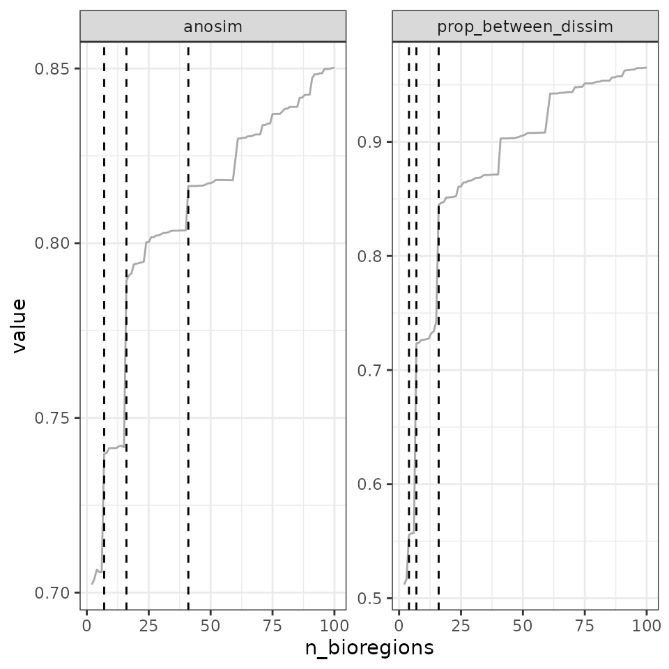

    ## Search for an optimal number of clusters:
    ##  - 99  partition(s) evaluated
    ##  - Range of clusters explored: from  2  to  100 
    ##  - Evaluated metric(s):  anosim prop_between_dissim 
    ## 
    ## Potential optimal partition(s):
    ##  - Criterion chosen to optimise the number of clusters:  increasing_step 
    ##    (step quantile chosen:  0.99  (i.e., only the top 1 %  increase  in evaluation metrics  are used as break points for the number of clusters)
    ##  - Optimal partition(s) of clusters for each metric:

Note that these steps generally correspond to large jumps in the tree,
which is why we like this approach as it fits well with the hierarchical
nature of the tree.

Second, you can set a quantile of steps to select, e.g. to select the 5%
largest steps set the quantile to 0.95 (`step_quantile = 0.95`):

``` r

find_optimal_n(eval_tree4,
               metrics_to_use = c("anosim", "prop_between_dissim"),
               criterion = "increasing_step",
               step_quantile = 0.95)
```

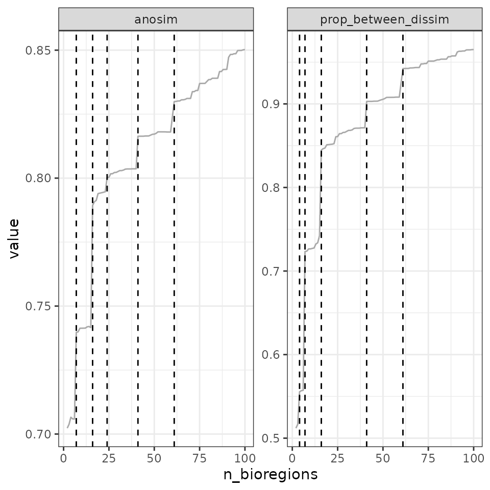

    ## Search for an optimal number of clusters:
    ##  - 99  partition(s) evaluated
    ##  - Range of clusters explored: from  2  to  100 
    ##  - Evaluated metric(s):  anosim prop_between_dissim 
    ## 
    ## Potential optimal partition(s):
    ##  - Criterion chosen to optimise the number of clusters:  increasing_step 
    ##    (step quantile chosen:  0.95  (i.e., only the top 5 %  increase  in evaluation metrics  are used as break points for the number of clusters)
    ##  - Optimal partition(s) of clusters for each metric:

Finally, a question that may arise is which cluster number to select
when a large step occurs. For example, if the largest step occurs
between partitions with 4 and 5 clusters, should we keep the partition
with 4 clusters, or the partition with 5 clusters?

By default, the function keeps the partition with \\N + 1\\ (5 clusters
in our example above). You can change this by setting
`step_round_above = FALSE`:

``` r

find_optimal_n(eval_tree4,
               metrics_to_use = c("anosim", "prop_between_dissim"),
               criterion = "decreasing_step",
               step_round_above = FALSE)
```

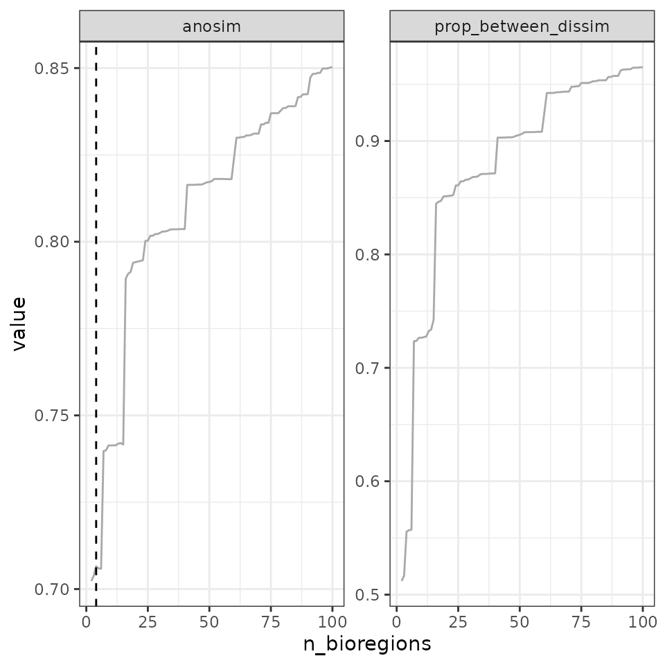

    ## Search for an optimal number of clusters:
    ##  - 99  partition(s) evaluated
    ##  - Range of clusters explored: from  2  to  100 
    ##  - Evaluated metric(s):  anosim prop_between_dissim 
    ## 
    ## Potential optimal partition(s):
    ##  - Criterion chosen to optimise the number of clusters:  decreasing_step 
    ##    (step quantile chosen:  0.99  (i.e., only the top 1 %  decrease  in evaluation metrics  are used as break points for the number of clusters)
    ##  - Optimal partition(s) of clusters for each metric:

#### 3.2.3 Cutting at different cut-off values

The idea of this method is to select specific metric values at which the
number of clusters should be used. For example, in their study, Holt *et
al.* (2013) used different cutoffs for `BetweenDissim` to find the
global biogeographic regions: 0.90, 0.95, 0.99, 0.999. The higher the
value, the more -diversity is explained, but also the more clusters
there are. Therefore, the choice is a trade-off between the total
-diversity explained and the number of clusters.

Eventually, the choice of these values depends on different factors:

1.  The geographic scope of your study. A global scale study can use
    large cutoffs like Holt *et al.* (2013) and end up with a reasonable
    number of clusters, whereas in regional to local scale studies with
    less endemism and more taxa shared among clusters, these values are
    too high, and other cutoffs should be explored, such as 0.5 and
    0.75.

2.  The characteristics of your study which will increase or decrease
    the degree of endemism among clusters: dispersal capacities of your
    taxonomic group, the connectivity/barriers in your study area, etc.
    Use lower cutoffs when you have a large number of widespread
    species, use higher cutoffs when you have high degrees of endemism.

3.  Using abundance or phylogenetic data to compute -diversity metrics
    may allow you to better distinguish clusters, which in turn will
    allow you to use higher cutoffs.

For example, in our case, a regional-scale study on vegetation, we can
use three cutoffs: 0.6 (deep cutoff), 0.8 (intermediate cutoff), and 0.9
(shallow cutoff).

``` r

find_optimal_n(eval_tree4,
               metrics_to_use = "prop_between_dissim",
               criterion = "cutoff",
               metric_cutoffs = c(.6, .8, .9))
```

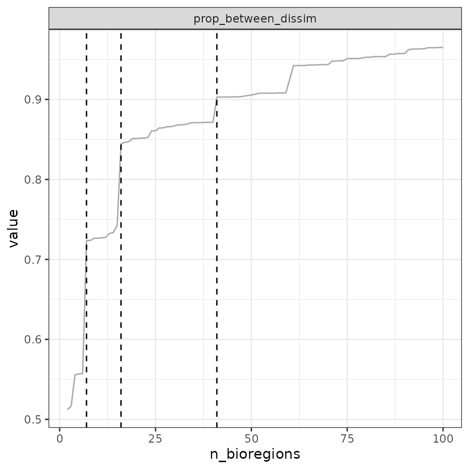

    ## Search for an optimal number of clusters:
    ##  - 99  partition(s) evaluated
    ##  - Range of clusters explored: from  2  to  100 
    ##  - Evaluated metric(s):  prop_between_dissim 
    ## 
    ## Potential optimal partition(s):
    ##  - Criterion chosen to optimise the number of clusters:  cutoff 
    ##    --> cutoff(s) chosen:  0.6 0.8 0.9 
    ##  - Optimal partition(s) of clusters for each metric:

#### 3.2.4 Cutting at the maximum or minimum metric value

This criterion finds the maximum (`criterion = "max"`) or minimum
(`criterion = "min"`) value of the metric in the list of partitions and
selects the corresponding partition. Such a criterion can be interesting
in the case of `anosim`, but is probably much less useful for the other
metrics implemented in the package.

#### 3.2.5 Finding break points in the curve

This criterion consists in applying a segmented regression model with
the formula evaluation metric ~ number of clusters. The user can define
the number of breaks to be identified on the curve. Note that such a
model is likely to require a minimum number of points to find an
appropriate number of clusters. In our example here, we make 100 cuts in
the tree to have enough values.

``` r

tree5 <- cut_tree(tree4,
                  cut_height = seq(0, max(tree4$algorithm$final.tree$height), 
                                   length = 100)) 

eval_tree5 <- bioregionalization_metrics(tree5, 
                                         eval_metrics = "all",
                                         dissimilarity = dissim, 
                                         comat = vegemat)

find_optimal_n(eval_tree5,
               criterion = "breakpoints")
```

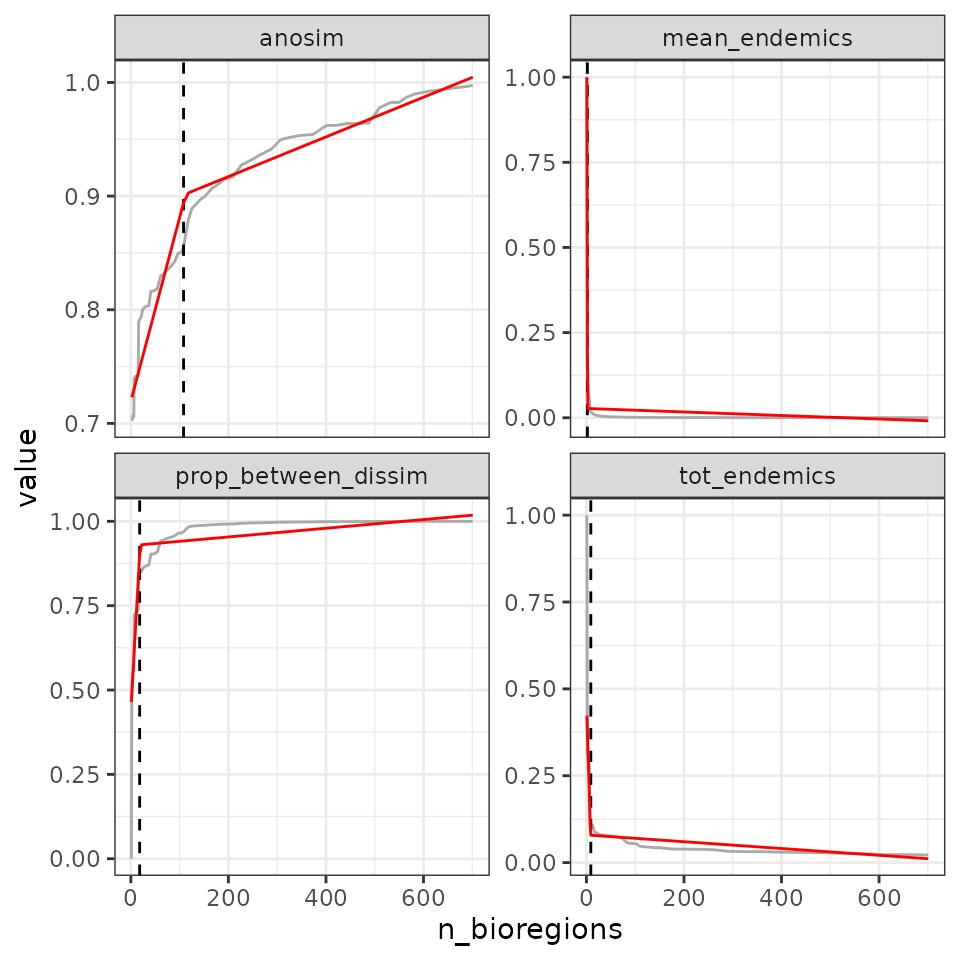

    ## Search for an optimal number of clusters:
    ##  - 100  partition(s) evaluated
    ##  - Range of clusters explored: from  1  to  701 
    ##  - Evaluated metric(s):  prop_between_dissim anosim mean_endemics tot_endemics 
    ## 
    ## Potential optimal partition(s):
    ##  - Criterion chosen to optimise the number of clusters:  breakpoints 
    ##  - Optimal partition(s) of clusters for each metric:

We can ask for a higher number of breaks:

- 2 breaks

``` r

find_optimal_n(eval_tree5,
               criterion = "breakpoints",
               n_breakpoints = 2)
```

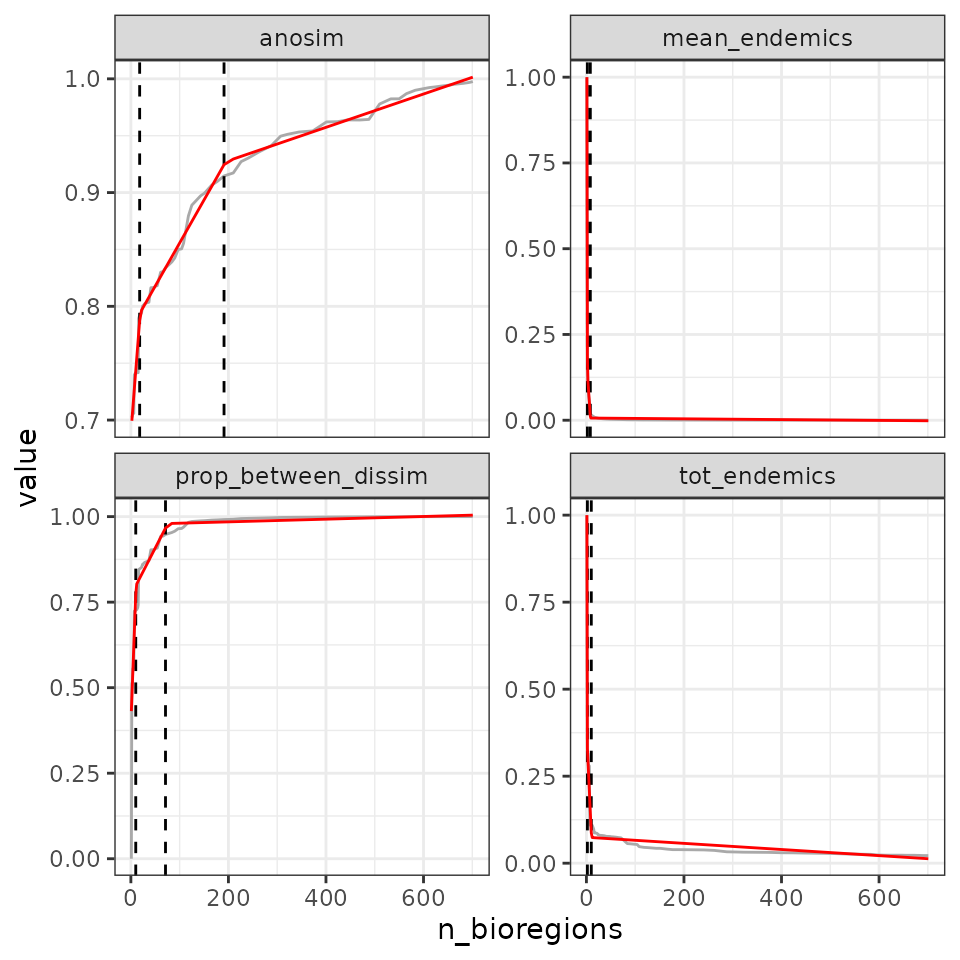

    ## Search for an optimal number of clusters:
    ##  - 100  partition(s) evaluated
    ##  - Range of clusters explored: from  1  to  701 
    ##  - Evaluated metric(s):  prop_between_dissim anosim mean_endemics tot_endemics 
    ## 
    ## Potential optimal partition(s):
    ##  - Criterion chosen to optimise the number of clusters:  breakpoints 
    ##  - Optimal partition(s) of clusters for each metric:

- 3 breaks

``` r

find_optimal_n(eval_tree5,
               criterion = "breakpoints",
               n_breakpoints = 3)
```

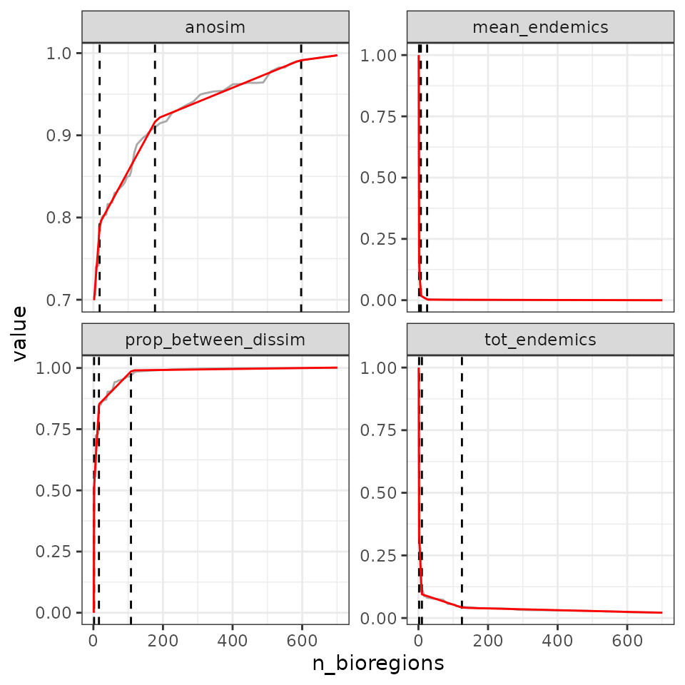

    ## Search for an optimal number of clusters:
    ##  - 100  partition(s) evaluated
    ##  - Range of clusters explored: from  1  to  701 
    ##  - Evaluated metric(s):  prop_between_dissim anosim mean_endemics tot_endemics 
    ## 
    ## Potential optimal partition(s):
    ##  - Criterion chosen to optimise the number of clusters:  breakpoints 
    ##  - Optimal partition(s) of clusters for each metric:

Increasing the number of breaks can be useful in situations where you
have, for example, non-linear silhouettes of metric ~ n clusters.

## 4. OPTICS as a semi-hierarchical clustering approach

OPTICS (Ordering Points To Identify the Clustering Structure) is a
semi-hierarchical clustering approach that orders the points in the
datasets so that the closest points become neighbors, calculates a
‘reachability’ distance between each point, and then extracts clusters
from this reachability distance in a hierarchical manner. However, the
hierarchical nature of clusters is not directly provided by the
algorithm in a tree-like output. Hence, users should explore the
‘reachability plot’ to understand the hierarchical nature of their
OPTICS clusters, and read the related publication to further understand
this method (Hahsler *et al.*, 2019).

To run the optics algorithm, use the
[`hclu_optics()`](https://bioRgeo.github.io/bioregion/reference/hclu_optics.md)
function:

``` r

data(vegemat)

# Calculate dissimilarities
dissim <- dissimilarity(vegemat)

clust1 <- hclu_optics(dissim)

clust1
```

    ## Clustering results for algorithm : hclu_optics 
    ##  - Number of sites:  715 
    ## Clustering results:
    ##  - Number of partitions:  1 
    ##  - Number of clusters:  10

## 5. References

Baselga A (2012) The relationship between species replacement,
dissimilarity derived from nestedness, and nestedness. *Global Ecology
and Biogeography* 21, 1223–1232.

Baselga A (2013) Separating the two components of abundance-based
dissimilarity: Balanced changes in abundance vs. Abundance gradients.
*Methods in Ecology and Evolution* 4, 552–557.

Ficetola GF, Mazel F & Thuiller W (2017) Global determinants of
zoogeographical boundaries. *Nature Ecology & Evolution* 1, 0089.

Hahsler M, Piekenbrock M & Doran D (2019) Dbscan: Fast density-based
clustering with r. *Journal of Statistical Software* 91, 1–30.

Holt BG, Lessard J-P, Borregaard MK *et al.* (2013) An update of
Wallace’s zoogeographic regions of the world. *Science* 339, 74–78.

Kaufman L & Rousseeuw PJ (2009) Finding groups in data: An introduction
to cluster analysis. In: *Finding groups in data: An introduction to
cluster analysis.* (ed JW & Sons.). John Wiley & Sons.

Kreft H & Jetz W (2010) A framework for delineating biogeographical
regions based on species distributions. *Journal of Biogeography* 37,
2029–2053.

Leprieur F & Oikonomou A (2014) The need for richness-independent
measures of turnover when delineating biogeographical regions. *Journal
of Biogeography* 41, 417–420.
