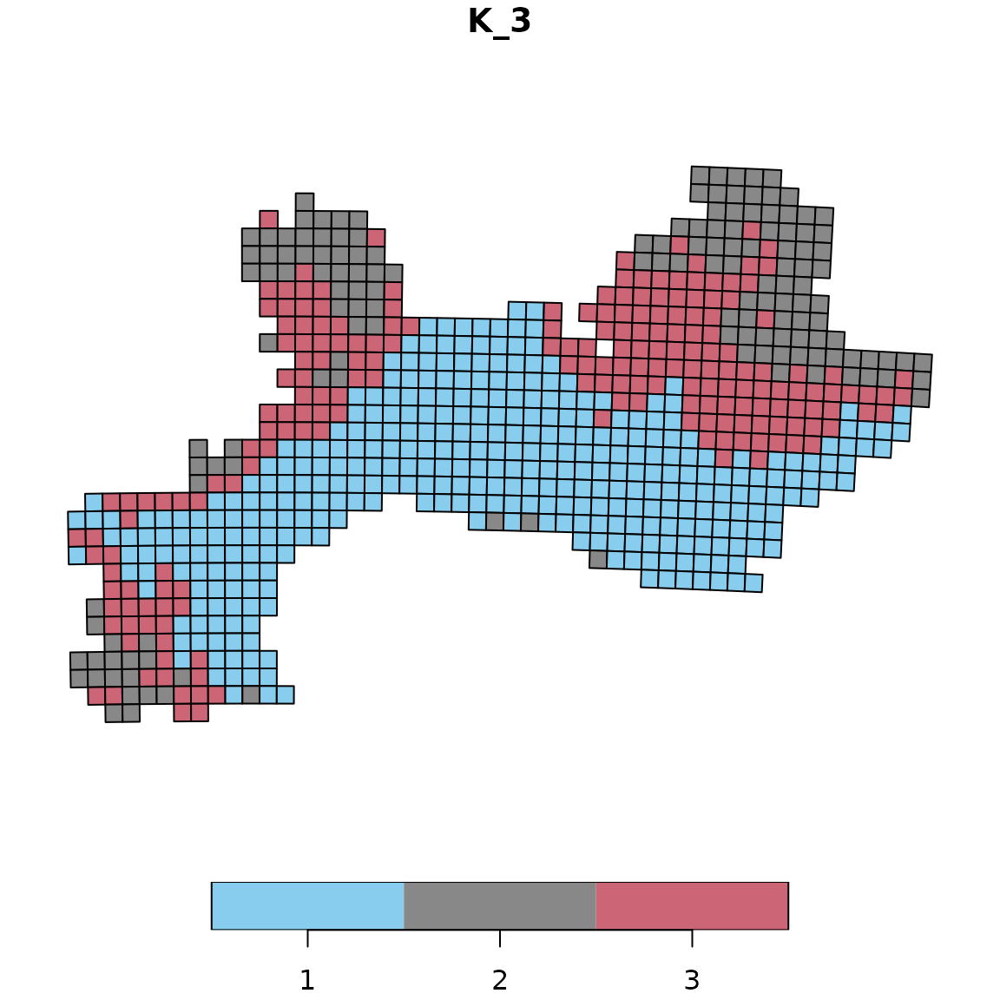
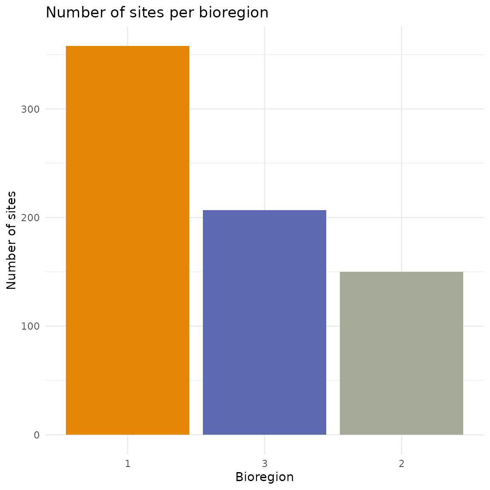
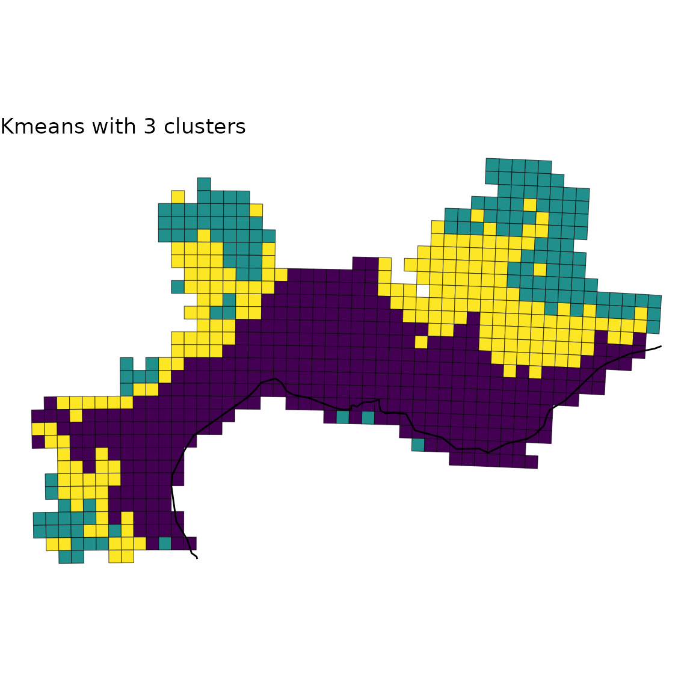
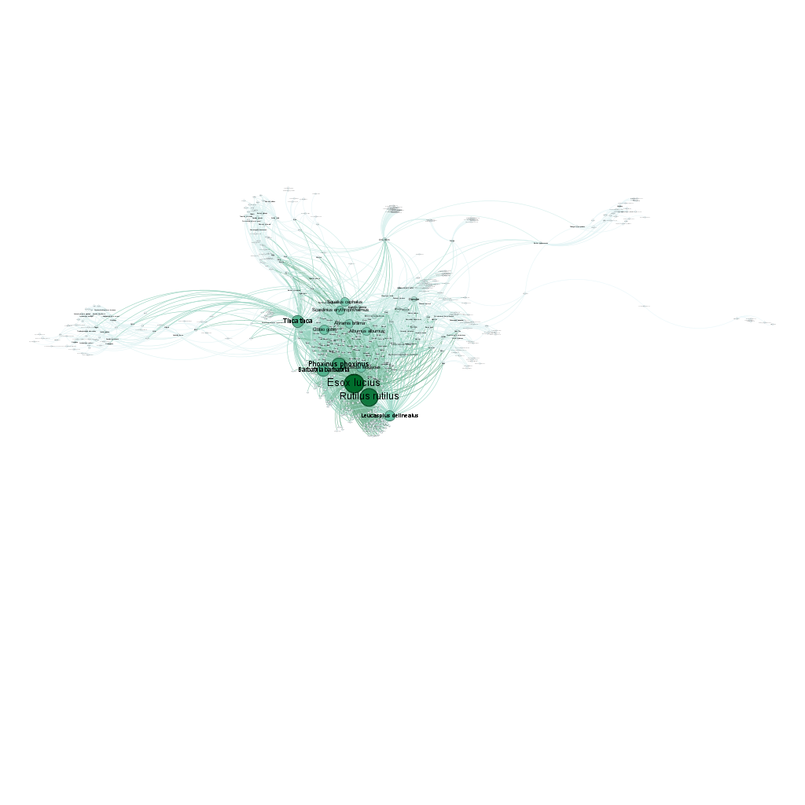
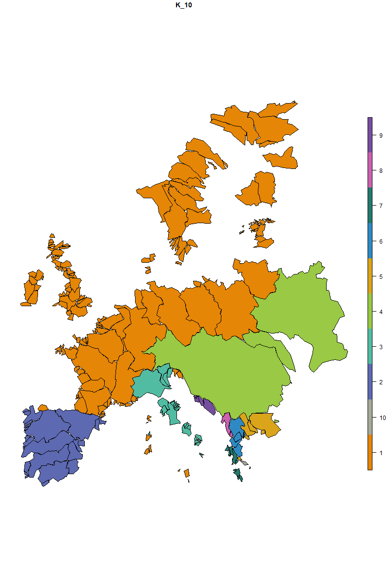

# 5.1 Visualization

In this vignette, we aim at illustrating how to plot the bioregions
identified with the diferent algorithms available in `bioregion`.  
Using one of the dataset coming along with `bioregion`, we show three
strategies to plot your results.

## 1. Data

For this vignette, we rely on the dataset describing the distribution of
vascular plants in the Mediterranean part of France. We first load the
matrix format of this dataset, computes the dissimilarity matrix out of
it and also load the data.frame format of the data.

``` r
data(vegemat)
vegedissim <- dissimilarity(vegemat, metric = "all")
data(vegedf)
```

Since we aim at plotting the result, we also need the object `vegesf`
linking each site of the dataset to a geometry.

``` r
data(vegesf)
```

We also import the world coastlines, available from the `rnaturalearth`
R package.

``` r
world <- rnaturalearth::ne_coastline(returnclass = "sf", scale = "medium")
# Align the CRS of both objects
vegesf <- st_transform(vegesf, crs = st_crs(world))
```

## 2. Plots

In this section, we show three ways to plot your results.  

### 2.1 map_bioregions()

The first possibility is to use the function
[`map_bioregions()`](https://bioRgeo.github.io/bioregion/reference/map_bioregions.md)
from the package. This function can directly provide a plot of each site
colored according to the cluster they belong to.  
Let’s take an example with a K-means clustering, with a number of
clusters set to 3.

``` r
set.seed(1)
vege_nhclu_kmeans <- nhclu_kmeans(vegedissim, n_clust = 3, index = "Simpson")
```

[`map_bioregions()`](https://bioRgeo.github.io/bioregion/reference/map_bioregions.md)
function can now simply takes the object `fish_nhclu_kmeans`, which is
of `bioregion.clusters` class, and the spatial distribution of sites,
stored in `fishsf`.

``` r
map_bioregions(vege_nhclu_kmeans, geometry = vegesf, plot = TRUE)
```


### 2.2 Color palettes with bioregion_colors()

The
[`bioregion_colors()`](https://bioRgeo.github.io/bioregion/reference/bioregion_colors.md)
function is designed to define and manage consistent color palettes
across all your visualizations. This function assigns fixed colors to
bioregions and ensures that these colors remain consistent across
different types of plots. The same bioregion should have the same color
in all your figures (maps, summary plots, networks, etc.)

#### Available color palettes

The function uses qualitative color palettes from the `rcartocolor`
package. Let’s explore a few examples with different palettes:

##### Example 1: Vivid palette (default)

``` r
# Apply the Vivid palette (default)
vege_kmeans_vivid <- bioregion_colors(vege_nhclu_kmeans, 
                                      palette = "Vivid",
                                      cluster_ordering = "n_sites")

# View the color assignments
vege_kmeans_vivid$colors
```

    ## $K_3
    ##   cluster   color
    ## 1       1 #E58606
    ## 2       3 #5D69B1
    ## 3       2 #A5AA99

``` r
# Map with Vivid colors
map_bioregions(vege_kmeans_vivid, geometry = vegesf, plot = TRUE)
```


Note that vege_kmeans_vivid is identical to vege_kmeans with two new
slots: \* colors: a small data.frame summarising the color assigned to
each bioregion \* clusters_colors: a data.frame identical to the
clusters slot, but with content modified to include colors

##### Example 2: Bold palette

``` r
# Apply the Bold palette
vege_kmeans_bold <- bioregion_colors(vege_nhclu_kmeans, 
                                     palette = "Bold",
                                     cluster_ordering = "n_sites")

# View the color assignments
vege_kmeans_bold$colors
```

    ## $K_3
    ##   cluster   color
    ## 1       1 #7F3C8D
    ## 2       3 #11A579
    ## 3       2 #A5AA99

``` r
# Map with Bold colors
map_bioregions(vege_kmeans_bold, geometry = vegesf, plot = TRUE)
```


##### Example 3: Safe palette

The Safe palette is designed to be colorblind-friendly.

``` r
# Apply the Safe palette
vege_kmeans_safe <- bioregion_colors(vege_nhclu_kmeans, 
                                      palette = "Safe",
                                      cluster_ordering = "n_sites")

# View the color assignments
vege_kmeans_safe$colors
```

    ## $K_3
    ##   cluster   color
    ## 1       1 #88CCEE
    ## 2       3 #CC6677
    ## 3       2 #888888

``` r
# Map with Safe colors
map_bioregions(vege_kmeans_safe, geometry = vegesf, plot = TRUE)
```



#### Using consistent colors across different plot types

Once you’ve assigned colors to your bioregions, you can use them
consistently across all your visualizations. Here’s an example creating
a summary bar chart showing the number of sites per bioregion with the
same colors as the map:

``` r
# Use the colored cluster object (e.g., with Vivid palette)
# Extract cluster assignments
clusters_df <- vege_kmeans_vivid$clusters

# Count number of sites per bioregion
bioregion_summary <- clusters_df %>%
  group_by(K_3) %>%
  summarise(n_sites = n()) %>%
  arrange(desc(n_sites))
# Another simpler option: dplyr::count(clusters_df, K_3)

# Extract colors for plotting
colors_df_K3 <- vege_kmeans_vivid$colors[[1]]  # First (and only) partition
color_vector <- setNames(colors_df_K3$color, colors_df_K3$cluster)

# Create bar plot with matching colors
ggplot(bioregion_summary, aes(x = reorder(K_3, -n_sites), 
                               y = n_sites, 
                               fill = K_3)) +
  geom_col() +
  scale_fill_manual(values = color_vector) +
  labs(title = "Number of sites per bioregion",
       x = "Bioregion",
       y = "Number of sites") +
  theme_minimal() +
  theme(legend.position = "none")
```



Colors in the bar chart match exactly those on the map. This makes it
easier for readers to connect the spatial patterns with the summary
statistics. The same color scheme can also be applied when exporting
networks to Gephi (see section 3.3 on “Network with node attributes and
colors”). The
[`exportGDF()`](https://bioRgeo.github.io/bioregion/reference/exportGDF.md)
function automatically uses the colors defined by
[`bioregion_colors()`](https://bioRgeo.github.io/bioregion/reference/bioregion_colors.md),
ensuring consistency between your maps and network visualizations.

### 2.3 Custom plot

If you want to customize yourself the plot and not simply rely on the
default option,
[`map_bioregions()`](https://bioRgeo.github.io/bioregion/reference/map_bioregions.md)
gives you the possibility to extract each site as well as its geometry
and cluster number.  
For this purpose, you can set the arguments like in the chunk below:

``` r
custom <- map_bioregions(vege_nhclu_kmeans, geometry = vegesf,
                         write_clusters = TRUE, plot = FALSE)
custom
```

    ## Simple feature collection with 715 features and 2 fields
    ## Geometry type: POLYGON
    ## Dimension:     XY
    ## Bounding box:  xmin: 1.686171 ymin: 42.29604 xmax: 7.798711 ymax: 45.13742
    ## Geodetic CRS:  WGS 84
    ## First 10 features:
    ##    ID K_3                       geometry
    ## 1  35   2 POLYGON ((6.098099 45.13742...
    ## 2  36   2 POLYGON ((6.22521 45.13381,...
    ## 3  37   2 POLYGON ((6.352304 45.13007...
    ## 4  38   2 POLYGON ((6.47938 45.12617,...
    ## 5  39   2 POLYGON ((6.606438 45.12213...
    ## 6  84   2 POLYGON ((6.093117 45.04745...
    ## 7  85   2 POLYGON ((6.220024 45.04385...
    ## 8  86   2 POLYGON ((6.346914 45.04011...
    ## 9  87   2 POLYGON ((6.473786 45.03622...
    ## 10 88   2 POLYGON ((6.600641 45.03219...

``` r
# Crop world coastlines to the extent of the sf object of interest
europe <- sf::st_crop(world, sf::st_bbox(custom))

# Plot
ggplot(custom) +
  geom_sf(aes(fill = K_3), show.legend = FALSE) +
  geom_sf(data = europe) +
  scale_fill_viridis_d() +
  labs(title = "Kmeans with 3 clusters") +
  theme_void()
```



### 2.4 Plot with facets

Finally, you can be interested in plotting several bioregionalizations
at once. For this purpose, we can build a single `data.frame` gathering
all the bioregions obtained from distinct algorithms and then take
advantage of the `facets` implemented in `ggplot2`.  

We first compute a few more bioregionalizations on the same dataset
using other algorithms.  

``` r
# Hierarchical clustering
set.seed(1)
vege_hclu_hierarclust <- hclu_hierarclust(dissimilarity = vegedissim,
                                          index = names(vegedissim)[6],
                                          method = "mcquitty", n_clust = 3,
                                          optimal_tree_method = "best")
vege_hclu_hierarclust$cluster_info
```

    ##   partition_name n_clust requested_n_clust output_cut_height
    ## 1            K_3       3                 3             0.625

``` r
# Walktrap network bioregionalization
vegesim <- dissimilarity_to_similarity(vegedissim)
set.seed(1)
vege_netclu_walktrap <- netclu_walktrap(vegesim,
                                        index = names(vegesim)[6])
vege_netclu_walktrap$cluster_info # 3
```

    ##     partition_name n_clust
    ## K_3            K_3       3

We can now make a single `data.frame` with an extra-column indicating
the algorithm used.

``` r
vege_kmeans <- vege_nhclu_kmeans$clusters
colnames(vege_kmeans)<- c("ID", "NHCLU_KMEANS")
vege_hieraclust <- vege_hclu_hierarclust$clusters
colnames(vege_hieraclust)<- c("ID", "HCLU_HIERARCLUST")
vege_walktrap <- vege_netclu_walktrap$clusters
colnames(vege_walktrap)<- c("ID", "NETCLU_Walktrap")

all_clusters <- dplyr::left_join(vege_kmeans, vege_hieraclust, by = "ID")
all_clusters <- dplyr::left_join(all_clusters, vege_walktrap, by = "ID")
```

We now convert this `data.frame` into a long-format `data.frame`.

``` r
all_long <- tidyr::pivot_longer(data = all_clusters,
                                cols = dplyr::contains("_"),
                                names_to = "Algorithm",
                                values_to = "Clusters")
all_long <- as.data.frame(all_long)
```

We now add back the geometry as an extra column to make this object
spatial.

``` r
all_long_sf <- dplyr::left_join(all_long,
                                vegesf[, c("ID", "geometry")],
                                by = "ID")
all_long_sf <- sf::st_as_sf(all_long_sf)
```

Now that we have a long-format spatial `data.frame`, we can take
advantage of the facets implemented in `ggplot2`.

``` r
ggplot(all_long_sf) +
  geom_sf(aes(color = Clusters, fill = Clusters)) +
  geom_sf(data = europe, fill = "gray80") +
  scale_color_viridis_d() +
  scale_fill_viridis_d() +
  theme_void() +
  facet_wrap(~ Algorithm)
```


We can refine the above map by:  
\* reordering the 3 bioregions so that they follow the same order  
\* add some background for the Mediterranean sea and the mainland  
\* crop the cells by the mainland  
\* adjust labels

  

``` r
world_countries <- rnaturalearth::ne_countries(scale = "medium",
                                               returnclass = "sf")

# Background box
xmin <- st_bbox(world)[["xmin"]]; xmax <- st_bbox(world)[["xmax"]]
ymin <- st_bbox(world)[["ymin"]]; ymax <- st_bbox(world)[["ymax"]]
bb <- sf::st_union(sf::st_make_grid(st_bbox(c(xmin = xmin,
                                              xmax = xmax,
                                              ymax = ymax,
                                              ymin = ymin),
                                            crs = st_crs(4326)),
                                    n = 100))

# Crop world coastlines to the extent of the sf object of interest
vegesf <- st_transform(vegesf, crs = st_crs(world))
larger_bbox <- sf::st_bbox(vegesf)
larger_bbox[[1]] <- 1.5
larger_bbox[[2]] <- 42.15
larger_bbox[[3]] <- 8.1
larger_bbox[[4]] <- 45.3

europe <- sf::st_crop(world, larger_bbox)
sf_use_s2(FALSE)
europe_countries <- sf::st_crop(world_countries, larger_bbox)
europe_bb <- sf::st_crop(bb, larger_bbox)

plot_basis <- ggplot(europe) +
  geom_sf(data = europe_bb, fill = "aliceblue") +
  geom_sf(data = europe_countries, fill = "ivory", color = "gray50") +
  theme_void()

# Reordering bioregions
all_long_sf$bioregion <- all_long_sf$Clusters

all_long_sf[which(all_long_sf$Algorithm == "NHCLU_KMEANS" &
                    all_long_sf$Clusters == "2"), ]$bioregion <- "3"
all_long_sf[which(all_long_sf$Algorithm == "NHCLU_KMEANS" &
                    all_long_sf$Clusters == "3"), ]$bioregion <- "2"

all_long_sf[which(all_long_sf$Algorithm == "NETCLU_Walktrap" &
                    all_long_sf$Clusters == "1"), ]$bioregion <- "2"
all_long_sf[which(all_long_sf$Algorithm == "NETCLU_Walktrap" &
                    all_long_sf$Clusters == "2"), ]$bioregion <- "3"
all_long_sf[which(all_long_sf$Algorithm == "NETCLU_Walktrap" &
                    all_long_sf$Clusters == "3"), ]$bioregion <- "1"

# More readable labels for algorithms
all_long_sf$Algo <-
  ifelse(all_long_sf$Algorithm == "NHCLU_KMEANS", "K-Means",
         ifelse(all_long_sf$Algorithm == "NHCLU_PAM", "PAM",
                ifelse(all_long_sf$Algorithm == "HCLU_HIERARCLUST",
                       "Hierarchical Clustering", "Walktrap")))

# Cropping with borders of France
all_long_sf_france <-
  st_intersection(all_long_sf,
                  europe_countries[which(europe_countries$sovereignt == "France"), ])

# Plot
final_plot <- plot_basis +
  geom_sf(data = all_long_sf_france,
          aes(color = bioregion, fill = bioregion), show.legend = TRUE) +
  geom_sf(data = st_union(all_long_sf_france), fill = "NA", color = "gray50") +
  geom_sf(data = europe, fill = "gray50", linewidth = 0.1) +
  scale_color_viridis_d("Bioregion", option = "magma", direction = -1) +
  scale_fill_viridis_d("Bioregion", option = "magma", direction = -1) +
  theme_void() +
  theme(legend.position = "bottom") +
  facet_wrap(~ Algo)
final_plot
```


## 3. Exporting networks to Gephi

In addition to visualizing bioregions on maps, you may want to visualize
the network structure of your data using specialized network
visualization software like [Gephi](https://gephi.org/). The `exportGDF`
function allows you to export your data in GDF (Graph Data Format),
which can be directly imported into Gephi.

For these examples, we will use the fish dataset which provides a
clearer network structure that is easier to visualize:

``` r
# Load the fish dataset
data(fishdf)
data(fishmat)
```

### 3.1 Basic network export

Let’s start by creating a simple bipartite network from the fish data
and exporting it without weights or colors:

``` r
# Export the entire bipartite (site-species) fish network to GDF format 
exportGDF(fishdf,
          col1 = "Site",
          col2 = "Species",
          file = "fish_network_basic.gdf")
```

This creates a GDF file with nodes (sites and species) and edges
(interactions) that can be opened in Gephi. The fish dataset contains
2703 site-species interactions across 338 sites and 195 species.

In gephi, this network can be visualised as follows, after applying a
layout algorithm:



### 3.2 Unipartite network with edge weights

In addition to bipartite networks, you can create unipartite networks
where sites are connected based on shared species richness. Edge weights
represent the number of species shared between pairs of sites:

``` r
# Create a site-to-site network based on shared species
# First, convert the matrix to a dissimilarity object
fish_dissim_jac <- dissimilarity(fishmat, metric = "Jaccard")

# Convert dissimilarity to similarity (shared species proportion)
# Jaccard similarity = 1 - Jaccard dissimilarity
# This is because links in a network represent similarity, not dissimilarity
fish_sim <- dissimilarity_to_similarity(fish_dissim_jac)

# Remove all links with weight 0 BEFORE exporting to GDF
fish_sim <- filter(fish_sim, Jaccard > 0)  # Remove zero similarity links

# Export the unipartite network with shared species as weights
exportGDF(fish_sim,
          col1 = "Site1",
          col2 = "Site2",
          weight = "Jaccard",
          file = "fish_network_unipartite_weighted.gdf")
```


This creates a unipartite network where nodes are sites and edges
represent the Jaccard similarity index. The edge weight indicates how
similar is each each pair of sites. In Gephi, these weights can be used
to size edges or influence layout algorithms, helping to visualize which
sites have similar fish communities.

### 3.3 Network with node attributes and colors

To create more sophisticated visualizations, you can add node attributes
and colors. For example, we can color sites according to their bioregion
assignment:

``` r
# Install binaries if not already installed
install_binaries(binpath = "tempdir")

# Run a bipartite network clustering analysis
fish_netclu <- netclu_infomap(fishdf, # Run Infomap on the bipartite network
                             weight = FALSE, # Do not use weights (no abundance here) for clustering
                             binpath = "tempdir", # Path to the Infomap binary
                             numtrials = 100, # Number of trials for Infomap
                             show_hierarchy = TRUE, # Show hierarchical levels
                             bipartite = TRUE, # This is a bipartite network
                             bipartite_version = FALSE, # Use standard Infomap, not bipartite version
                             # Because in our experience the standard version produces better results even
                             # for bipartite biogeographical networks
                             site_col = "Site", # Column name for sites
                             species_col = "Species", # Column name for species
                             seed = 123) # Set seed for reproducibility

fish_netclu <- bioregion_colors(fish_nhclu, # Assign colors to bioregions
                                   palette = "Vivid", # Color palette from rcartocolor
                                   cluster_ordering = "n_both") # Order clusters by total size (sites + species)

# Let's make the map for the first bioregionalization
map_bioregions(fish_netclu, geometry = fishsf,
                partition = 1)

# Export the first bioregionalization to GDF with colors and attributes
exportGDF(fishdf, 
          col1 = "Site", 
          col2 = "Species",
          bioregions = fish_netclu,
          file = "fish_network_colored.gdf")
# Note: the first bioregionalization is exported by default, but you 
# can specify another one with the 'cluster_column' argument
```




### 3.4 Visualizing in Gephi

Once you have exported your network to GDF format, you can visualize it
in Gephi:

1.  Open Gephi and go to **File \> Open** and select your GDF file
2.  The network will be imported with:
    - All nodes (sites and species) and edges (occurrences here)
    - Edge weights representing abundance (if specified)
    - Node colors indicating bioregions for sites (if specified)
    - Node attributes such as bioregion and node type (if specified)
3.  **Layout**: Apply a ForceAtlas 2 algorithm to arrange nodes
4.  **Appearance**:
    - Node colors are already set based on bioregions
    - Adjust node sizes based on degree (= occurrence/richness in our
      example here) or other attributes
5.  Now, spend time on Gephi to make it look gorgeous ;)
