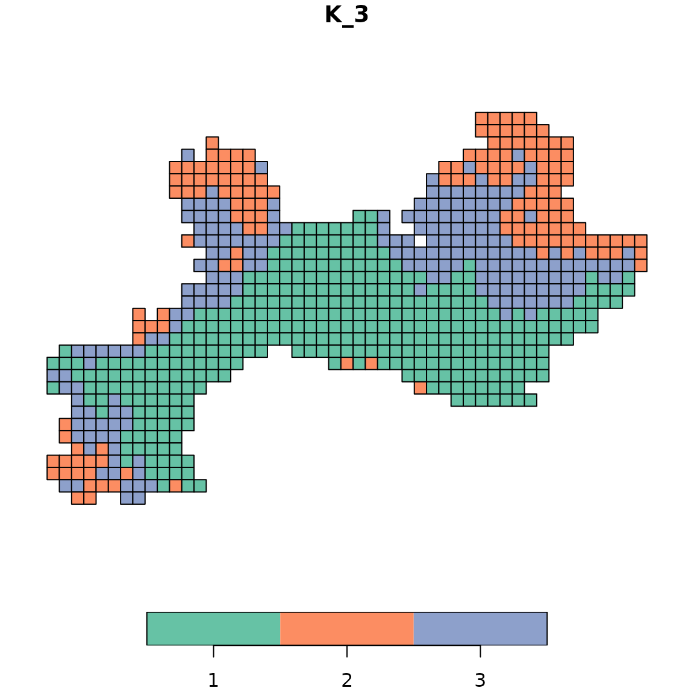

# 5.2 Summary metrics

In this vignette, we describe three functions to compute summary
metrics:

- metrics calculated for each species and/or site
  [`site_species_metrics()`](https://bioRgeo.github.io/bioregion/reference/site_species_metrics.md)
- metrics calculated for each bioregion
  [`bioregion_metrics()`](https://bioRgeo.github.io/bioregion/reference/bioregion_metrics.md)
- metrics calculated for a bioregionalization
  [`bioregionalization_metrics()`](https://bioRgeo.github.io/bioregion/reference/bioregionalization_metrics.md)

## 1. Terminology clarification

The `bioregion` is focused on bioregionalization, i.e. clustering of
geographical areas on the basis of species data. However, there are
several cases where species can also become part of the clustering (for
example, in bipartite network clustering), which poses terminology
issues.

To be conceptually accurate, we have chosen to name species clusters as
‘chorotypes’:

- **Bioregion**: A group of sites with similar species composition,
  identified through clustering analysis. Bioregions are geographic
  units.

- **Chorotype**: A group of species with similar distributions within
  the study area. Chorotypes are biological units. This generally
  corresponds to the concept of “regional chorotype” sensu (Baroni
  Urbani *et al.*, 1978), as clarified by Fattorini (2015). Note that
  when clustering on worldwide ranges, the concept becomes “global
  chorotypes” (see Fattorini (2015) for further details).

### Possible cases of chorotypes

| Clustering scenario | Site clusters | Species clusters | Conceptual basis |
|:---|:--:|:--:|:---|
| Site-only clustering | Bioregions | — | Sites grouped by compositional similarity |
| Bipartite network clustering | Bioregions | Chorotypes (same cluster IDs) | Sites and species grouped by shared network structure |
| Species-only clustering | — | Chorotypes | Species grouped by distributional similarity |
| Post-hoc species assignment | Bioregions | Chorotypes (derived) | Species assigned to bioregions based on Specificity/IndVal |

#### Bipartite network clustering

In bipartite network clustering, both sites and species are assigned to
the **same clusters** (network modules). A species assigned to cluster 1
belongs to the same bioregion as sites assigned to cluster 1. We use the
term **chorotype** to refer to the set of species assigned to a given
bioregion, but it is important to understand that:

> **In bipartite clustering, bioregion ID = chorotype ID.** They are two
> perspectives on the same network partition: bioregion refers to the
> sites in a cluster, chorotype refers to the species in that same
> cluster.

#### Site-only clustering with post-hoc species assignment

Species can be secondarily assigned to bioregions based on metrics such
as maximum Specificity or IndVal. Here, **chorotype** refers to the
group of species most strongly associated with a given bioregion. Unlike
bipartite clustering, this assignment is derived rather than intrinsic
to the clustering algorithm.

#### Species-only clustering

When clustering species directly (e.g., by distributional similarity),
the resulting groups are true **chorotypes** in the regional sense
(Fattorini, 2015): species with similar distributions within the study
area.

## 2. Example data

We use the vegetation dataset included in the `bioregion`.

``` r

data("vegedf")
data("vegemat")

# Calculation of (dis)similarity matrices
vegedissim <- dissimilarity(vegemat, metric = c("Simpson"))
vegesim <- dissimilarity_to_similarity(vegedissim)
```

## 3. Bioregionalization

We use the same three bioregionalization algorithms as in the
[visualization
vignette](https://biorgeo.github.io/bioregion/articles/a5_1_visualization.html),
i.e., non-hierarchical, hierarchical, and network bioregionalizations.
In addition, we include a network bioregionalization algorithm based on
a bipartite network, which assigns clusters to both sites and species.
We chose three bioregions for the non-hierarchical and hierarchical
bioregionalizations.  

``` r

# Non hierarchical bioregionalization
vege_nhclu <- nhclu_kmeans(vegedissim, 
                           n_clust = 3, 
                           index = "Simpson",
                           seed = 1)
vege_nhclu$cluster_info 
```

    ##     partition_name n_clust
    ## K_3            K_3       3

``` r

# Hierarchical bioregionalization
vege_hclu <- hclu_hierarclust(dissimilarity = vegedissim,
                              index = "Simpson",
                              seed = 1,
                              method = "average", 
                              n_clust = 3,
                              optimal_tree_method = "best",
                              verbose = FALSE)
vege_hclu$cluster_info
```

    ##   partition_name n_clust requested_n_clust output_cut_height
    ## 1            K_3       3                 3            0.5625

``` r

# Network bioregionalization
vege_netclu <- netclu_walktrap(vegesim,
                               index = "Simpson")
vege_netclu$cluster_info 
```

    ##     partition_name n_clust
    ## K_3            K_3       3

``` r

# Bipartite network bioregionalization
install_binaries(verbose = FALSE)
vege_netclubip <- netclu_infomap(vegedf,
                                 seed = 1, 
                                 bipartite = TRUE)
vege_netclubip$cluster_info
```

    ##     partition_name n_clust
    ## K_8            K_8       8

## 4. Metric components

Before diving into specific metrics, we can understand the core terms
using a simple example. Consider a study area with **4 sites** and **4
species**, where sites have been assigned to **2 bioregions**.

### 4.1 Species-derived metrics

The following diagram shows the site-species matrix where sites are
grouped by bioregion. Marginal sums give us all the core terms needed to
compute metrics:

                              Species
                       sp1   sp2   sp3   sp4      n_b 
                     ┌─────┬─────┬─────┬─────┐
              Site A │  1  │  1  │  ·  │  ·  │
         B1   ───────┼─────┼─────┼─────┼─────┤     2
              Site B │  1  │  1  │  1  │  ·  │
     Bioregion ══════╪═════╪═════╪═════╪═════╪══════
              Site C │  ·  │  1  │  1  │  1  │
         B2   ───────┼─────┼─────┼─────┼─────┤     2
              Site D │  ·  │  ·  │  1  │  1  │
                     └─────┴─────┴─────┴─────┘
                      
         n_sb            sp1   sp2   sp3   sp4     n_b
       (per bioregion) ┌─────┬─────┬─────┬─────┐
                  B1   │  2  │  2  │  1  │  0  │   2
                       ├─────┼─────┼─────┼─────┤
                  B2   │  0  │  1  │  2  │  2  │   2
                       └─────┴─────┴─────┴─────┘
         n_s (total)      2     3     3     2      n = 4
         K_s (# bioreg)   1     2     2     1      K = 2

| Term | Meaning | Where to find it |
|:---|:---|:---|
| \\n\\ | Total number of sites | Bottom-right corner (4) |
| \\K\\ | Total number of bioregions | Bottom-right corner (2) |
| \\n_b\\ | Sites in bioregion \\b\\ | Right margin per bioregion row |
| \\n_s\\ | Sites where species \\s\\ occurs | Bottom margin per species column |
| \\K_s\\ | Number of bioregions where species \\s\\ occurs | Bottom margin \\n_s\\ |
| \\n\_{sb}\\ | Sites in bioregion \\b\\ with species \\s\\ | The \\n\_{sb}\\ summary table |

#### Examples of calculations

From the \\n\_{sb}\\ table, all species-per-bioregion metrics follow
directly:

**Specificity** (fraction of species’ occurrences in a bioregion):
\\A\_{sp1,B1} = \frac{n\_{sp1,B1}}{n\_{sp1}} = \frac{2}{2} = 1.00 \quad
\text{(sp1 is exclusive to B1)}\\ \\A\_{sp2,B1} =
\frac{n\_{sp2,B1}}{n\_{sp2}} = \frac{2}{3} = 0.67 \quad \text{(sp2
mostly in B1)}\\

**Fidelity** (fraction of bioregion’s sites with the species):
\\B\_{sp2,B1} = \frac{n\_{sp2,B1}}{n\_{B1}} = \frac{2}{2} = 1.00 \quad
\text{(sp2 in all B1 sites)}\\ \\B\_{sp3,B1} =
\frac{n\_{sp3,B1}}{n\_{B1}} = \frac{1}{2} = 0.50 \quad \text{(sp3 in
half of B1)}\\

**IndVal** (IndVal = Specificity × Fidelity): \\IndVal\_{sp1,B1} = 1.00
\times 1.00 = 1.00 \quad \text{(perfect indicator of B1)}\\
\\IndVal\_{sp2,B1} = 0.67 \times 1.00 = 0.67\\

### 4.2 Site-derived metrics

The following diagram shows the same site-species matrix, but now
**species are grouped by cluster** (chorotype). We compute how many
species from each cluster occur in each site:

                                    Chorotypes 
                            ┌─── C1 ───┐ ┌─── C2 ───┐
                              sp1   sp2   sp3   sp4
                            ┌─────┬─────┬─────┬─────┐
                     Site A │  1  │  1  │  ·  │  ·  │  2
                            ├─────┼─────┼─────┼─────┤
       Sites         Site B │  1  │  1  │  1  │  ·  │  3
                            ├─────┼─────┼─────┼─────┤
                     Site C │  ·  │  1  │  1  │  1  │  3
                            ├─────┼─────┼─────┼─────┤
                     Site D │  ·  │  ·  │  1  │  1  │  2
                            └─────┴─────┴─────┴─────┘
                      n_c          2           2         n = 4
                      
           n_gc                C1      C2          n_g
         (per cluster)     ┌───────┬───────┐
                    Site A │   2   │   0   │        2
                           ├───────┼───────┤
                    Site B │   2   │   1   │        3
                           ├───────┼───────┤
                    Site C │   1   │   2   │        3
                           ├───────┼───────┤
                    Site D │   0   │   2   │        2
                           └───────┴───────┘
         n_c                   2       2           n = 4

| Term | Meaning | Where to find it |
|:---|:---|:---|
| \\n\\ | Total number of species | Bottom-right corner (4) |
| \\n_c\\ | Species in cluster \\c\\ | Bottom margin per cluster |
| \\n_g\\ | Species present in site \\g\\ | Right margin per site row |
| \\n\_{gc}\\ | Species from cluster \\c\\ present in site \\g\\ | The \\n\_{gc}\\ summary table |

**NOTE:** in bipartite clustering, bioregion and chorotypes can be the
**exact same clusters.** Nevertheless, we use different terms here to
avoid confusion in the calculation of metrics.

#### Examples of calculations

**Specificity** of Site A for C1 (fraction of site’s species belonging
to C1): \\A\_{A,C1} = \frac{n\_{A,C1}}{n_A} = \frac{2}{2} = 1.00 \quad
\text{(Site A has only C1 species)}\\

**Specificity** of Site B for C1: \\A\_{B,C1} = \frac{n\_{B,C1}}{n_B} =
\frac{2}{3} = 0.67 \quad \text{(Site B mostly has C1 species)}\\

**Fidelity** of Site A for C1 (fraction of C1 species present in Site
A): \\B\_{A,C1} = \frac{n\_{A,C1}}{n_C1} = \frac{2}{2} = 1.00 \quad
\text{(Site A has all C1 species)}\\

**Fidelity** of Site C for C1: \\B\_{C,C1} = \frac{n\_{C,C1}}{n\_{C1}} =
\frac{1}{2} = 0.50 \quad \text{(Site C has half of C1 species)}\\

## 5. List of site/species metrics included in the package

### Metrics per cluster

#### When clusters are assigned to sites (`cluster_on = "site"` or `cluster_on = "both"`)

| Metric | Entity | Cluster type | Based on | Occ | Ab | Formula (occurrence) | Interpretation |
|:---|:---|:---|:---|:--:|:--:|:---|:---|
| specificity | Species | Bioregion | Co-occurrence | ✓ | ✓ | \\A\_{sb} = \frac{n\_{sb}}{n_s}\\ | Fraction of species’ occurrences in bioregion |
| n_specificity | Species | Bioregion | Co-occurrence | ✓ | ✓ | \\\bar{A}\_{sb} = \frac{n\_{sb}/n_b}{\sum_k n\_{sk}/n_k}\\ | Size-normalized specificity |
| fidelity | Species | Bioregion | Co-occurrence | ✓ | ✓ | \\B\_{sb} = \frac{n\_{sb}}{n_b}\\ | Fraction of bioregion’s sites with species |
| ind_val | Species | Bioregion | Co-occurrence | ✓ | ✓ | \\A\_{sb} \times B\_{sb}\\ | Indicator value (specificity × fidelity) |
| n_ind_val | Species | Bioregion | Co-occurrence | ✓ | ✓ | \\\bar{A}\_{sb} \times B\_{sb}\\ | Size-normalized indicator value |
| rho | Species | Bioregion | Co-occurrence | ✓ | ✓ | See section 7.1.1 | Standardized contribution index |
| core_terms | Species | Bioregion | Co-occurrence | ✓ | ✓ | \\n\\, \\n_b\\, \\n_s\\, \\n\_{sb}\\ | Raw counts for custom calculations |
|  |  |  |  |  |  |  |  |
| richness | Site | — | Co-occurrence | ✓ | — | \\S_g = n_g\\ | Number of species |
| rich_endemics | Site | Bioregion | Co-occurrence | ✓ | — | \\E_g = \sum{K_s}\\ | Number of endemic species in the site (i.e., species occurring in only one bioregion) |
| prop_endemics | Site | Bioregion | Co-occurrence | ✓ | — | \\\bar{PctEnd}\_{g} = \frac{E_g}{S_g}\\ | Proportion of endemic species in the site |
|  |  |  |  |  |  |  |  |
| mean_sim | Site | Bioregion | Similarity | — | — | \\\frac{1}{n_b - \delta} \sum\_{g' \neq g} sim\_{gg'}\\ | Mean similarity to bioregion |
| sd_sim | Site | Bioregion | Similarity | — | — | See section 7.2.1 | SD of similarity to bioregion |

#### When clusters are assigned to species (`cluster_on = "species"` or `cluster_on = "both"`)

| Metric | Entity | Cluster type | Based on | Occ | Ab | Formula (occurrence) | Interpretation |
|:---|:---|:---|:---|:--:|:--:|:---|:---|
| specificity | Site | Chorotype | Co-occurrence | ✓ | ✓ | \\A\_{gc} = \frac{n\_{gc}}{n_g}\\ | Fraction of site’s species in cluster |
| n_specificity | Site | Chorotype | Co-occurrence | ✓ | ✓ | \\\bar{A}\_{gc} = \frac{n\_{gc}/n_c}{\sum_k n\_{gk}/n_k}\\ | Size-normalized specificity |
| fidelity | Site | Chorotype | Co-occurrence | ✓ | ✓ | \\B\_{gc} = \frac{n\_{gc}}{n_c}\\ | Fraction of cluster’s species in site |
| ind_val | Site | Chorotype | Co-occurrence | ✓ | ✓ | \\A\_{gc} \times B\_{gc}\\ | Indicator value (specificity × fidelity) |
| n_ind_val | Site | Chorotype | Co-occurrence | ✓ | ✓ | \\\bar{A}\_{gc} \times B\_{gc}\\ | Size-normalized indicator value |
| rho | Site | Chorotype | Co-occurrence | ✓ | ✓ | See section 7.2.2 | Standardized contribution index |
| core_terms | Site | Chorotype | Co-occurrence | ✓ | ✓ | \\n\\, \\n_c\\, \\n_g\\, \\n\_{gc}\\ | Raw counts for custom calculations |

### Metrics in bioregionalization/clustering

These metrics summarize how an entity is distributed across *all*
clusters, rather than in relation to each individual cluster.

#### When `cluster_on = "site"` (or `"both"`)

| Metric | Entity | Based on | Occ | Ab | Formula | Interpretation |
|:---|:---|:---|:--:|:--:|:---|:---|
| p | Species | Co-occurrence | ✓ | ✓ | \\1 - \sum_k \left(\frac{n\_{sk}}{n_s}\right)^2\\ | Evenness of species across bioregions (0–1) |
| silhouette | Site | Similarity | — | — | \\\frac{a_g - b_g}{\max(a_g, b_g)}\\ | Fit to assigned vs. nearest bioregion |

#### When `cluster_on = "species"` (or `"both"`)

| Metric | Entity | Based on | Occ | Ab | Formula | Interpretation |
|:---|:---|:---|:--:|:--:|:---|:---|
| p | Site | Co-occurrence | ✓ | ✓ | \\1 - \sum_k \left(\frac{n\_{gk}}{n_g}\right)^2\\ | Evenness of site across chorotypes (0–1) |

## 6. Usage

This section demonstrates how to use
[`site_species_metrics()`](https://bioRgeo.github.io/bioregion/reference/site_species_metrics.md)
with all metrics computed for both sites and species. This is only
possible in a bipartite network clustering, where both sites and species
receive clusters simultaneously.

For this example, we will use the bipartite network bioregionalization
from section 3, where both sites and species are assigned to the same
clusters. We compute all available metrics for both sites and species.

``` r

all_metrics <- site_species_metrics(
  bioregionalization = vege_netclubip,
  bioregion_metrics = c("specificity", "n_specificity", "fidelity", 
                        "ind_val", "n_ind_val", "rho", "core_terms",
                        "richness", "rich_endemics", "prop_endemics",
                        "mean_sim", "sd_sim"), # You can also simply write "all"
  bioregionalization_metrics = c("p", "silhouette"),
  data_type = "both",
  cluster_on = "both",
  comat = vegemat,
  similarity = vegesim,
  index = "Simpson",
  verbose = FALSE)
```

Typing the name of the object in the console calls
[`print()`](https://rdrr.io/r/base/print.html), which provides a concise
overview of the output, including the settings used, a preview of
available metrics, and instructions for accessing the data.

``` r

all_metrics
```

    ## Site and species metrics
    ## ========================
    ## 
    ## Settings:
    ##  - Number of partitions: 1 
    ##  - Clusters based on: sites and species 
    ##  - Clustering data type: abundance 
    ##  - Metric data type: occurrence and abundance 
    ## 
    ## Computed metrics:
    ##  - Per-cluster co-occurrence metrics (occurrence): specificity, n_specificity, fidelity, ind_val, n_ind_val, rho, core_terms 
    ##  - Per-cluster co-occurrence metrics (abundance): specificity, n_specificity, fidelity, ind_val, n_ind_val, rho, core_terms 
    ##  - Per-cluster richness & endemism metrics: richness, rich_endemics, prop_endemics 
    ##  - Per-cluster similarity-based metrics: mean_sim, sd_sim 
    ##  - Bioregionalization co-occurrence metrics (occurrence): p 
    ##  - Bioregionalization co-occurrence metrics (abundance): p 
    ## 
    ## Data preview:
    ## $species_bioregions (29576 rows x 20 cols):
    ##  species bioregion n_sb n_s n_b specificity_occ n_specificity_occ fidelity_occ
    ##    10017         1  392 551 515           0.711             0.148        0.761
    ##    10017         2   86 551  92           0.156             0.182        0.935
    ##    10017         3   68 551  75           0.123             0.176        0.907
    ##  ind_val_occ n_ind_val_occ rho_occ w_sb   w_s     w_b specificity_abund
    ##        0.542         0.113  -0.965 4545 10660 2831323             0.426
    ##        0.146         0.170   4.009 5349 10660 1136829             0.502
    ##        0.112         0.160   2.960  733 10660  137186             0.069
    ##  n_specificity_abund fidelity_abund ind_val_abund n_ind_val_abund rho_abund
    ##                0.082          0.002         0.325           0.063    -9.237
    ##                0.542          0.005         0.469           0.507    15.718
    ##                0.091          0.005         0.062           0.083    -1.663
    ## # ... with 29573 more rows
    ## 
    ## $species_bioregionalization (3697 rows x 3 cols):
    ##  species p_occ p_abund
    ##    10017 0.454   0.562
    ##    10024 0.463   0.504
    ##    10034 0.493   0.264
    ## # ... with 3694 more rows
    ## 
    ## $site_chorotypes (5720 rows x 20 cols):
    ##  site chorotype n_gc n_g  n_c specificity_occ n_specificity_occ fidelity_occ
    ##    35         1    1 129 2219           0.008             0.003        0.000
    ##    35         2  121 129  873           0.938             0.892        0.139
    ##    35         3    7 129  430           0.054             0.105        0.016
    ##  ind_val_occ n_ind_val_occ rho_occ w_gc w_g     w_c specificity_abund
    ##        0.000         0.000 -13.981    1 423 2873216             0.002
    ##        0.130         0.124  19.103  411 423 1149003             0.972
    ##        0.001         0.002  -2.237   11 423  103264             0.026
    ##  n_specificity_abund fidelity_abund ind_val_abund n_ind_val_abund rho_abund
    ##                0.001              0         0.000           0.000    -7.973
    ##                0.948              0         0.135           0.131    11.313
    ##                0.051              0         0.000           0.001    -1.840
    ## # ... with 5717 more rows
    ## 
    ## $site_chorological (715 rows x 3 cols):
    ##  site p_occ p_abund
    ##    35 0.117   0.055
    ##    36 0.465   0.199
    ##    37 0.350   0.082
    ## # ... with 712 more rows
    ## 
    ## $site_bioregions (5720 rows x 7 cols):
    ##  site bioregion richness rich_endemics prop_endemics mean_sim sd_sim
    ##    35         1      129             0         0.000    0.116  0.123
    ##    35         2      129             2         0.016    0.809  0.179
    ##    35         3      129             0         0.000    0.264  0.189
    ## # ... with 5717 more rows
    ## 
    ## $site_bioregionalization (715 rows x 2 cols):
    ##  site silhouette
    ##    35      0.540
    ##    36      0.379
    ##    37      0.511
    ## # ... with 712 more rows
    ## 
    ## Access data with:
    ##   your_object$species_bioregions
    ##   your_object$species_bioregionalization
    ##   your_object$site_chorotypes
    ##   your_object$site_chorological
    ##   your_object$site_bioregions
    ##   your_object$site_bioregionalization

You can also run [`summary()`](https://rdrr.io/r/base/summary.html) on
the object to quickly see a statistical summary for each output table,
including the number of rows and summary statistics for numeric columns.

``` r

summary(all_metrics)
```

    ## 
    ## Summary of site and species metrics
    ## ===================================
    ## 
    ## Settings:
    ##  - Number of partitions: 1 
    ##  - Cluster based on: sites and species 
    ##  - Clustering data type: abundance 
    ##  - Metric data type: occurrence and abundance 
    ## 
    ## Partition 1: Single partition (0 bioregions, 0 chorotypes)
    ## ---------------------------------------------------------- 
    ## 
    ## Species-per-bioregion metrics ($species_bioregions):
    ##               Metric      Min      Mean        Median         Max
    ##                 n_sb    0.000     0.000     0.0000000     500.000
    ##                  n_s    1.000    72.000    72.0000000     671.000
    ##                  n_b    1.000    15.000    15.0000000     515.000
    ##      specificity_occ    0.000     0.000     0.0000000       1.000
    ##    n_specificity_occ    0.000     0.000     0.0000000       1.000
    ##         fidelity_occ    0.000     0.000     0.0000000       1.000
    ##          ind_val_occ    0.000     0.000     0.0000000       0.844
    ##        n_ind_val_occ    0.000     0.000     0.0000000       0.996
    ##              rho_occ  -18.940    -0.335    -0.3346268      24.233
    ##                 w_sb    0.000     0.000     0.0000000   22716.000
    ##                  w_s    1.000   422.000   422.0000000   27353.000
    ##                  w_b 5558.000 55402.000 55402.0000000 2831323.000
    ##    specificity_abund    0.000     0.000     0.0000000       1.000
    ##  n_specificity_abund    0.000     0.000     0.0000000       1.000
    ##       fidelity_abund    0.000     0.000     0.0000000       0.161
    ##        ind_val_abund    0.000     0.000     0.0000000       0.973
    ##      n_ind_val_abund    0.000     0.000     0.0000000       1.000
    ##            rho_abund  -12.483    -0.239    -0.2393045      26.693
    ## 
    ## Top species by ind_val_occ:
    ##   1.  (Bioregion ): 0.844
    ##   2.  (Bioregion ): 0.841
    ##   3.  (Bioregion ): 0.841
    ##   4.  (Bioregion ): 0.838
    ##   5.  (Bioregion ): 0.837
    ## 
    ## Species summary metrics ($species_bioregionalization):
    ##   Metric Min  Mean Median   Max
    ##    p_occ   0 0.269  0.246 0.719
    ##  p_abund   0 0.216  0.159 0.739
    ## 
    ## Site-per-chorotype metrics ($site_chorotypes):
    ##               Metric      Min       Mean    Median         Max
    ##                 n_gc    0.000     80.573     1.000    1091.000
    ##                  n_g    1.000    644.585   673.000    1221.000
    ##                  n_c    3.000    462.125    76.500    2219.000
    ##      specificity_occ    0.000      0.125     0.002       1.000
    ##    n_specificity_occ    0.000      0.125     0.028       1.000
    ##         fidelity_occ    0.000      0.091     0.015       1.000
    ##          ind_val_occ    0.000      0.032     0.000       0.524
    ##        n_ind_val_occ    0.000      0.033     0.000       0.661
    ##              rho_occ  -27.165     -0.927    -1.144      39.347
    ##                 w_gc    0.000    741.633     3.000   38926.000
    ##                  w_g    1.000   5933.064  4012.000   43753.000
    ##                  w_c 2942.000 530267.625 50655.500 2873216.000
    ##    specificity_abund    0.000      0.125     0.001       1.000
    ##  n_specificity_abund    0.000      0.125     0.010       1.000
    ##       fidelity_abund    0.000      0.001     0.000       0.496
    ##        ind_val_abund    0.000      0.034     0.000       0.701
    ##      n_ind_val_abund    0.000      0.036     0.000       0.991
    ##            rho_abund  -20.999     -0.462    -0.777      43.653
    ## 
    ## Top sites by ind_val_occ:
    ##   1.  (Chorotype ): 0.524
    ##   2.  (Chorotype ): 0.522
    ##   3.  (Chorotype ): 0.497
    ##   4.  (Chorotype ): 0.488
    ##   5.  (Chorotype ): 0.482
    ## 
    ## Site chorological summary metrics ($site_chorological):
    ##   Metric Min  Mean Median   Max
    ##    p_occ   0 0.294  0.244 0.668
    ##  p_abund   0 0.254  0.196 0.668
    ## 
    ## Site-per-bioregion metrics ($site_bioregions):
    ##         Metric Min    Mean  Median      Max
    ##       richness   1 644.585 673.000 1221.000
    ##  rich_endemics   0   1.185   0.000   71.000
    ##  prop_endemics   0   0.002   0.000    0.156
    ##       mean_sim   0   0.439   0.452    1.000
    ##         sd_sim   0   0.059   0.037    0.500
    ## 
    ## Site summary metrics ($site_bioregionalization):
    ##      Metric Min  Mean Median   Max
    ##  silhouette  -1 -0.02 -0.029 0.789

We can see it also displays the top sites or species for ind_val for a
convenient quick look at our clustering structure.

You can also use [`str()`](https://rdrr.io/r/utils/str.html) to display
the internal structure of the object, showing the settings and the
dimensions and column types of each data frame component.

``` r

str(all_metrics)
```

    ## bioregion.site.species.metrics object
    ##  - Partitions: 1 
    ##  - Cluster based on: sites and species 
    ##  - Clustering data type: abundance 
    ##  - Metric data type: occurrence and abundance 
    ##  - Per-cluster co-occurrence metrics (occurrence): specificity, n_specificity, fidelity, ind_val, n_ind_val, rho, core_terms 
    ##  - Per-cluster co-occurrence metrics (abundance): specificity, n_specificity, fidelity, ind_val, n_ind_val, rho, core_terms 
    ##  - Per-cluster richness & endemism metrics: richness, rich_endemics 
    ##  - Per-cluster similarity-based metrics: mean_sim, sd_sim 
    ##  - Bioregionalization co-occurrence metrics (occurrence): p 
    ##  - Bioregionalization co-occurrence metrics (abundance): p 
    ## 
    ##  $ species_bioregions        :'data.frame':  29576 obs. of  20 variables:
    ##   ..$ species            : chr [1:29576] "10017" "10017" "10017" "10017" ...
    ##   ..$ bioregion          : chr [1:29576] "1" "2" "3" "4" ...
    ##   ..$ n_sb               : num [1:29576] 392 86 68 1 2 1 0 1 153 74 ...
    ##   ..$ n_s                : num [1:29576] 551 551 551 551 551 551 551 551 232 232 ...
    ##   ..$ n_b                : int [1:29576] 515 92 75 26 4 1 1 1 515 92 ...
    ##   ..$ specificity_occ    : num [1:29576] 0.71143 0.15608 0.12341 0.00181 0.00363 ...
    ##   ..$ n_specificity_occ  : num [1:29576] 0.14806 0.18183 0.17636 0.00748 0.09726 ...
    ##   ..$ fidelity_occ       : num [1:29576] 0.7612 0.9348 0.9067 0.0385 0.5 ...
    ##   ..$ ind_val_occ        : num [1:29576] 5.42e-01 1.46e-01 1.12e-01 6.98e-05 1.81e-03 ...
    ##   ..$ n_ind_val_occ      : num [1:29576] 0.112695 0.169968 0.159897 0.000288 0.048628 ...
    ##   ..$ rho_occ            : num [1:29576] -0.965 4.009 2.96 -9.04 -1.29 ...
    ##   ..$ w_sb               : int [1:29576] 4545 5349 733 1 2 18 0 12 3781 3549 ...
    ##   ..$ w_s                : int [1:29576] 10660 10660 10660 10660 10660 10660 10660 10660 7361 7361 ...
    ##   ..$ w_b                : int [1:29576] 2831323 1136829 137186 83829 26975 12303 8138 5558 2831323 1136829 ...
    ##   ..$ specificity_abund  : num [1:29576] 4.26e-01 5.02e-01 6.88e-02 9.38e-05 1.88e-04 ...
    ##   ..$ n_specificity_abund: num [1:29576] 0.082265 0.541967 0.091103 0.000359 0.004661 ...
    ##   ..$ fidelity_abund     : num [1:29576] 1.61e-03 4.71e-03 5.34e-03 1.19e-05 7.41e-05 ...
    ##   ..$ ind_val_abund      : num [1:29576] 3.25e-01 4.69e-01 6.23e-02 3.61e-06 9.38e-05 ...
    ##   ..$ n_ind_val_abund    : num [1:29576] 6.26e-02 5.07e-01 8.26e-02 1.38e-05 2.33e-03 ...
    ##   ..$ rho_abund          : num [1:29576] -9.24 15.72 -1.66 -2.73 -1.02 ...
    ##  $ species_bioregionalization:'data.frame':  3697 obs. of  3 variables:
    ##   ..$ species: chr [1:3697] "10017" "10024" "10034" "10035" ...
    ##   ..$ p_occ  : num [1:3697] 0.4542 0.4631 0.4929 0.0588 0.3132 ...
    ##   ..$ p_abund: num [1:3697] 0.5617 0.5037 0.26396 0.00308 0.05098 ...
    ##  $ site_chorotypes           :'data.frame':  5720 obs. of  20 variables:
    ##   ..$ site               : chr [1:5720] "35" "35" "35" "35" ...
    ##   ..$ chorotype          : chr [1:5720] "1" "2" "3" "4" ...
    ##   ..$ n_gc               : num [1:5720] 1 121 7 0 0 0 0 0 241 585 ...
    ##   ..$ n_g                : num [1:5720] 129 129 129 129 129 129 129 129 867 867 ...
    ##   ..$ n_c                : int [1:5720] 2219 873 430 137 16 16 3 3 2219 873 ...
    ##   ..$ specificity_occ    : num [1:5720] 0.00775 0.93798 0.05426 0 0 ...
    ##   ..$ n_specificity_occ  : num [1:5720] 0.0029 0.8923 0.1048 0 0 ...
    ##   ..$ fidelity_occ       : num [1:5720] 0.000451 0.138603 0.016279 0 0 ...
    ##   ..$ ind_val_occ        : num [1:5720] 3.49e-06 1.30e-01 8.83e-04 0.00 0.00 ...
    ##   ..$ n_ind_val_occ      : num [1:5720] 1.31e-06 1.24e-01 1.71e-03 0.00 0.00 ...
    ##   ..$ rho_occ            : num [1:5720] -13.981 19.103 -2.237 -2.268 -0.762 ...
    ##   ..$ w_gc               : int [1:5720] 1 411 11 0 0 0 0 0 4139 38926 ...
    ##   ..$ w_g                : int [1:5720] 423 423 423 423 423 423 423 423 43753 43753 ...
    ##   ..$ w_c                : int [1:5720] 2873216 1149003 103264 85285 16026 9049 3356 2942 2873216 1149003 ...
    ##   ..$ specificity_abund  : num [1:5720] 0.00236 0.97163 0.026 0 0 ...
    ##   ..$ n_specificity_abund: num [1:5720] 0.000907 0.947603 0.05149 0 0 ...
    ##   ..$ fidelity_abund     : num [1:5720] 3.48e-07 3.58e-04 1.07e-04 0.00 0.00 ...
    ##   ..$ ind_val_abund      : num [1:5720] 1.07e-06 1.35e-01 4.23e-04 0.00 0.00 ...
    ##   ..$ n_ind_val_abund    : num [1:5720] 4.09e-07 1.31e-01 8.38e-04 0.00 0.00 ...
    ##   ..$ rho_abund          : num [1:5720] -7.973 11.313 -1.84 -1.282 -0.431 ...
    ##  $ site_chorological         :'data.frame':  715 obs. of  3 variables:
    ##   ..$ site   : chr [1:715] "35" "36" "37" "38" ...
    ##   ..$ p_occ  : num [1:715] 0.117 0.465 0.35 0.293 0.387 ...
    ##   ..$ p_abund: num [1:715] 0.0553 0.1993 0.0825 0.0694 0.1883 ...
    ##  $ site_bioregions           :'data.frame':  5720 obs. of  7 variables:
    ##   ..$ site         : chr [1:5720] "35" "35" "35" "35" ...
    ##   ..$ bioregion    : chr [1:5720] "1" "2" "3" "4" ...
    ##   ..$ richness     : num [1:5720] 129 129 129 129 129 129 129 129 867 867 ...
    ##   ..$ rich_endemics: num [1:5720] 0 2 0 0 0 0 0 0 0 43 ...
    ##   ..$ prop_endemics: num [1:5720] 0 0.0155 0 0 0 ...
    ##   ..$ mean_sim     : num [1:5720] 0.1156 0.8088 0.2635 0.0143 0.0291 ...
    ##   ..$ sd_sim       : num [1:5720] 0.12299 0.17917 0.18876 0.01273 0.00742 ...
    ##  $ site_bioregionalization   :'data.frame':  715 obs. of  2 variables:
    ##   ..$ site      : chr [1:715] "35" "36" "37" "38" ...
    ##   ..$ silhouette: num [1:715] 0.54 0.379 0.511 0.541 0.433 ...
    ##  - attr(*, "n_partitions")= num 1
    ##  - attr(*, "cluster_on")= chr "both"
    ##  - attr(*, "clustering_data_type")= chr "abundance"
    ##  - attr(*, "index_data_type")= chr "both"
    ##  - attr(*, "has_similarity")= logi TRUE
    ##  - attr(*, "has_comat")= logi TRUE
    ##  - attr(*, "bioregion_metrics_occ")= chr [1:7] "specificity" "n_specificity" "fidelity" "ind_val" ...
    ##  - attr(*, "bioregion_metrics_abd")= chr [1:7] "specificity" "n_specificity" "fidelity" "ind_val" ...
    ##  - attr(*, "bioregionalization_metrics_occ")= chr "p"
    ##  - attr(*, "bioregionalization_metrics_abd")= chr "p"
    ##  - attr(*, "similarity_metrics")= chr [1:6] "richness" "rich_endemics" "prop_endemics" "mean_sim" ...

## 7. Metrics per cluster

### 7.1 Species-per-bioregion metrics

These metrics are computed when sites have clusters (i.e.,
`cluster_on = "site"` (or `"both"`)). In the following example, we
compute all metrics
(`bioregion_metrics = c("specificity", "n_specificity", "fidelity", "ind_val", "n_ind_val", "rho", "core_terms")`).
To compute these metrics, we need to provide `comat`.

#### 7.1.1 Co-occurrence metrics: occurrence version

The occurrence metrics are computed when `data_type = "occurrence"`. By
default, the function will detect the type of data used for the
clustering. However, this parameter can be overriden by users, such that
occurrence metrics can be calculated for abundance clustering, and
vice-versa. Users can also specify `data_type = "both"` if they want to
obtain both versions of co-occurrence metrics.

``` r

nsb <- site_species_metrics(bioregionalization = vege_nhclu,
                            bioregion_metrics = c("specificity", "n_specificity",
                                                  "fidelity", "ind_val", "n_ind_val",
                                                  "rho", 
                                                  "core_terms"),
                            bioregionalization_metrics = NULL,
                            data_type = "occurrence",
                            cluster_on = "site",
                            comat = vegemat,
                            similarity = NULL,
                            index = NULL, # Name of similarity column
                            verbose = FALSE)

nsb
```

    ## Site and species metrics
    ## ========================
    ## 
    ## Settings:
    ##  - Number of partitions: 1 
    ##  - Clusters based on: site 
    ##  - Clustering data type: occurrence 
    ##  - Metric data type: occurrence 
    ## 
    ## Computed metrics:
    ##  - Per-cluster co-occurrence metrics (occurrence): specificity, n_specificity, fidelity, ind_val, n_ind_val, rho, core_terms 
    ## 
    ## Data preview:
    ## $species_bioregions (11091 rows x 11 cols):
    ##  species bioregion n_sb n_s n_b specificity_occ n_specificity_occ fidelity_occ
    ##    10001         1   27 254 358           0.106             0.056        0.075
    ##    10001         2   97 254 150           0.382             0.479        0.647
    ##    10001         3  130 254 207           0.512             0.465        0.628
    ##  ind_val_occ n_ind_val_occ rho_occ
    ##        0.008         0.004 -15.645
    ##        0.247         0.310   8.384
    ##        0.321         0.292   9.722
    ## # ... with 11088 more rows
    ## 
    ## Access data with:
    ##   your_object$species_bioregions

##### specificity (occurrence)

The specificity \\A\_{sb}\\ of species \\s\\ for bioregion \\b\\ (De
Cáceres & Legendre, 2009) is defined as

\\A\_{sb} = \frac{n\_{sb}}{n_s}\\

and measures the fraction of occurrences of species \\s\\ that belong to
bioregion \\b\\. It therefore reflects the uniqueness of a species to a
particular bioregion.

##### n_specificity (occurrence)

A normalized version that accounts for the size of each bioregion is
also available, as defined in (De Cáceres & Legendre, 2009):

\\\bar{A}\_{sb} = \frac{n\_{sb}/n_b}{\sum\_{k=1}^K n\_{sk}/n_k}\\

It corresponds to a normalized specificity value that adjusts for
differences in bioregion size.

##### fidelity (occurrence)

The fidelity \\B\_{sb}\\ of species \\s\\ for bioregion \\b\\ (De
Cáceres & Legendre, 2009) is defined as

\\B\_{sb} = \frac{n\_{sb}}{n_b}\\

and measures the fraction of sites in bioregion \\b\\ where species
\\s\\ is present. It therefore reflects the frequency of occurrence of a
species within a bioregion.

##### ind_val (occurrence)

The indicator value \\{IndVal}\_{sb}\\ of species \\s\\ for bioregion
\\b\\ can be defined as the product of specificity and fidelity (De
Cáceres & Legendre, 2009):

\\{IndVal}\_{sb} = A\_{sb} \times B\_{sb}\\

This index quantifies the strength of association between a species and
a bioregion by combining its specificity (uniqueness to that bioregion)
and fidelity (consistency of occurrence within that bioregion). High
IndVal values identify species that are both frequent and restricted to
a single bioregion, making them good indicators of that region.

##### n_ind_val (occurrence)

A normalized version of the indicator value is also available:

\\\bar{IndVal}\_{sb} = \bar{A}\_{sb} \times B\_{sb}\\

This normalization adjusts for differences in bioregion size, allowing
more comparable indicator values across regions with unequal sampling
effort or extent.

##### rho (occurrence)

The contribution index \\\rho\\ can also be calculated following
Lenormand *et al.* (2019):

\\\rho\_{sb} = \frac{n\_{sb} - n_s\frac{n_b}{n}}{\sqrt{\frac{n_b(n -
n_b)}{n - 1} \frac{n_s}{n}(1 - \frac{n_s}{n}) }}\\

This index measures the deviation between the observed number of
occurrences of species \\s\\ in bioregion \\b\\ and the expected value
under random association, providing a standardized measure of
contribution to the bioregional structure.

#### Co-occurrence metrics: abundance version

The occurrence metrics are computed when `data_type = "occurrence"`. By
default, the function will detect the type of data used for the
clustering. However, this parameter can be overriden by users, such that
occurrence metrics can be calculated for abundance clustering, and
vice-versa.

The abundance version of these metrics can also be computed when
`data_type = "abundance"` (or `data_type = "both"`). In this case the
core terms and associated metrics are:

- \\w\_{sb}\\ is the sum of abundances of species **s** in sites of
  bioregion **b**.
- \\w_s\\ is the total abundance of species **s**.  
- \\w_b\\ is the total abundance of all species present in sites of
  bioregion **b**.

``` r

wsb <- site_species_metrics(bioregionalization = vege_nhclu,
                            bioregion_metrics = c("specificity", "n_specificity",
                                                  "fidelity",
                                                  "ind_val", "n_ind_val",
                                                  "rho",
                                                  "core_terms"),
                            bioregionalization_metrics = NULL,
                            data_type = "abundance",
                            cluster_on = "site",
                            comat = vegemat,
                            similarity = NULL, # Name of similarity column
                            index = NULL,
                            verbose = FALSE)

wsb
```

    ## Site and species metrics
    ## ========================
    ## 
    ## Settings:
    ##  - Number of partitions: 1 
    ##  - Clusters based on: site 
    ##  - Clustering data type: occurrence 
    ##  - Metric data type: abundance 
    ## 
    ## Computed metrics:
    ##  - Per-cluster co-occurrence metrics (abundance): specificity, n_specificity, fidelity, ind_val, n_ind_val, rho, core_terms 
    ## 
    ## Data preview:
    ## $species_bioregions (11091 rows x 11 cols):
    ##  species bioregion w_sb  w_s     w_b specificity_abund n_specificity_abund
    ##    10001         1   85 6255 1889243             0.014               0.007
    ##    10001         2 3037 6255 1081424             0.486               0.568
    ##    10001         3 3133 6255 1271474             0.501               0.425
    ##  fidelity_abund ind_val_abund n_ind_val_abund rho_abund
    ##           0.000         0.001           0.001    -6.806
    ##           0.003         0.314           0.368     4.731
    ##           0.002         0.315           0.267     3.256
    ## # ... with 11088 more rows
    ## 
    ## Access data with:
    ##   your_object$species_bioregions

##### specificity (abundance)

\\A\_{sb} = \frac{w\_{sb}}{w_s}\\

##### n_specificity (abundance)

\\\bar{A}\_{sb} = \frac{w\_{sb}/n_b}{\sum\_{k=1}^K w\_{sk}/n_k}\\

##### fidelity (abundance)

\\B\_{sb} = \frac{w\_{sb}}{w_b}\\

##### ind_val (abundance)

\\{IndVal}\_{sb} = A\_{sb} \times \frac{n\_{sb}}{n_b}\\ Note that the
fidelity based on occurrence is used here (De Cáceres & Legendre, 2009).

##### n_ind_val (abundance)

\\\bar{IndVal}\_{sb} = \bar{A}\_{sb} \times \frac{n\_{sb}}{n_b}\\

Note that the fidelity based on occurrence is used here (De Cáceres &
Legendre, 2009).

##### rho (abundance)

\\\rho\_{sb} = \frac{\mu\_{sb} - \mu_s}{\sqrt{\left(\frac{n -
n_b}{n-1}\right) \left(\frac{{\sigma_s}^2}{n_b}\right)}}\\ where

- \\\mu\_{sb} = \frac{w\_{sb}}{n_b}\\ the average abundance of species
  \\s\\ in bioregion \\b\\ (as in n_specificity and n_ind_val).
- \\\mu_s = \frac{w_s}{n}\\ the average abundance of species \\s\\.
- \\\sigma_s\\ the associated standard deviation.

### 7.2 Site metrics

For sites, two types of metrics can be computed, depending on whether
the clustering is based on site or species:

- if the clustering is based on sites (`cluster_on = "site"` (or
  `"both"`)), then richness and similarity-based metrics can be computed
- if the clustering is based on species (`cluster_on = "species"` (or
  `"both"`)), then we can also compute metrics that are typically
  applied at the species level, such as affinity, fidelity, ind_val and
  other similar metrics. The conceptual interpretation differs in this
  case.

#### 7.2.1 Diversity & endemicity site metrics

When clusters are assigned to sites (bioregions), we can compute basic
diversity metrics:

- richness = number of species in the site
- rich_endemics = number of species in the site that are endemic to a
  single region (i.e., occur in only one bioregion)
- prop_endemics = proportion of endemic species, i.e. ratio between
  rich_endemics and richness

``` r

sim_metrics <- site_species_metrics(bioregionalization = vege_nhclu,
                            bioregion_metrics = c("richness", "rich_endemics",
                                                  "prop_endemics"),
                            bioregionalization_metrics = NULL,
                            data_type = "occurrence",
                            cluster_on = "site",
                            comat = vegemat,
                            similarity = vegesim,
                            index = "Simpson", # Name of similarity column
                            verbose = FALSE)

sim_metrics
```

    ## Site and species metrics
    ## ========================
    ## 
    ## Settings:
    ##  - Number of partitions: 1 
    ##  - Clusters based on: site 
    ##  - Clustering data type: occurrence 
    ## 
    ## Computed metrics:
    ##  - Per-cluster richness & endemism metrics: richness, rich_endemics, prop_endemics 
    ## 
    ## Data preview:
    ## $site_bioregions (2145 rows x 5 cols):
    ##  site bioregion richness rich_endemics prop_endemics
    ##    35         1      129             0         0.000
    ##    35         2      129             2         0.016
    ##    35         3      129             0         0.000
    ## # ... with 2142 more rows
    ## 
    ## Access data with:
    ##   your_object$site_bioregions

#### 7.2.2 Similarity-based site metrics

To compute similarity-based metrics for sites, we need to provide the
site similarity matrix (`vegesim`).

These metrics include the average similarity of each site to the sites
of  
each bioregion (\\\mathrm{mean\\sim}\\) and the associated standard
deviation (\\\mathrm{sd\\sim}\\). When computing the average similarity,
the focal site itself is not included in the calculation for its own
bioregion.

``` r

sim_metrics <- site_species_metrics(bioregionalization = vege_nhclu,
                            bioregion_metrics = c("mean_sim", "sd_sim"),
                            bioregionalization_metrics = NULL,
                            data_type = "occurrence",
                            cluster_on = "site",
                            comat = vegemat,
                            similarity = vegesim,
                            index = "Simpson", # Name of similarity column
                            verbose = FALSE)

sim_metrics
```

    ## Site and species metrics
    ## ========================
    ## 
    ## Settings:
    ##  - Number of partitions: 1 
    ##  - Clusters based on: site 
    ##  - Clustering data type: occurrence 
    ## 
    ## Computed metrics:
    ##  - Per-cluster similarity-based metrics: mean_sim, sd_sim 
    ## 
    ## Data preview:
    ## $site_bioregions (2145 rows x 4 cols):
    ##  site bioregion mean_sim sd_sim
    ##    35         1    0.055  0.033
    ##    35         2    0.554  0.340
    ##    35         3    0.251  0.195
    ## # ... with 2142 more rows
    ## 
    ## Access data with:
    ##   your_object$site_bioregions

##### mean_sim

Let \\g\\ be a site and \\b\\ a bioregion with sites \\g' \in b\\, then:

\\MeanSim\_{gb} = \frac{1}{n_b - \delta\_{g \in b}} \sum\_{g' \in b, g'
\neq g} sim\_{gg'}\\ where \\sim\_{gg'}\\ is the similarity between
sites \\g\\ and \\g'\\, \\n_b\\ is the number of sites in bioregion
\\b\\, and \\\delta\_{g \in b}\\ is 1 if site \\g\\ belongs to bioregion
\\b\\ (to exclude itself), 0 otherwise.

##### sd_sim

The standard deviation of similarities of site \\g\\ to bioregion \\b\\
is:

\\SdSim\_{gb} = \sqrt{\frac{1}{n_b - 1 - \delta\_{g \in b}} \sum\_{g'
\in b, g' \neq g} \left( sim\_{gg'} - MeanSim\_{gb} \right)^2}\\ where
\\sim\_{gg'}\\ is the similarity between sites \\g\\ and \\g'\\, \\n_b\\
is the number of sites in bioregion \\b\\, and \\\delta\_{g \in b}\\ is
1 if site \\g\\ belongs to bioregion \\b\\ (to exclude itself), 0
otherwise.

#### 7.2.3 Chorotype/Cluster-based site metrics

In the following example we compute only metrics for sites, on the basis
of species clusters (`cluster_on = "species"`).

``` r

gc <- site_species_metrics(bioregionalization = vege_netclubip,
                            bioregion_metrics = c("specificity", "n_specificity",
                                                  "fidelity",
                                                  "ind_val", "n_ind_val",
                                                  "rho",
                                                  "core_terms"),
                            bioregionalization_metrics = "p",
                            data_type = "both",
                            cluster_on = "species",
                            comat = vegemat,
                            similarity = NULL,
                            index = NULL,
                            verbose = FALSE)

gc
```

    ## Site and species metrics
    ## ========================
    ## 
    ## Settings:
    ##  - Number of partitions: 1 
    ##  - Clusters based on: species 
    ##  - Clustering data type: abundance 
    ##  - Metric data type: occurrence and abundance 
    ## 
    ## Computed metrics:
    ##  - Per-cluster co-occurrence metrics (occurrence): specificity, n_specificity, fidelity, ind_val, n_ind_val, rho, core_terms 
    ##  - Per-cluster co-occurrence metrics (abundance): specificity, n_specificity, fidelity, ind_val, n_ind_val, rho, core_terms 
    ##  - Bioregionalization co-occurrence metrics (occurrence): p 
    ##  - Bioregionalization co-occurrence metrics (abundance): p 
    ## 
    ## Data preview:
    ## $site_chorotypes (5720 rows x 20 cols):
    ##  site chorotype n_gc n_g  n_c specificity_occ n_specificity_occ fidelity_occ
    ##    35         1    1 129 2219           0.008             0.003        0.000
    ##    35         2  121 129  873           0.938             0.892        0.139
    ##    35         3    7 129  430           0.054             0.105        0.016
    ##  ind_val_occ n_ind_val_occ rho_occ w_gc w_g     w_c specificity_abund
    ##        0.000         0.000 -13.981    1 423 2873216             0.002
    ##        0.130         0.124  19.103  411 423 1149003             0.972
    ##        0.001         0.002  -2.237   11 423  103264             0.026
    ##  n_specificity_abund fidelity_abund ind_val_abund n_ind_val_abund rho_abund
    ##                0.001              0         0.000           0.000    -7.973
    ##                0.948              0         0.135           0.131    11.313
    ##                0.051              0         0.000           0.001    -1.840
    ## # ... with 5717 more rows
    ## 
    ## $site_chorological (715 rows x 3 cols):
    ##  site p_occ p_abund
    ##    35 0.117   0.055
    ##    36 0.465   0.199
    ##    37 0.350   0.082
    ## # ... with 712 more rows
    ## 
    ## Access data with:
    ##   your_object$site_chorotypes
    ##   your_object$site_chorological

## 8. Metrics over the entire bioregionalization (i.e., over all clusters)

### 8.1 Site metrics

Based on \\MeanSim}\\, it is possible to derive aggregated metrics that
assess  
how well a site fits within its assigned bioregion relative to others.

For now, only the Silhouette index (Rousseeuw, 1987) is proposed.

#### silhouette

The Silhouette index for a site \\g\\ is defined as:

\\Silhouette_g = \frac{a_g - b_g}{\max(a_g, b_g)}\\

where:

- \\a_g\\ is the average similarity of site \\g\\ to all other sites in
  its own bioregion,  
- \\b_g\\ is the average similarity of site \\g\\ to all sites belonging
  to the nearest bioregion.

This index reflects how strongly a site is associated with its assigned
bioregion relative to the most similar alternative bioregion, ranging
from -1, when the site may be misassigned (i.e., more similar to another
bioregion than its own), to 1, when the site is well matched to its own
bioregion, and around 0 when the site lies near the boundary between
bioregions.

``` r

sil_metrics <- site_species_metrics(bioregionalization = vege_nhclu,
                            bioregion_metrics = NULL,
                            bioregionalization_metrics = "silhouette",
                            data_type = "occurrence",
                            cluster_on = "site",
                            comat = vegemat,
                            similarity = vegesim,
                            index = "Simpson", # Name of similarity column
                            verbose = FALSE)

sil_metrics
```

    ## Site and species metrics
    ## ========================
    ## 
    ## Settings:
    ##  - Number of partitions: 1 
    ##  - Clusters based on: site 
    ##  - Clustering data type: occurrence 
    ## 
    ## Computed metrics:
    ## 
    ## Data preview:
    ## $site_bioregionalization (715 rows x 2 cols):
    ##  site silhouette
    ##    35      0.548
    ##    36      0.308
    ##    37      0.441
    ## # ... with 712 more rows
    ## 
    ## Access data with:
    ##   your_object$site_bioregionalization

#### Site participation coefficient

We can compute the participation coefficient \\P_s\\ of a species \\s\\
to the bioregionalization as described in Denelle *et al.* (2020),
available in both its occurrence and abundance versions.

These metrics measure whether a site has species from a single region or
from multiple regions - useful when investigating transition zones
(Leroy *et al.*, 2019). There are ranging from 0 to 1. Values close to 0
indicate that the site only has species from a single chorotype (i.e.,
not a transition zone), whereas values close to 1 indicate that the site
has species evenely distributed across multiple chorotypes (i.e., likely
a transition zone).

#### p (occurrence)

\\ P_s = 1 - \sum\_{k=1}^K \left(\frac{n\_{sk}}{n_s}\right)^2 \\

``` r

p_occ_site <- site_species_metrics(bioregionalization = vege_netclubip,
                            bioregion_metrics = NULL,
                            bioregionalization_metrics = "p",
                            data_type = "occurrence",
                            cluster_on = "species",
                            comat = vegemat,
                            similarity = NULL,
                            index = "Simpson", # Name of similarity column
                            verbose = FALSE)

p_occ_site
```

    ## Site and species metrics
    ## ========================
    ## 
    ## Settings:
    ##  - Number of partitions: 1 
    ##  - Clusters based on: species 
    ##  - Clustering data type: abundance 
    ##  - Metric data type: occurrence 
    ## 
    ## Computed metrics:
    ##  - Bioregionalization co-occurrence metrics (occurrence): p 
    ## 
    ## Data preview:
    ## $site_chorological (715 rows x 2 cols):
    ##  site p_occ
    ##    35 0.117
    ##    36 0.465
    ##    37 0.350
    ## # ... with 712 more rows
    ## 
    ## Access data with:
    ##   your_object$site_chorological

#### p (abundance)

\\ P_s = 1 - \sum\_{k=1}^K \left(\frac{w\_{sk}}{w_s}\right)^2 \\

``` r

p_ab_site <- site_species_metrics(bioregionalization = vege_netclubip,
                            bioregion_metrics = NULL,
                            bioregionalization_metrics = "p",
                            data_type = "abundance",
                            cluster_on = "species",
                            comat = vegemat,
                            similarity = NULL,
                            index = "Simpson", # Name of similarity column
                            verbose = FALSE)

p_ab_site
```

    ## Site and species metrics
    ## ========================
    ## 
    ## Settings:
    ##  - Number of partitions: 1 
    ##  - Clusters based on: species 
    ##  - Clustering data type: abundance 
    ##  - Metric data type: abundance 
    ## 
    ## Computed metrics:
    ##  - Bioregionalization co-occurrence metrics (abundance): p 
    ## 
    ## Data preview:
    ## $site_chorological (715 rows x 2 cols):
    ##  site p_abund
    ##    35   0.055
    ##    36   0.199
    ##    37   0.082
    ## # ... with 712 more rows
    ## 
    ## Access data with:
    ##   your_object$site_chorological

### 8.2 Species metrics

We can compute the participation coefficient \\P_s\\ of a species \\s\\
to the bioregionalization for species as well.

#### p (occurrence)

\\ P_s = 1 - \sum\_{k=1}^K \left(\frac{n\_{sk}}{n_s}\right)^2 \\

``` r

p_occ_sp <- site_species_metrics(bioregionalization = vege_netclubip,
                            bioregion_metrics = NULL,
                            bioregionalization_metrics = "p",
                            data_type = "occurrence",
                            cluster_on = "site",
                            comat = vegemat,
                            similarity = NULL,
                            index = "Simpson", # Name of similarity column
                            verbose = FALSE)

p_occ_sp
```

    ## Site and species metrics
    ## ========================
    ## 
    ## Settings:
    ##  - Number of partitions: 1 
    ##  - Clusters based on: site 
    ##  - Clustering data type: abundance 
    ##  - Metric data type: occurrence 
    ## 
    ## Computed metrics:
    ##  - Bioregionalization co-occurrence metrics (occurrence): p 
    ## 
    ## Data preview:
    ## $species_bioregionalization (3697 rows x 2 cols):
    ##  species p_occ
    ##    10001 0.598
    ##    10002 0.188
    ##    10003 0.068
    ## # ... with 3694 more rows
    ## 
    ## Access data with:
    ##   your_object$species_bioregionalization

#### p (abundance)

\\ P_s = 1 - \sum\_{k=1}^K \left(\frac{w\_{sk}}{w_s}\right)^2 \\

``` r

p_ab_sp <- site_species_metrics(bioregionalization = vege_netclubip,
                            bioregion_metrics = NULL,
                            bioregionalization_metrics = "p",
                            data_type = "abundance",
                            cluster_on = "site",
                            comat = vegemat,
                            similarity = NULL,
                            index = "Simpson", # Name of similarity column
                            verbose = FALSE)

p_ab_sp
```

    ## Site and species metrics
    ## ========================
    ## 
    ## Settings:
    ##  - Number of partitions: 1 
    ##  - Clusters based on: site 
    ##  - Clustering data type: abundance 
    ##  - Metric data type: abundance 
    ## 
    ## Computed metrics:
    ##  - Bioregionalization co-occurrence metrics (abundance): p 
    ## 
    ## Data preview:
    ## $species_bioregionalization (3697 rows x 2 cols):
    ##  species p_abund
    ##    10001   0.509
    ##    10002   0.090
    ##    10003   0.022
    ## # ... with 3694 more rows
    ## 
    ## Access data with:
    ##   your_object$species_bioregionalization

These metrics measure how evenly a species is distributed among
bioregions. There are ranging from 0 to 1. Values close to 0 indicate
that the species is largely restricted to a single bioregion, while
values close to 1 indicate that the species is evenly distributed across
multiple bioregions.

Calculations on both occurrence & abundance at the same time:

``` r

ps <- site_species_metrics(bioregionalization = vege_nhclu,
                           bioregion_metrics = NULL,
                           bioregionalization_metrics = "p",
                           data_type = "both",
                           cluster_on = "site",
                           comat = vegemat,
                           similarity = NULL,
                           index = NULL,
                           verbose = FALSE)

ps
```

    ## Site and species metrics
    ## ========================
    ## 
    ## Settings:
    ##  - Number of partitions: 1 
    ##  - Clusters based on: site 
    ##  - Clustering data type: occurrence 
    ##  - Metric data type: occurrence and abundance 
    ## 
    ## Computed metrics:
    ##  - Bioregionalization co-occurrence metrics (occurrence): p 
    ##  - Bioregionalization co-occurrence metrics (abundance): p 
    ## 
    ## Data preview:
    ## $species_bioregionalization (3697 rows x 3 cols):
    ##  species p_occ p_abund
    ##    10001 0.581   0.513
    ##    10002 0.460   0.413
    ##    10003 0.089   0.022
    ## # ... with 3694 more rows
    ## 
    ## Access data with:
    ##   your_object$species_bioregionalization

## 9. Bioregion metrics & spatial coherence

At the bioregion level, we can compute the number of sites and the
total  
species richness across those sites. We can also derived the number
and  
proportion of endemic species, defined (as above) as species occurring
exclusively  
within a single bioregion (i.e., not found in any other bioregion).

``` r

bioregion_summary <- bioregion_metrics(vege_nhclu,
                                       comat = vegemat)
bioregion_summary
```

    ##   bioregion n_sites richness rich_endemics prop_endemics
    ## 1         1     358     2821           407    0.14427508
    ## 2         2     150     2688           133    0.04947917
    ## 3         3     207     3090            58    0.01877023

We also use the metric of spatial coherence following Divíšek *et al.*
(2016).  
Spatial coherence quantifies how contiguous the sites of a bioregion
are.  
Two variants are computed:

- **sc_size**: the fraction of the bioregion’s sites contained in its
  largest  
  contiguous patch, calculated based on site counts rather than area.

- **sc_area**: the fraction of the bioregion’s total area contained in
  its  
  largest spatially contiguous patch, calculated from polygon
  geometries.

Both metrics range from 0 to 1, with 1 indicating a fully contiguous
bioregion. Here is an example with the vegetation dataset.

``` r

data(vegesf)

bioregion_metrics(vege_nhclu, 
                  comat = vegemat,
                  map = vegesf) 
```

    ##   bioregion n_sites richness rich_endemics prop_endemics   sc_size   sc_area
    ## 1         1     358     2821           407    0.14427508 0.9972067 0.9972067
    ## 2         2     150     2688           133    0.04947917 0.5400000 0.5400000
    ## 3         3     207     3090            58    0.01877023 0.5555556 0.5555556

The bioregion 1 is almost constituted of one homogeneous block, which is
why the spatial coherence is very close to 1.

``` r

map_bioregions(vege_nhclu,
               map = vegesf)
```



## 10. Bioregionalization metrics

At the bioregionalization level, several metrics described below can be
computed to assess the quality of the resulting bioregionalization
across its different partitions. As is the case for
[`site_species_metrics()`](https://bioRgeo.github.io/bioregion/reference/site_species_metrics.md),
some metrics are based on a similarity or dissimilarity object, while
others are based on a co-occurrence matrix.

``` r

bioregionalization_summary <- bioregionalization_metrics(vege_nhclu,
                                                         eval_metrics = "all",
                                                         dissimilarity = vegedissim,
                                                         comat = vegemat)
bioregionalization_summary 
```

    ##     partition n_bioregions prop_between_dissim    anosim mean_endemics
    ## K_3       K_3            3            0.725851 0.6663875    0.07084149
    ##     tot_endemics
    ## K_3    0.1617528

#### prop_between_dissim

This metric, proposed by Holt *et al.* (2013), computes the proportion
of total dissimilarity occurring between bioregions relative to the
total dissimilarity. Following the same notation, the metric can be
defined as

\\ \frac{ \sum\_{g,g'} dissim\_{gg'} \left(1 - \sum_b \delta\_{g \in
b}\delta\_{g' \in b}\right) }{ \sum\_{g,g'} dissim\_{gg'} } \\

where \\dissim\_{gg'}\\ is the dissimilarity between sites \\g\\ and
\\g'\\.

``` r

bd <- bioregionalization_metrics(vege_nhclu,
                                 eval_metrics = "prop_between_dissim",
                                 dissimilarity = vegedissim,
                                 comat = NULL)
bd
```

    ##     partition n_bioregions prop_between_dissim
    ## K_3       K_3            3            0.725851

#### anosim

The Analysis of Similarities (ANOSIM) statistic measures the separation
between within- and between-bioregion dissimilarities. It is based on
the ranks of the dissimilarities and compares the average ranks within
bioregions to those between bioregions.

``` r

stat <- bioregionalization_metrics(vege_nhclu,
                                   eval_metrics = "anosim",
                                   dissimilarity = vegedissim,
                                   comat = NULL)
stat
```

    ##     partition n_bioregions    anosim
    ## K_3       K_3            3 0.6663875

When `permutation > 1`, a p-value is calculated using permutation
testing.

``` r

pval <- bioregionalization_metrics(vege_nhclu,
                                   eval_metrics = "anosim",
                                   dissimilarity = vegedissim,
                                   comat = NULL,
                                   anosim_permutations = 100)
pval
```

    ##     partition n_bioregions    anosim anosim_pval
    ## K_3       K_3            3 0.6663875  0.00990099

The statistic and associated p-value are computed using the
[anosim](https://vegandevs.github.io/vegan/reference/anosim.html#references)
function from the R package
[vegan](https://cran.r-project.org/package=vegan).

#### mean_endemics

The mean endemism measures the average proportion of endemic species
across bioregions, as proposed by Kreft & Jetz (2010). It is calculated
as the mean of the proportion of endemic species within each bioregion.

``` r

mean_endemics <- bioregionalization_metrics(vege_nhclu,
                                            eval_metrics = "mean_endemics",
                                            dissimilarity = NULL,
                                            comat = vegemat)
mean_endemics
```

    ##     partition n_bioregions mean_endemics
    ## K_3       K_3            3    0.07084149

This information is directly derived from the ouptput of

``` r

bioregion_summary <- bioregion_metrics(vege_nhclu,
                                       comat = vegemat)

bioregion_summary
```

    ##   bioregion n_sites richness rich_endemics prop_endemics
    ## 1         1     358     2821           407    0.14427508
    ## 2         2     150     2688           133    0.04947917
    ## 3         3     207     3090            58    0.01877023

``` r

mean(bioregion_summary$prop_endemics)
```

    ## [1] 0.07084149

#### tot_endemics

The proportion of endemic species across all bioregion. It is calculated
as the total number of endemic species divided by the total number of
species. Endemic species are those occurring in only one bioregion.

``` r

tot_endemics <- bioregionalization_metrics(vege_nhclu,
                                            eval_metrics = "tot_endemics",
                                            dissimilarity = NULL,
                                            comat = vegemat)
tot_endemics
```

    ##     partition n_bioregions tot_endemics
    ## K_3       K_3            3    0.1617528

This information is directly derived from the ouptput of

``` r

sum(bioregion_summary$rich_endemics) / sum(apply(vegemat, 2, sum) > 0)
```

    ## [1] 0.1617528

## 11. References

Baroni Urbani C, Ruffo S & Vigna Taglianti A (1978) Materiali per una
biogeografia italiana fondata su alcuni generi di coleotteri
cicindelidi, carabidi e crisomelidi. *Memorie della Società Entomologica
Italiana* 56, 35–92.

De Cáceres M & Legendre P (2009) Associations between species and groups
of sites: Indices and statistical inference. *Ecology* 90, 3566–3574.

Denelle P, Violle C & Munoz F (2020) Generalist plants are more
competitive and more functionally similar to each other than specialist
plants: Insights from network analyses. *Journal of Biogeography* 47,
1922–1933.

Divíšek J, Storch D, Zelený D & Culek M (2016) Towards the spatial
coherence of biogeographical regionalizations at subcontinental and
landscape scales. *Journal of biogeography* 43, 2489–2501.

Fattorini S (2015) On the concept of chorotype. *Journal of
Biogeography* 42, 2246–2251.

Holt BG, Lessard J-P, Borregaard MK *et al.* (2013) An update of
Wallace’s zoogeographic regions of the world. *Science* 339, 74–78.

Kreft H & Jetz W (2010) A framework for delineating biogeographical
regions based on species distributions. *Journal of Biogeography* 37,
2029–2053.

Lenormand M, Papuga G, Argagnon O, Soubeyrand M, Alleaume S & Luque S
(2019) Biogeographical network analysis of plant species distribution in
the mediterranean region. *Ecology and evolution* 9, 237–250.

Leroy B, Dias MS, Giraud E *et al.* (2019) Global biogeographical
regions of freshwater fish species. *Journal of Biogeography* 2407–2419.

Rousseeuw PJ (1987) Silhouettes: A graphical aid to the interpretation
and validation of cluster analysis. *Journal of Computational and
Applied Mathematics* 20, 53–65.
