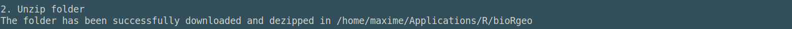
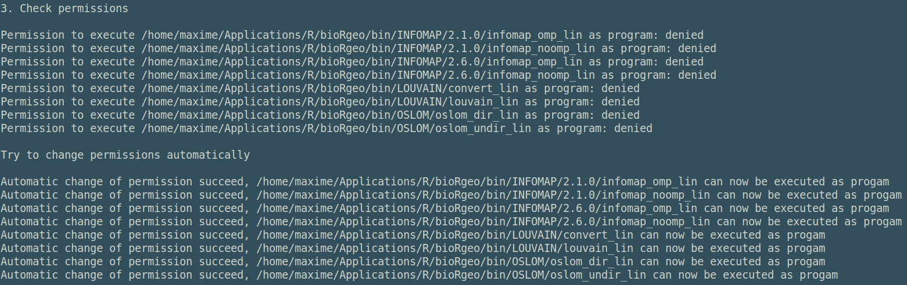
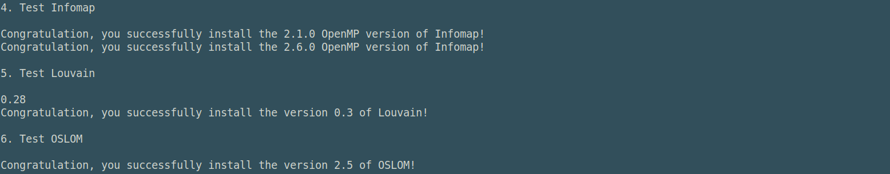

Some functions (listed below) or at least part of them require executable binary
files to run. 

* [netclu_infomap](https://biorgeo.github.io/bioRgeo/reference/netclu_infomap.html)
* [netclu_louvain](https://biorgeo.github.io/bioRgeo/reference/netclu_louvain.html) (Cpp version)
* [netclu_oslom](https://biorgeo.github.io/bioRgeo/reference/netclu_oslom.html)

The function [install_binaries](https://biorgeo.github.io/bioRgeo/reference/install_binaries.html)
downloads and unzips the 'bin' folder needed to run these functions. It also 
checks if the files have the permissions to be executed as programs. It finally 
tests if the executable are running properly.

### Run install_binaries()

The function [install_binaries](https://biorgeo.github.io/bioRgeo/reference/install_binaries.html) 
should be run prior to using 
[netclu_infomap](https://biorgeo.github.io/bioRgeo/reference/netclu_infomap.html),
the Cpp version of [netclu_louvain](https://biorgeo.github.io/bioRgeo/reference/netclu_louvain.html) 
and [netclu_oslom](https://biorgeo.github.io/bioRgeo/reference/netclu_oslom.html) 
as follows.

```{r install_binaries, eval=FALSE}
install_binaries(binpath = NULL , infomap_version = c("2.1.0", "2.6.0"))
```

The function has two parameters. `binpath` indicating 
the path to the folder that will host the 'bin' folder containing the executable 
binary files. It is located in the `bioRgeo`'s package folder by default. Any other
folder can be chosen but if you use a different folder please be sure to update 
the `binpath` argument in 
[netclu_infomap](https://biorgeo.github.io/bioRgeo/reference/netclu_infomap.html), 
[netclu_louvain](https://biorgeo.github.io/bioRgeo/reference/netclu_louvain.html)
and [netclu_oslom](https://biorgeo.github.io/bioRgeo/reference/netclu_oslom.html)
accordingly. The second parameter `infomap_version` indicating the Infomap 
version(s) to install. Only the Infomap version 2.1.0 and 2.6.0 are available 
for now.

The installation of the executable binary files is divided into six steps:

#### 1. Download bin.zip 

<br>
<center>
  
</center> 
<br>

#### 2. Unzip bin.zip in the binpath 

<br>
<center>
  
</center> 
<br>

#### 3. Check the permissions, try to change them automatically or propose an iterative process to change them manually

<br>
<center>
  
</center> 
<br>

#### 4->6. Test that Infomap, Louvain and OSLOM are running properly 

<br>
<center>
  
</center> 
<br>

###  Known issues

* The OpenMP versions of Infomap require `libomp-dev` on Ubuntu 
(`sudo apt-get install libomp-dev`) and `libomp` on macOS (install [Homebrew](https://brew.sh) 
and run `brew install libomp`).


