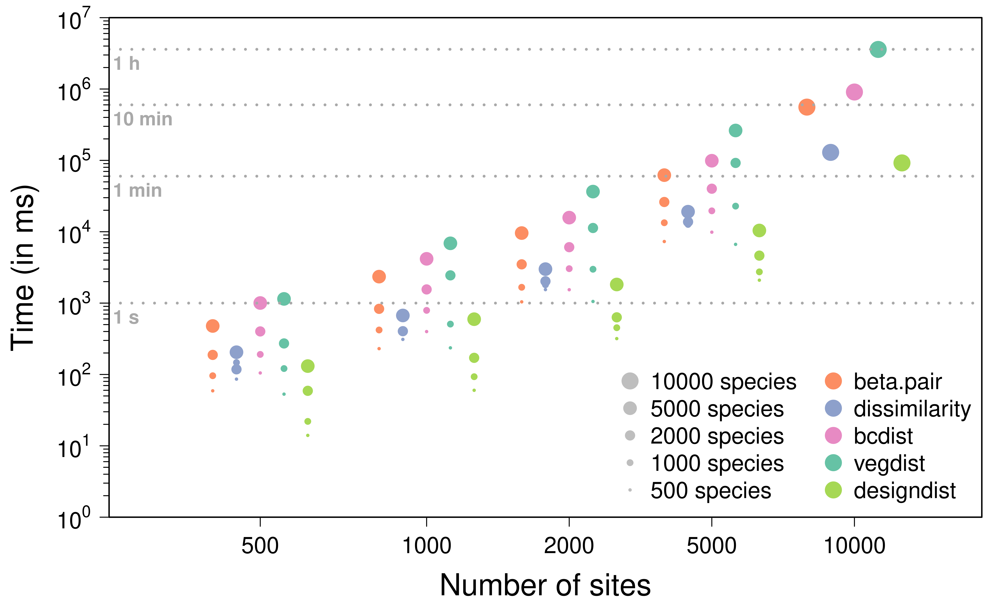
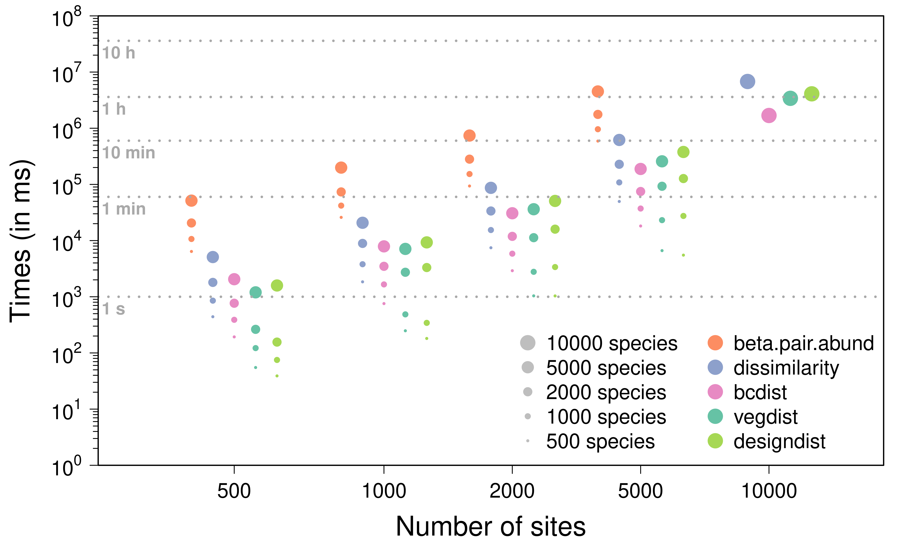

```{r setup, include=FALSE}

knitr::opts_chunk$set(echo = TRUE, message = FALSE, warning = FALSE,
                      fig.width = 8, fig.height = 8)
# Packages --------------------------------------------------------------------
suppressPackageStartupMessages({
  suppressWarnings({
    library(microbenchmark)
    library(adespatial)
    library(betapart)
    library(bioregion)
    library(ecodist)
    library(vegan)
  })
})

options(tinytex.verbose = TRUE)

```

```{r loading_vegemat, include=FALSE}
data(vegemat)
```

# 1. Compute pairwise similarity metrics

The function 
[similarity](https://bioRgeo.github.io/bioregion/reference/similarity.html) 
computes well-known and customized pairwise similarity metrics based on a 
co-occurrence `matrix`, such as 
[vegemat](https://biorgeo.github.io/bioregion/reference/vegemat.html). In the 
example below, the `Simpson` similarity index is computed between each pair of 
sites.

``` {r similarity_1}
sim <- similarity(vegemat, 
                  metric = "Simpson", 
                  formula = NULL, 
                  method = "prodmat")
sim[1:10,]
```

The resulting `data.frame` is stored in a `bioregion.pairwise.metric` object, 
which contains the Simpson similarity metric between each pair of sites. The 
function 
[similarity](https://bioRgeo.github.io/bioregion/reference/similarity.html) 
can handle three types of metrics: metrics based on `abc`, metrics based on 
`ABC`, and one metric based on the Euclidean distance.

The first kind of metrics such as Jaccard, the turnover component of Jaccard 
[@Baselga2012], Simpson or Sørensen are based on presence data with 
$a$ the number of species shared by a pair of sites, $b$ species only present 
in the first site and $c$ species only present in the second site. 

$$\displaystyle Jaccard = 1 - \frac{b + c}{a + b + c}$$
$$\displaystyle Jaccardturn = 1 - \frac{2 \cdot min(b, c)}{a + 2 \cdot min(b, c)}$$
$$\displaystyle Sorensen = 1 - \frac{b + c}{2 \cdot a + b + c}$$
$$\displaystyle Simpson = 1 - \frac{min(b, c)}{a + min(b, c)}$$
Two methods can be used to compute the `abc` based metrics. 
The first method is based on a matrix product (performed with the [tcrossprod](https://www.rdocumentation.org/packages/Matrix/versions/1.5-1/topics/matrix-products) 
function from the R package 
[Matrix](https://www.rdocumentation.org/packages/Matrix/versions/1.5-1)). 
The method is fast but is greedy in memory... The second method is 
based on a 
[three loops function](https://github.com/bioRgeo/bioregion/blob/master/src/abc.cpp) 
coded in C++ and largely inspired by the [bcdist](https://www.rdocumentation.org/packages/ecodist/versions/2.0.9/topics/bcdist) 
function from the R package 
[ecodist](https://www.rdocumentation.org/packages/ecodist/versions/2.0.9) 
(version 2.0.7). It is less efficient than the matrix product but allows to handle 
co-occurrence matrix with a large number of sites and/or species.

The second kind of metrics such as Bray-Curtis and the turnover component of 
Bray-Curtis [@Baselga2012] are based on abundance data with $A$ the sum of the 
lesser values for common species shared by a pair of sites. $B$ and $C$ are the 
total number of specimens counted at both sites minus $A$. Only three loops 
function is available for the `ABC` based metrics. 

$$\displaystyle Bray = 1 - \frac{B + C}{2 \cdot A + B + C}$$
$$\displaystyle Brayturn = 1 - \frac{min(B, C)}{A + min(B, C)}$$

The main advantage of the 
[similarity](https://bioRgeo.github.io/bioregion/reference/similarity.html) 
function is to compute and return several metrics, to allow the computation of
customized metric with the `formula` argument and to include the possibility of
returning the quantities $a$, $b$ and $c$ and/or $A$, $B$ and $C$. This feature 
is particularly interesting to compute similarity metrics on large 
co-occurrence matrix. 

``` {r similarity_2}
sim <- similarity(vegemat, 
                  metric = c("abc","ABC","Simpson","Bray"), 
                  formula = c("1 - pmin(b,c) / (a + pmin(b,c))", "1 - (B + C) / (2*A + B + C)"))
sim[1:10,]
```

It is also possible to compute Euclidean similarity between each pair of sites 
following this equation:

$$\displaystyle Euclidean = \frac{1}{1 + d_{ij}}$$
where $d_{ij}$ is the Euclidean distance between site $i$ and  site $j$ in terms of 
species composition.

# 2. Compute pairwise dissimilarity metrics

The [dissimilarity](https://bioRgeo.github.io/bioregion/reference/dissimilarity.html) 
function is very similar, with the sole exception that it computes the 
dissimilarity version of the available metrics. It corresponds to 1 minus the 
similarity metrics, except for the Euclidean dissimilarity, which corresponds 
to the Euclidean distance (i.e. $d_{ij}$).

``` {r dissimilarity}
dissim <- dissimilarity(vegemat, 
                        metric = "Sorensen", 
                        formula = "(b + c) / (2*a + b + c)")
dissim[1:10,]

```

# 3. From similarity to dissimilarity (and back again) 

The functions [similarity_to_dissimilarity](https://bioRgeo.github.io/bioregion/reference/dissimilarity_to_similarity.html) and [dissimilarity_to_similarity](https://bioRgeo.github.io/bioregion/reference/dissimilarity_to_similarity.html) and 
can be used to switch easily switch between similarity and dissimilarity metrics.

``` {r simtodissim}
sim1 <- similarity(vegemat, 
                  metric = c("abc","Sorensen"), 
                  formula = "1 - (b + c) / (2*a + b + c)")
sim1[1:10,]

dissim1 <- dissimilarity(vegemat, 
                         metric = c("abc","Sorensen"), 
                         formula = "(b + c) / (2*a + b + c)")
dissim1[1:10,]

dissim2 <- similarity_to_dissimilarity(sim1)
dissim2[1:10,]

sim2 <- dissimilarity_to_similarity(dissim1)
sim2[1:10,]
```

# 4. Comparison with other R packages

`bioregion` is not the only R package that allows the computation of 
similarity, dissimilarity, distance, and $\beta$-diversity metrics based 
on a (site-species) co-occurrence `matrix`. In this section, we focus on 
several functions provided by the packages 
[adespatial](https://cran.r-project.org/package=adespatial), 
[betapart](https://cran.r-project.org/package=betapart), 
[ecodist](https://cran.r-project.org/package=ecodist), and 
[vegan](https://cran.r-project.org/package=vegan).

The table below displays the main differences between these packages in 
terms of dissimilarity metric computation. The `bioregion` package is the 
only one that allows the computation of several metrics returned as a 
`data.frame` in a network format. It also supports the use of custom 
formulas based on the `a`, `b`, `c`, `A`, `B` and `C` components. This 
flexibility is also available in 
[vegan](https://cran.r-project.org/package=vegan) via the 
`designdist` function.

`bioregion` also allows the computation of the `a`, `b`, `c`, `A`, `B` and `C`
components. Users can choose to extract none of the components, only the 
three `abc` components, only the three `ABC` components, or all six components. 
These components (`abc` or `ABC` separately) can also be accessed in 
[adespatial](https://cran.r-project.org/package=adespatial) using the 
`beta.div.comp` function, and in 
[betapart](https://cran.r-project.org/package=betapart) using 
`betapart.core` and 
`betapart.core.abund`. Finally, the 
[vegan](https://cran.r-project.org/package=vegan) package, via 
the `designdist` function, also allows the extraction of 
the `a`, `b`, `c`, `A`, `B` or `C` components separately.


|                     | adespatial (0.3-28)       | betapart (1.6)   | bioregion (1.2.0)              | ecodist (2.1.3)        | vegan (2.6-10)               |
| ------------------- | ------------------------- | -----------------| ------------------------------ | ---------------------- | ---------------------------- |
| **Format**          | matrix                    | matrix           | data.frame (network)           | matrix                 | matrix                       |
| **Custom formulas** | no                        | no               | yes                            | no                     | yes                          |
| **abc/ABC**         | yes (abc or ABC)          | yes (abc or ABC) | yes (abc and ABC)              | no                     | yes (a, b, c, A, B or C)     |
| **Several metrics** | no                        | no               | yes                            | no                     | no                           |

## 4.1 Basic comparison (Jaccard and Bray-Curtis)

We first present a basic comparison of the computation of two well-known 
metrics, Jaccard and Bray-Curtis, based on a small co-occurrence `matrix`.

``` {r comat}
nbsite <- 100
nbsp <- 200

comat <- matrix(runif(nbsite*nbsp), nbsite, nbsp)
rownames(comat) <- paste0("s", 1:nbsite)
colnames(comat) <- paste0("sp", 1:nbsp)

comatbin <- comat
comatbin[comat > 0.7] <- 1
comatbin[comat <= 0.7] <- 0
```

### 4.1.1 Jaccard

We propose below a comparison of computation time for generating a Jaccard 
dissimilarity matrix based on the `comatbin` defined above. It should be noted 
that the output of `beta.div` and 
`dissimilarity`requires an additional step to obtain 
a dissimilarity matrix. Specifically, `beta.div` returns 
the root mean square of the desired quantity, and as shown above, 
`dissimilarity` outputs the metric in a network 
(`data.frame`) format, as it supports the computation of multiple metrics.

The `beta.pair` function is used for the 
[betapart](https://cran.r-project.org/package=betapart) package. Two functions, 
`distance` and `bcdist`, are used from the 
[ecodist](https://cran.r-project.org/package=ecodist) package. We also use the 
two available functions, `vegdist` and 
`designdist`, from the 
[vegan](https://cran.r-project.org/package=vegan) package.

``` {r jaccard 1}
dissim <- list()

comp_j <- microbenchmark(
  
  adespatial = { d <- beta.div(comatbin, 
                               method = "jaccard",
                               samp = FALSE,
                               nperm = 1,
                               save.D = TRUE) 
                 d <- as.matrix(d$D)
                 d <- d*d
                 dissim$adespatial <- d},
  
  betapart = { d <- beta.pair(comatbin, 
                              index.family = "jaccard")
               d <- as.matrix(d$beta.jac)
               dissim$betapart <- d},
  
  bioregion = { d <- dissimilarity(comatbin, 
                                   metric = "Jaccard")
                d <- net_to_mat(d,   
                                weight = TRUE,
                                squared = TRUE,
                                symmetrical = TRUE)
                     dissim$bioregion <- d },
  
  ecodist_dist = { d <- distance(comatbin, 
                                 method = "jaccard")
                   d <- as.matrix(d)
                   dissim$ecodist_dist <- d },
  
  ecodist_bcdist = { d <- bcdist(comatbin)
                     d <- as.matrix(d)
                     dissim$ecodist_bcdist <- d },
  
  vegan_veg = { d <- vegdist(comatbin,
                             method = "jaccard")
                d <- as.matrix(d)
                dissim$vegan_veg <- d },
  
  vegan_design = { d <- designdist(comatbin,
                                   method = "(A+B-2*J)/(A+B-J)",
                                   terms = "binary")
                   d <- as.matrix(d)
                   dissim$vegan_design <- d },
                      
  times = 10
)
```

After ensuring that all the functions return the same dissimilarity matrix, 

``` {r jaccard 2}
all_identical <- all(
  identical(trunc(dissim$adespatial, digits=4), 
            trunc(dissim$betapart, digits=4)),
  identical(trunc(dissim$adespatial, digits=4), 
            trunc(dissim$bioregion, digits=4)),
  identical(trunc(dissim$adespatial, digits=4), 
            trunc(dissim$ecodist_dist , digits=4)),
  identical(trunc(dissim$adespatial, digits=4), 
            trunc(dissim$ecodist_bcdist , digits=4)),
  identical(trunc(dissim$adespatial, digits=4), 
            trunc(dissim$vegan_veg, digits=4)),
  identical(trunc(dissim$adespatial, digits=4), 
            trunc(dissim$vegan_design, digits=4))
)
print(all_identical)

```

we proceed with a comparison of their computation times.

``` {r jaccard 3}
comp_j
```

On this very small example, the functions from 
[vegan](https://cran.r-project.org/package=vegan) outperform the others in terms 
of computation time. They are followed by `bcdist` and `beta.pair`. Our 
`dissimilarity` function performs slightly slower, partly due to the additional 
reformatting step (from matrix to network and back). The `distance` 
and `beta.div` functions rank significantly 
lower in terms of speed.

### 4.1.2 Bray-Curtis

We present below a similar example using the Bray-Curtis dissimilarity metric, 
based on the `comat` defined above.

``` {r bray 1}
dissim <- list()

comp_bc <- microbenchmark(
  
  adespatial = { d <- beta.div(comat, 
                               method = "percentdiff",
                               samp = FALSE,
                               nperm = 1,
                               save.D = TRUE) 
                 d <- as.matrix(d$D)
                 d <- d*d
                 dissim$adespatial <- d},
  
  betapart = { d <- beta.pair.abund(comat, 
                                    index.family = "bray")
               d <- as.matrix(d$beta.bray)
               dissim$betapart <- d},
  
  bioregion = { d <- dissimilarity(comatbin, 
                                    metric = "Bray")
                 d <- net_to_mat(d,   
                                 weight = TRUE,
                                 squared = TRUE,
                                 symmetrical = TRUE)
                 dissim$bioregion <- d },
  
  ecodist_dist = { d <- distance(comat, 
                                 method = "bray-curtis")
                   d <- as.matrix(d)
                   dissim$ecodist_dist <- d },
  
  ecodist_bcdist = { d <- bcdist(comat)
                     d <- as.matrix(d)
                     dissim$ecodist_bcdist <- d },
  
  vegan_veg = { d <- vegdist(comatbin,
                             method = "bray")
                d <- as.matrix(d)
                dissim$vegan_veg <- d },
  
  vegan_design = { d <- designdist(comat,
                                   method = "(A+B-2*J)/(A+B)",
                                   terms = "minimum")
                   d <- as.matrix(d)
                   dissim$vegan_design <- d },
                      
  times = 10
)

```

Here again after ensuring that all the functions return the same 
dissimilarity matrix, 

``` {r bray 2}
all_identical <- all(
  identical(trunc(dissim$adespatial, digits=4), 
            trunc(dissim$betapart, digits=4)),
  identical(trunc(dissim$adespatial, digits=4), 
            trunc(dissim$bioregion, digits=4)),
  identical(trunc(dissim$adespatial, digits=4), 
            trunc(dissim$ecodist_dist , digits=4)),
  identical(trunc(dissim$adespatial, digits=4), 
            trunc(dissim$ecodist_bcdist , digits=4)),
  identical(trunc(dissim$adespatial, digits=4), 
            trunc(dissim$vegan_veg, digits=4)),
  identical(trunc(dissim$adespatial, digits=4), 
            trunc(dissim$vegan_design, digits=4))
)
print(all_identical)

```

we proceed with a comparison of their computation times.

``` {r bray 3}
comp_bc
```

The functions from 
[vegan](https://cran.r-project.org/package=vegan) continue to outperform the 
others. They are again followed by `bcdist`, while our `dissimilarity` function 
remains slightly slower. The `distance` and `beta.div` functions, joined by 
`beta.pair.abund`, rank significantly lower in terms of computation speed.

## 4.2 Systematic comparison (Jaccard and Bray-Curtis)

These differences in computation times become noticeable only for (site-species) 
co-occurrence `matrix` objects of significant size. To better understand the 
computation times for such matrices, we perform a similar experiment using a 
subset of functions (`beta.pair` and `beta.pair.abund`, `dissimilarity`, 
`bcdist`, `vegdist`, and `designdist`) on datasets with varying numbers of sites 
and species.

The plot below shows the results obtained for the Jaccard dissimilarity metric
based on 16 combinations of numbers of
sites and species (chosen among 500, 1000, 2000, and 5000), averaged over three
replications. We also include the results from a single simulation with 10,000
sites and species.

<center>

</center> 

A similar plot showing the results obtained for the Bray-Curtis dissimilarity
metric is available below. In this case, the results based on a single
simulation with 10,000 sites and species exclude `beta.pair.abund` because it
took too much time to compute.

<center>

</center> 

<!--
# Converting other R objects into bioregion dissimilarity objects

Work in progress

# Enrich a similarity/dissimilarity object

Work in progress
-->

---
# 5. Reference
