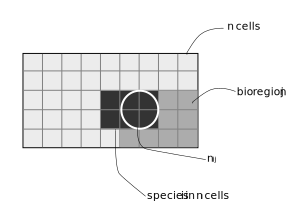

```{r setup, include=FALSE}
knitr::opts_chunk$set(echo = TRUE, message = FALSE, warning = FALSE,
                      fig.width = 6, fig.height = 6)
# Packages --------------------------------------------------------------------
suppressPackageStartupMessages({
  suppressWarnings({
    library("bioregion")
    library("dplyr")
  })
})

options(tinytex.verbose = TRUE)
```

In this vignette, we aim at evaluating the contribution of individual species
to each bioregion, using the function `contribution()`.

# Data  
We use the vegetation dataset that comes with `bioregion`.

```{r}
data("vegedf")
data("vegemat")

# Calculation of (dis)similarity matrices
vegedissim <- dissimilarity(vegemat, metric = c("Simpson"))
vegesim <- dissimilarity_to_similarity(vegedissim)
```

# Bioregionalization
We use the same three bioregionalization algorithms as in the
[visualization vignette](https://biorgeo.github.io/bioregion/articles/a5_visualization.html),
i.e. a non-hierarchical, hierarchical and network bioregionalizations.  
We chose 3 bioregions for the non-hierarchical and hierarchical
bioregionalizations.
<br>

```{r}
# Non hierarchical bioregionalization
vege_nhclu_kmeans <- nhclu_kmeans(vegedissim, n_clust = 3, index = "Simpson")
vege_nhclu_kmeans$cluster_info # 3

# Hierarchical bioregionalization
set.seed(1)
vege_hclu_hierarclust <- hclu_hierarclust(dissimilarity = vegedissim,
                                          index = names(vegedissim)[3],
                                          method = "average", n_clust = 3)
vege_hclu_hierarclust$cluster_info # 3

# Network bioregionalization
set.seed(1)
vege_netclu_walktrap <- netclu_walktrap(vegesim,
                                        index = names(vegesim)[3])
vege_netclu_walktrap$cluster_info # 3
```

# Indices

<center>
  
</center> 

<br>

The contribution index $\rho$ is calculated for each species x bioregion combination,
following [@Lenormand2019].
<br>
Its formula is the following:

$$\rho_{ij} = \frac{n_{ij} - \frac{n_i n_j}{n}}{\sqrt{\frac{n - n_j}{n-1} (1-\frac{n_j}{n}) \frac{n_i n_j}{n}}}$$
with $n$ the number of sites, $n_i$ the number of sites in which species $i$
is present, $n_j$ the number of sites belonging to the bioregion $j$, $n_ij$
the number of occurrences of species $i$ in sites belonging to the bioregion
$j$.

# Contribution
We can now run the function `contribution()`.
<br>

```{r}
contrib_kmeans <- contribution(vege_nhclu_kmeans, vegemat,
                               indices = "contribution")
contrib_hclu <- contribution(vege_hclu_hierarclust, vegemat,
                             indices = "contribution")
contrib_netclu <- contribution(vege_netclu_walktrap, vegemat,
                               indices = "contribution")
```

`contribution()` produces a single `data.frame` output.

