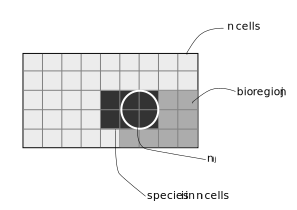

```{r setup, include=FALSE}
knitr::opts_chunk$set(echo = TRUE, message = FALSE, warning = FALSE,
                      fig.width = 6, fig.height = 6)
# Packages --------------------------------------------------------------------
suppressPackageStartupMessages({
  suppressWarnings({
    library("bioregion")
    library("dplyr")
    library("ggplot2")
    library("sf")
  })
})

options(tinytex.verbose = TRUE)
```

In this vignette, we aim at evaluating the contribution of individual species
to each bioregion, using the function `site_species_metrics()`.

# Data  
We use the vegetation dataset that comes with `bioregion`.

```{r}
data("vegedf")
data("vegemat")

# Calculation of (dis)similarity matrices
vegedissim <- dissimilarity(vegemat, metric = c("Simpson"))
vegesim <- dissimilarity_to_similarity(vegedissim)
```

# Bioregionalization
We use the same three bioregionalization algorithms as in the
[visualization vignette](https://biorgeo.github.io/bioregion/articles/a5_visualization.html),
i.e. a non-hierarchical, hierarchical and network bioregionalizations.  
We chose 3 bioregions for the non-hierarchical and hierarchical
bioregionalizations.
<br>

```{r}
# Non hierarchical bioregionalization
vege_nhclu_kmeans <- nhclu_kmeans(vegedissim, n_clust = 3, index = "Simpson")
vege_nhclu_kmeans$cluster_info # 3

# Hierarchical bioregionalization
set.seed(1)
vege_hclu_hierarclust <- hclu_hierarclust(dissimilarity = vegedissim,
                                          index = names(vegedissim)[3],
                                          method = "average", n_clust = 3,
                                          optimal_tree_method = "best")
vege_hclu_hierarclust$cluster_info # 3

# Network bioregionalization
set.seed(1)
vege_netclu_walktrap <- netclu_walktrap(vegesim,
                                        index = names(vegesim)[3])
vege_netclu_walktrap$cluster_info # 3
```

# Bioregion metrics

Number of sites belonging to a bioregion, how many species do these sites
contain. Number of endemic and proportion of endemism are also calculated.
Endemic species are species only present in sites assigned to a particular
bioregion.

```{r}
bioregion_summary <- bioregion_metrics(bioregionalization = vege_nhclu_kmeans,
                                       comat = vegemat)
bioregion_summary
```

# Species metrics

Different summary statistics are available at the species level.

## Contribution ($\rho$)
<center>

</center> 

<br>

The contribution index $\rho$ is calculated for each species x bioregion combination, following [@Lenormand2019].
<br>
Its formula is the following:

$$\rho_{ij} = \frac{n_{ij} - \frac{n_i n_j}{n}}{\sqrt{\frac{n - n_j}{n-1} (1-\frac{n_j}{n}) \frac{n_i n_j}{n}}}$$
with $n$ the number of sites, $n_i$ the number of sites in which species $i$
is present, $n_j$ the number of sites belonging to the bioregion $j$, $n_ij$
the number of occurrences of species $i$ in sites belonging to the bioregion
$j$.

## Individual contributions
Affinity, fidelity and individual contributions describe how species are
linked to their bioregions. These metrics are presented in [@Bernardo2019].

Affinity of species to their region: $$A_i = \frac{R_i}{Z}$$
where $R_i$ is the occurrence/range size of species $i$ in its
associated bioregion, and $Z$ the total size (number of sites) of the
bioregion.

A high affinity means that the species is occupying most sites of its
associated bioregion.

Fidelity of species to their region: $$F_i = \frac{R_i}{D_i}$$
where $R_i$ is the occurrence/range size of species $i$ in its
associated bioregion, and $D_i$ is its total occurrence/range size.

A high fidelity means that the species is not present in other bioregions
than their associated one.

Indicator Value of species: $$IndVal = F_i \times A_i$$
<br>

# Bipartite metrics

When running a community detection algorithm on a site x species matrix, both
sites and species get a bioregion assigned. The degree of affinity of both
types of nodes can therefore be directly assessed, with metrics like the
coefficient of participation `C` or the within-bioregion degree `z`.

## Cz statistics

`Cz` metrics are derived from [@Guimera2005].
Their respective formula are:
$$C_i = 1 - \sum_{s=1}^{N_M}{{(\frac{k_is}{k_i}})^2}$$

where $k_{is}$ is the number of links of node (species or site) $i$
to nodes in bioregion $s$, and $k_i$ is the total degree of node
$i$. The participation coefficient of a node is therefore close to 1 if
its links are uniformly distributed among all the bioregions and 0 if all
its links are within its own bioregion.

And:
$$z_i = \frac{k_i - \overline{k_{si}}}{\sigma_{k_{si}}}$$

where $k_i$ is the number of links of node (species or site) $i$ to
other nodes in its bioregion $s_i$, $\overline{k_{si}}$ is the
average of $k$ over all the nodes in $s_i$, and
$\sigma_{k_{si}}$ is the standard deviation of $k$ in $s_i$.
The within-bioregion degree z-score measures how well-connected node $i$
is to other nodes in the bioregion.

## Running the site_species_metrics function
We can now run the function `site_species_metrics()`.
<br>

```{r}
contrib_kmeans <- site_species_metrics(vege_nhclu_kmeans, vegemat,
                                       indices = "rho")
contrib_hclu <- site_species_metrics(vege_hclu_hierarclust, vegemat,
                                     indices = "rho")
contrib_netclu <- site_species_metrics(vege_netclu_walktrap, vegemat,
                                       indices = "rho")

# Cz indices
clust_bip <- netclu_greedy(vegedf, bipartite = TRUE)
cz_netclu <- site_species_metrics(bioregionalization = clust_bip,  comat = vegemat,
                                  net = vegedf, indices = "Cz")
```

`site_species_metrics()` outputs `data.frame` with the contribution metrics available
at the species level.

# Spatial coherence

We use the metric of spatial coherence as in [@Divisek2016], except that we
replace the number of pixels per bioregion with the area of each coherent part.

The spatial coherence is expressed in percentage, and has the following
formula:

$$SC_j = 100 \times \frac{LargestPatch_j}{Area_j}$$

where $j$ is a bioregion.

Here is an example with the vegetation dataset.

```{r}
# Spatial coherence
vegedissim <- dissimilarity(vegemat)
hclu <- nhclu_kmeans(dissimilarity = vegedissim, n_clust = 4)
vegemap <- map_bioregions(hclu, vegesf, write_clusters = TRUE, plot = FALSE)

bioregion_metrics(bioregionalization = hclu, comat = vegemat, map = vegemap,
col_bioregion = 2) 
```

The bioregion 4 is almost constituted of one homogeneous block, which is why 
the spatial coherence is very close to 100 %.

```{r}
ggplot(vegemap) +
  geom_sf(aes(fill = as.factor(K_4))) +
  scale_fill_viridis_d("Bioregion") +
  theme_bw() +
  theme(legend.position = "bottom")
```


# References
