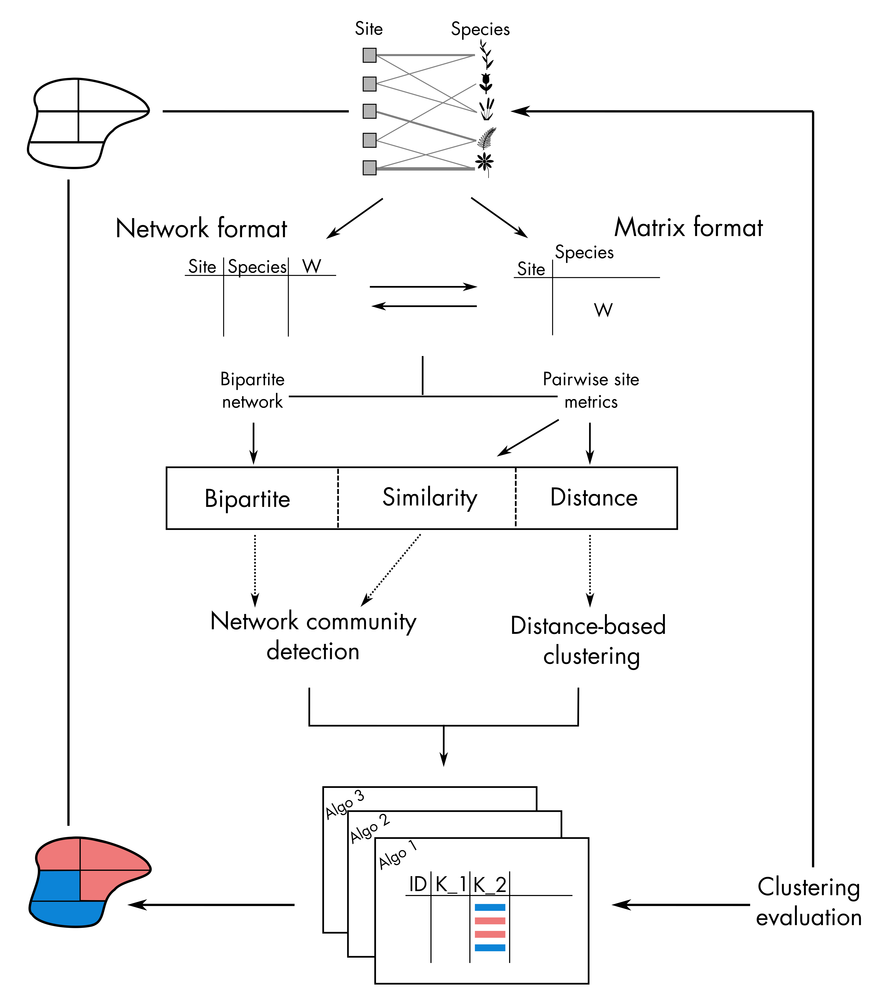

```{r setup, include=FALSE}

knitr::opts_chunk$set(echo = TRUE, message = FALSE, warning = FALSE,
                      fig.width = 8, fig.height = 8)
# Packages --------------------------------------------------------------------
suppressPackageStartupMessages({
  suppressWarnings({
    library(bioRgeo)
  })
})

options(tinytex.verbose = TRUE)

```

## 0. Brief introduction

This tutorial aims at describing the different features of the R package `bioRgeo`. 
The main purpose of the `bioRgeo`'s package is to propose a transparent 
methodological framework to compare bioregionalization methods. Below is the 
typical flow chart of bioregions' identification based on a site-species 
bipartite network or co-occurrence matrix with `bioRgeo` (Figure 1). This workflow 
can be divided into four main steps:

1. Preprocess the data (matrix or network formats)
2. Compute similarity/dissimilarity metrics between sites based on species composition
3. Run the different algorithms to identify different set of bioregions
4. Evaluate and visualize the results

<br>
<center>
  
</center> 
<br>
<center>
  <b>Figure 1: Workflow of the bioRgeo's package.</b>
</center> 
<br>

## 1. Matrix or Network formats

The `bioRgeo`'s package takes as input site-species information stored in a 
bipartite network or a co-occurrence matrix. Relying on the function  [mat_to_net](https://biorgeo.github.io/bioRgeo/reference/mat_to_net.html)
and [net_to_mat](https://biorgeo.github.io/bioRgeo/reference/net_to_mat.html)
, it handles both the matrix and network formats throughout the workflow. 

Please have a look at this [tutorial page](https://biorgeo.github.io/bioRgeo/articles/a1_matrix_and_network_formats.html) 
to better understand how these two functions work.

## 2. Pairwise similarity/dissimilarity metrics

The functions [similarity](https://biorgeo.github.io/bioRgeo/reference/similarity.html) 
and [dissimilarity](https://biorgeo.github.io/bioRgeo/reference/dissimilarity.html)
compute respectively pairwise similarity and dissimilarity metrics based on a 
(site-species) co-occurence matrix. The resulting `data.frame` is stored in a 
`bioRgeo.pairwise.metric` object containing all requested metrics between each 
pair of sites.

The functions [dissimilarity_to_similarity](https://biorgeo.github.io/bioRgeo/reference/dissimilarity_to_similarity.html) and [similarity_to_dissimilarity](https://biorgeo.github.io/bioRgeo/reference/dissimilarity_to_similarity.html)
can be used to transform a similarity object into a dissimilarity object 
and vice versa.

Please have a look at this [tutorial page](https://biorgeo.github.io/bioRgeo/articles/a2_pairwise_metrics.html) 
to better understand how these functions work.
 
## 3. Clustering algorithms

### 3.1 Install executable binary files

Some functions or at least part of them (listed below) require executable binary
files to run. 

* [netclu_infomap](https://biorgeo.github.io/bioRgeo/reference/netclu_infomap.html)
* [netclu_louvain](https://biorgeo.github.io/bioRgeo/reference/netclu_louvain.html) (Cpp version)
* [netclu_oslom](https://biorgeo.github.io/bioRgeo/reference/netclu_oslom.html)

Please check this 
[tutorial page](https://biorgeo.github.io/bioRgeo/articles/a3_1_install_executable_binary_files.html) 
to get instructions regarding the installation of the executable binary files.

### 3.2 The bioRgeo.clusters class

`bioRgeo.clusters` 

### 3.3 Hierarchical clustering

### 3.4 Non-hierarchical clustering

### 3.5 Network clustering

The `bioRgeo`'s package contains 8 network clustering functions: 

* [netclu_infomap](https://biorgeo.github.io/bioRgeo/reference/netclu_infomap.html)
* [netclu_oslom](https://biorgeo.github.io/bioRgeo/reference/netclu_oslom.html)
* [netclu_louvain](https://biorgeo.github.io/bioRgeo/reference/netclu_louvain.html) 
* [netclu_greedy](https://biorgeo.github.io/bioRgeo/reference/netclu_greedy.html)
* [netclu_labelprop](https://biorgeo.github.io/bioRgeo/reference/netclu_labelprop.html)
* [netclu_leadingeigen](https://biorgeo.github.io/bioRgeo/reference/netclu_leadingeigen.html)
* [netclu_walktrap](https://biorgeo.github.io/bioRgeo/reference/netclu_walktrap.html) 
* [netclu_beckett](https://biorgeo.github.io/bioRgeo/reference/netclu_beckett.html) 

Please check this 
[tutorial page](https://biorgeo.github.io/bioRgeo/articles/a3_5_network_clustering.html) 
to get more information regarding the network clustering functions.

## 4. Visualization and evaluation of the results


