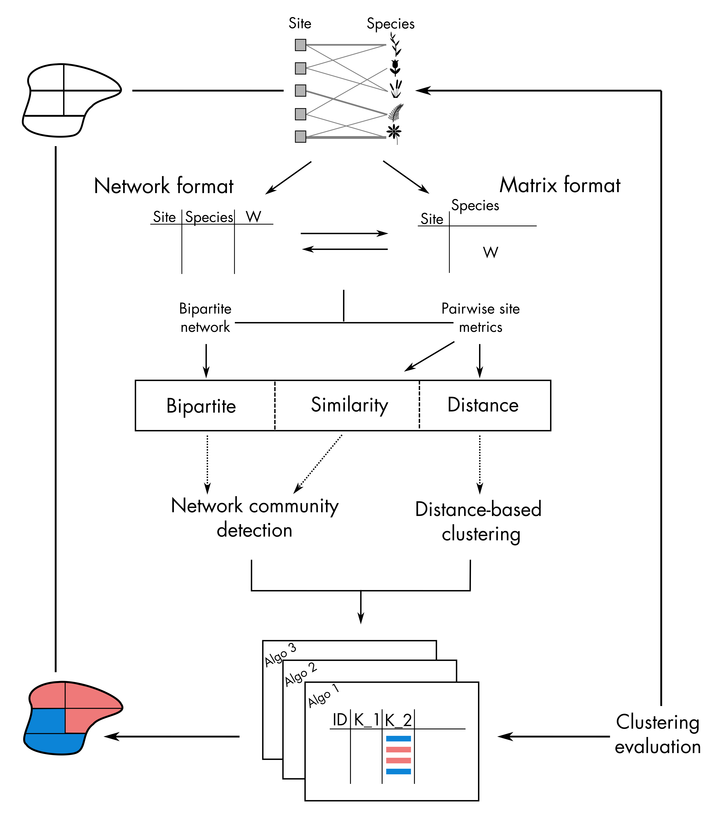

```{r setup, include = FALSE}
knitr::opts_chunk$set(
  collapse = TRUE,
  comment = "#>",
  eval=FALSE
)
```


This tutorial aims at describing the bioRgeo's processing workflow 


Below is the typical flow chart of ... with __bioRgeo__ :




