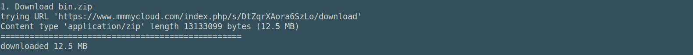

Some functions (listed below) or at least part of them require executable binary
files to run. 

* [netclu_infomap](https://biorgeo.github.io/bioRgeo/reference/netclu_infomap.html)
* [netclu_louvain](https://biorgeo.github.io/bioRgeo/reference/netclu_louvain.html)
* [netclu_oslom](https://biorgeo.github.io/bioRgeo/reference/netclu_oslom.html)

The function \code{install_binaries} downloads and unzips the 'bin' folder 
needed to run these functions. It also checks if the files have the permissions 
to be executed as programs. It finally tests if the executable are running 
properly.

## Run install_binaries()


```{r install_binaries, eval=FALSE}
install_binaries(binpath = NULL)
```

The only par

<p>&nbsp;</p>
<center>
  
</center> 
<p>&nbsp;</p>

##  Known issues

https://brew.sh

brew install libomp


